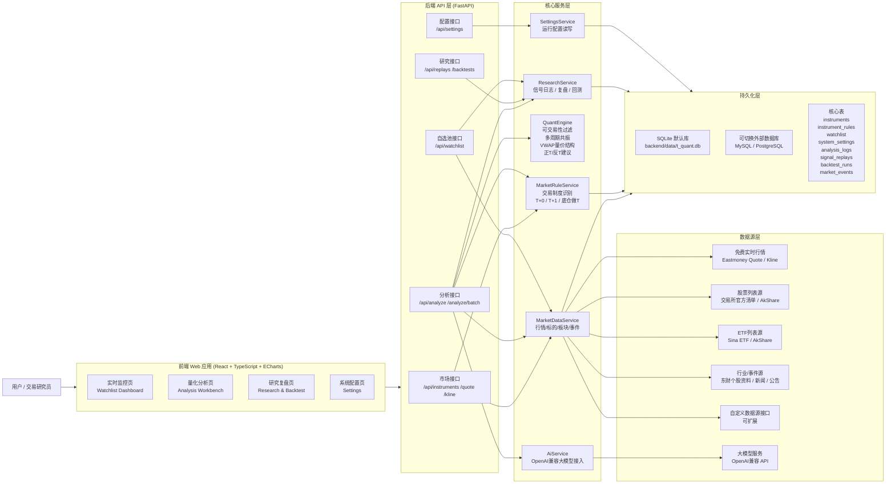
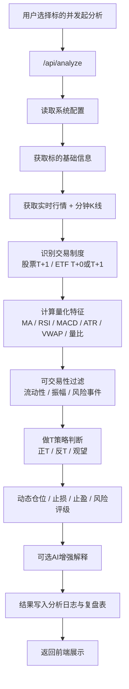
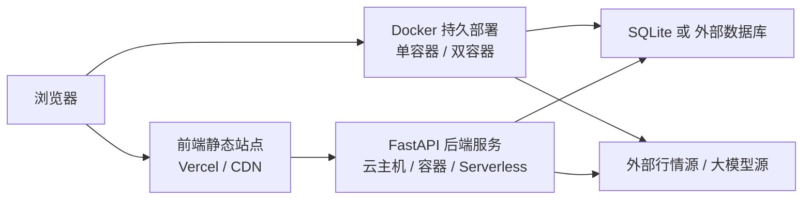

# A股短线做T量化系统架构图

## 整体架构

## 核心分析链路

## 部署结构

## 架构说明

- 前端负责展示、交互、图表和配置输入，不直接处理策略判断。
- 后端负责统一接入行情、制度识别、量化引擎、AI增强、研究回测。
- 数据源层采用“默认免费接口 + 可配置扩展”的设计，保证开箱即用。
- 数据库默认使用 SQLite，便于本地运行；生产环境可切换为外部数据库。
- 分析结果和回测结果都持久化，便于复盘和后续策略优化。
