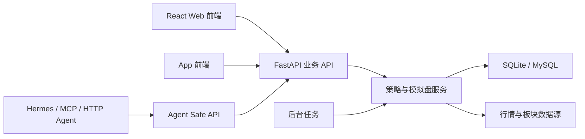

# 维斯量化交易平台架构说明

## 当前定位

本项目是 A 股短线做 T、低吸选股、模拟盘验证与 Agent 辅助分析平台。系统不执行真实下单，所有交易建议、模拟委托和 Agent 输出均为辅助决策信息。

## 总体分层

## 后端模块

- `auth`：统一登录、刷新令牌、模拟盘白名单和接口认证。
- `watchlist`：自选和持仓监控，输出做 T 信号。
- `low_buy`：低吸策略体系，采用“生产 / 辅助 / 研究 / 因子”分层。
- `paper`：模拟账户、委托、成交、自动交易、绩效归档和风控熔断。
- `market`：行情、K 线、板块、市场环境和盘中确认数据。
- `agent_tools` / `agent_providers`：Agent 工具注册、权限、审计和 provider 适配。
- `research`：回测、策略验证和样本外评估。

## 低吸策略体系

生产策略只保留当前验证可用的短线逻辑：

- `first_board`：首板回调。
- `volume_shrink`：量能低吸。
- `late_session_strong_support`：收盘强势承接。
- `core_midcap_vwap_ma5_retrace`：中军 VWAP / 均线回踩。
- `sector_mainline_first_divergence_low_buy`：主线首分歧低吸。

旧策略处理：

- `classic_retrace`、`breakout_support`、`limit_up_breakout_retrace`、`divergence_consensus`：保留研究兼容，不进入生产强买入口。
- `ma_support`、`deep_pullback`、`trend_rebound`：作为因子或研究特征，不单独作为生产策略。

## 性能原则

- API 默认读取物化快照，不在请求线程里做全量扫描。
- 行情价格走轻量刷新，分钟 K/VWAP 仅对临近买点候选限量刷新。
- 低吸样本池按 `base_pool -> family_pool -> strategy_pool` 分层，策略可声明独立或共享样本池。
- 回测和月度验证写入 `backtest_runs`，交互接口只读取结果。
- 前端对关键 GET 接口提供内存缓存和离线回退，降低 502 对页面的影响。

## Agent 架构

Agent 只能通过 `/api/agent/*` 读取脱敏结构化数据：

- 自选/持仓摘要。
- 全策略优先级榜。
- 个股分析摘要。
- 每日报告。
- 模拟盘组合摘要。
- 模拟盘候选委托建议。

默认禁用 write/notify/dangerous 工具。Hermes、MCP、Custom HTTP 通过同一 Tool Registry 接入。

## 部署结构

生产部署使用云服务器容器：

- Nginx / HTTPS 入口。
- FastAPI 后端。
- React 静态文件。
- MySQL 或 SQLite 数据库。
- 定时备份脚本。
- 后台任务：低吸物化、watchlist 刷新、模拟盘归档、月度策略验证。

## 安全边界

- 所有核心业务路由需要登录。
- 管理与设置接口需要管理员令牌。
- `AUTH_SECRET_KEY` 必须显式配置，不允许回退到数据库连接串。
- SSE 使用短期订阅令牌，不通过长期 token query 传参。
- Agent 不直接访问数据库、不执行 shell、不改策略参数、不下单。
