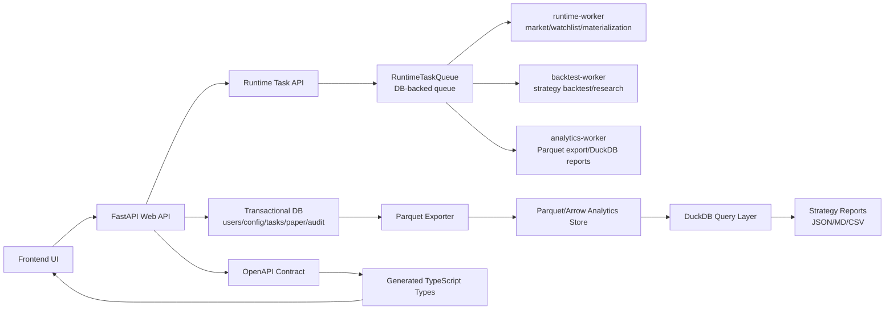

# TQuant DuckDB + Parquet/Arrow、独立任务 Worker、Contract-first API 开发方案

生成日期：2026-05-30
适用项目：`/Users/j/Documents/gupiao`
目标范围：回测、策略分析、报告性能；补数据、回测、报告、后台任务稳定性；前后端字段契约一致性。

## 1. 结论

本项目当前最值得优先引入的不是一门新语言，而是三层工程能力：

1. **DuckDB + Parquet/Arrow 分析层**：把回测、策略分析、报告从事务库和 Python 内存循环里拆出来，形成可复用、可追溯、可高速扫描的本地分析仓。
2. **独立任务 Worker**：把补数据、回测、报告、策略验证、后台巡检从 Web 主进程拆出来，提高稳定性、可恢复性和可观测性。
3. **Contract-first API**：以后端 OpenAPI 契约作为前后端共同事实源，自动生成前端类型，减少字段漂移、重复类型和接口回归。

三者应一起落地：DuckDB/Parquet 解决“算得慢、重复算、难追溯”；Worker 解决“长任务拖垮 Web、失败不可恢复”；Contract-first 解决“后端字段变了前端才发现”。

## 2. 当前项目证据

基于当前仓库结构，已有以下基础可以利用：

- `backend/app/services/tasks/queue.py` 已有数据库驱动的 `RuntimeTaskQueue`，支持任务状态、重试、事件、SSE 订阅和可替换队列适配层。
- `backend/app/api/routes/runtime_tasks.py` 已暴露运行任务查询、详情、事件流接口，适合作为统一任务状态 API。
- `backend/app/runtime/background_jobs.py` 目前聚合了大量后台循环，包括行情刷新、策略信号、市场状态预热、物化刷新、日报、ML 训练、漂移监控、因子挖掘等，适合分阶段迁移到独立 Worker。
- `scripts/backtest_worker.py` 与 `backend/app/services/backtest_research_worker.py` 已有回测/研究 Worker 雏形，可以作为拆分长任务的第一批落地点。
- `backend/app/api/routes/backtests.py` 已使用 FastAPI `response_model` 暴露回测接口，天然具备 OpenAPI 契约基础。
- `frontend/src/api/backtests.ts` 与 `frontend/src/api/backtestTypes.ts` 仍以手写类型和手写请求封装为主，存在字段漂移和重复维护风险。
- `backend/requirements.txt` 当前没有 `duckdb`、`pyarrow`、`polars` 等分析仓依赖，也没有 API 类型生成链路。

## 3. 非目标

本方案不做以下事情：

- 不替换现有交易/用户/配置/审计类事务数据库。
- 不改变策略收益口径、仓位规则、止损规则和交易风控逻辑，除非回测结果证明需要调整。
- 不把所有后台任务一次性迁移到 Celery/Temporal 等重型系统。
- 不重写前端页面，不做 UI 大改。
- 不把 DuckDB 作为线上交易事实源；DuckDB 只承担分析、回测、报告和离线校验。

## 4. 目标架构



核心边界：

- **Web API**：只负责同步请求、权限、轻量查询、任务提交和任务状态读取。
- **RuntimeTaskQueue**：继续作为统一任务状态事实源，保留现有接口，内部可逐步替换为 Redis/RQ/Celery/Temporal。
- **Worker**：独立进程执行耗时任务，支持心跳、取消、重试、进度、产物路径和日志。
- **Parquet/Arrow Store**：用于保存可复用分析数据集，避免每次报告都从事务库全量扫描。
- **DuckDB**：用于本地 OLAP 查询、策略指标聚合、回测报告、跨策略对比。
- **OpenAPI Contract**：后端 schema 是事实源，前端类型自动生成，手写类型逐步退场。

## 5. DuckDB + Parquet/Arrow 分析层

### 5.1 目标

- 提高 24 个月回测、全策略对比、报告生成、策略指标分析速度。
- 减少重复计算，统一数据版本、时间范围、数据质量检查。
- 支持报告可追溯：知道本次回测使用了哪些数据、数据完整性如何、生成时间和版本是什么。

### 5.2 推荐依赖

新增独立分析依赖文件，避免立刻增加默认部署体积：

- `backend/requirements-analytics.txt`
  - `duckdb`
  - `pyarrow`
  - `polars`，可选，用于大表转换和 Arrow 批处理
  - `pandas`，已有则复用

生产环境可先不默认安装分析依赖，Worker 环境按需安装。

### 5.3 数据目录

推荐新增：

```text
backend/data/analytics/
  parquet/
    daily_bars/
    minute_bars/
    strategy_signals/
    backtest_trades/
    strategy_metrics/
    market_regimes/
    data_quality/
  manifests/
  reports/
```

可配置环境变量：

```text
TQUANT_ANALYTICS_ROOT=backend/data/analytics
TQUANT_ANALYTICS_ENABLED=false
TQUANT_DUCKDB_THREADS=4
```

### 5.4 数据集设计

#### `daily_bars`

用途：24 个月回测、策略特征、报告主数据。

字段建议：

| 字段 | 类型 | 说明 |
| --- | --- | --- |
| `symbol` | string | 股票/ETF 代码 |
| `trade_date` | date | 交易日期 |
| `open` | double | 开盘价 |
| `high` | double | 最高价 |
| `low` | double | 最低价 |
| `close` | double | 收盘价 |
| `pre_close` | double | 前收盘价 |
| `volume` | double | 成交量 |
| `amount` | double | 成交额 |
| `adjusted` | string | 复权口径，例如 `none`、`qfq`、`hfq` |
| `source` | string | 数据源 |
| `loaded_at` | timestamp | 写入时间 |
| `data_quality` | string | `ok`、`missing`、`suspect` |

分区建议：

```text
daily_bars/trade_year=2026/trade_month=05/part-*.parquet
```

#### `strategy_signals`

用途：策略信号回放、信号命中率分析、前端报告。

字段建议：

| 字段 | 类型 | 说明 |
| --- | --- | --- |
| `strategy_key` | string | 策略唯一键 |
| `symbol` | string | 标的 |
| `signal_date` | date | 信号日期 |
| `signal_state` | string | buy/sell/hold/watch |
| `score` | double | 策略评分 |
| `market_state` | string | 市场状态 |
| `sector` | string | 板块 |
| `feature_asof_date` | date | 特征截止日期，防止未来函数 |
| `data_cutoff_time` | timestamp | 数据截止时间 |
| `decision_generated_at` | timestamp | 信号生成时间 |
| `payload_json` | string | 扩展解释字段 |
| `version` | string | 策略/信号版本 |

#### `backtest_trades`

用途：交易级分析、盈亏归因、胜率和回撤拆解。

字段建议：

| 字段 | 类型 | 说明 |
| --- | --- | --- |
| `run_id` | string | 回测任务 ID |
| `strategy_key` | string | 策略键 |
| `symbol` | string | 标的 |
| `entry_time` | timestamp | 入场时间 |
| `exit_time` | timestamp | 出场时间 |
| `entry_price` | double | 入场价 |
| `exit_price` | double | 出场价 |
| `quantity` | double | 数量 |
| `gross_pnl` | double | 毛收益 |
| `net_pnl` | double | 扣费后收益 |
| `fee` | double | 费用 |
| `slippage` | double | 滑点 |
| `exit_reason` | string | 出场原因 |

#### `strategy_metrics`

用途：策略排行榜、对比页、报告汇总。

字段建议：

| 字段 | 类型 | 说明 |
| --- | --- | --- |
| `run_id` | string | 回测 ID |
| `strategy_key` | string | 策略键 |
| `period_start` | date | 统计开始 |
| `period_end` | date | 统计结束 |
| `total_return` | double | 总收益 |
| `annual_return` | double | 年化收益 |
| `max_drawdown` | double | 最大回撤 |
| `sharpe` | double | 夏普 |
| `win_rate` | double | 胜率 |
| `profit_factor` | double | 盈亏比 |
| `trade_count` | int | 交易数 |
| `exposure` | double | 持仓暴露 |

#### `data_quality`

用途：防止“数据不完整但回测继续跑”。

字段建议：

| 字段 | 类型 | 说明 |
| --- | --- | --- |
| `dataset_key` | string | 数据集 |
| `symbol` | string | 标的，可为空 |
| `period_start` | date | 检查开始 |
| `period_end` | date | 检查结束 |
| `expected_days` | int | 应有交易日 |
| `actual_days` | int | 实际交易日 |
| `missing_days` | int | 缺失交易日数 |
| `duplicate_rows` | int | 重复行 |
| `status` | string | ok/warn/fail |
| `checked_at` | timestamp | 检查时间 |

### 5.5 Manifest 设计

每次导出必须写入 Manifest：

```json
{
  "dataset_key": "daily_bars",
  "schema_version": "1.0.0",
  "dataset_version": "daily_bars_2026-05-30_001",
  "generated_at": "2026-05-30T10:00:00+08:00",
  "period_start": "2024-05-30",
  "period_end": "2026-05-30",
  "row_count": 1234567,
  "symbol_count": 5000,
  "source": {
    "type": "transaction_db",
    "snapshot": "2026-05-30T09:55:00+08:00"
  },
  "quality": {
    "status": "ok",
    "missing_days": 0,
    "duplicate_rows": 0
  },
  "files": [
    {
      "path": "parquet/daily_bars/trade_year=2026/trade_month=05/part-000.parquet",
      "rows": 120000,
      "sha256": "..."
    }
  ]
}
```

Manifest 是报告和回测的输入凭证。任何 24 个月回测都必须引用具体 Manifest，不能只写“使用本地数据”。

### 5.6 后端模块建议

新增：

```text
backend/app/services/analytics/
  __init__.py
  config.py
  duckdb_repository.py
  exporters.py
  manifest.py
  quality.py
  report_queries.py
  schemas.py

backend/scripts/
  export_analytics_parquet.py
  run_duckdb_strategy_report.py
  validate_analytics_store.py
```

职责：

- `config.py`：读取 `TQUANT_ANALYTICS_ROOT`、线程数、是否启用分析层。
- `exporters.py`：从事务库/现有服务导出 Arrow Table 或 Pandas DataFrame，再写 Parquet。
- `duckdb_repository.py`：封装 DuckDB 连接、只读查询、临时视图注册。
- `manifest.py`：写入/读取 Manifest，生成数据版本。
- `quality.py`：检查交易日覆盖、重复行、OHLC 合法性、未来函数风险字段。
- `report_queries.py`：沉淀策略报告 SQL。
- `schemas.py`：定义数据集 schema 和版本。

### 5.7 DuckDB 查询样例

策略月度表现：

```sql
SELECT
  strategy_key,
  date_trunc('month', exit_time) AS month,
  count(*) AS trade_count,
  sum(net_pnl) AS net_pnl,
  avg(CASE WHEN net_pnl > 0 THEN 1 ELSE 0 END) AS win_rate
FROM read_parquet('backend/data/analytics/parquet/backtest_trades/**/*.parquet')
WHERE exit_time >= current_date - interval '24 months'
GROUP BY strategy_key, month
ORDER BY strategy_key, month;
```

策略风险收益排行榜：

```sql
SELECT
  strategy_key,
  avg(annual_return) AS avg_annual_return,
  max(max_drawdown) AS worst_drawdown,
  avg(sharpe) AS avg_sharpe,
  sum(trade_count) AS trade_count
FROM read_parquet('backend/data/analytics/parquet/strategy_metrics/**/*.parquet')
WHERE period_start >= current_date - interval '24 months'
GROUP BY strategy_key
ORDER BY avg_sharpe DESC, worst_drawdown ASC;
```

数据完整性检查：

```sql
SELECT
  dataset_key,
  symbol,
  period_start,
  period_end,
  expected_days,
  actual_days,
  missing_days,
  duplicate_rows,
  status
FROM read_parquet('backend/data/analytics/parquet/data_quality/**/*.parquet')
WHERE status <> 'ok'
ORDER BY missing_days DESC, duplicate_rows DESC;
```

### 5.8 验收标准

- 能导出最近 24 个月 `daily_bars` Parquet，并生成 Manifest。
- 能通过 DuckDB 查询所有策略 24 个月核心指标。
- 能输出 `docs/reports/strategy_24m_duckdb_report.md` 和配套 JSON。
- 如果本地数据不足 24 个月，任务必须进入 `data_backfill_24m`，补齐后再回测；不能静默用不足数据跑完整报告。
- DuckDB 报告的关键指标与现有 Python 回测汇总在允许误差内一致。
- 同一 Manifest 重复运行报告，结果应可复现。

## 6. 独立任务 Worker

### 6.1 目标

- Web 主进程不再直接承担长时间补数据、回测、报告和研究任务。
- 所有长任务都能查看状态、进度、错误、日志、产物路径和重试次数。
- Worker 崩溃后任务可恢复，不产生重复写入或脏报告。

### 6.2 Worker 类型

建议拆成四类 Worker：

| Worker | 职责 | 优先级 |
| --- | --- | --- |
| `runtime-worker` | 行情刷新、观察列表信号、物化视图、市场状态预热 | P1 |
| `backtest-worker` | 单策略/全策略回测、研究任务、验证任务 | P0 |
| `analytics-worker` | Parquet 导出、DuckDB 报告、数据质量检查 | P0 |
| `research-worker` | ML 训练、因子挖掘、Agent 分析、实验任务 | P2，默认关闭 |

第一阶段只强制落地 `backtest-worker` 和 `analytics-worker`，避免一次性迁移所有后台循环。

### 6.3 任务类型

新增或规范以下任务类型：

| 任务类型 | Worker | 说明 |
| --- | --- | --- |
| `data_backfill_24m` | `analytics-worker` | 补齐 24 个月行情数据 |
| `analytics_export_daily_bars` | `analytics-worker` | 导出日线 Parquet |
| `analytics_export_minute_bars` | `analytics-worker` | 导出分钟线 Parquet，可后置 |
| `analytics_quality_check` | `analytics-worker` | 检查覆盖率、重复、异常价格 |
| `strategy_24m_duckdb_report` | `analytics-worker` | 生成 24 个月策略分析报告 |
| `backtest_single_strategy_24m` | `backtest-worker` | 单策略 24 个月回测 |
| `backtest_all_strategies_24m` | `backtest-worker` | 全策略 24 个月回测 |
| `strategy_adjustment_from_backtest` | `backtest-worker` | 根据回测结果产出策略调整建议 |

### 6.4 任务状态模型

沿用现有 `RuntimeTaskQueue`，补齐任务元数据规范：

```json
{
  "task_id": "rt_...",
  "task_type": "strategy_24m_duckdb_report",
  "queue": "analytics",
  "status": "queued|running|succeeded|failed|cancelled|retrying",
  "progress": 0.65,
  "current_step": "quality_check",
  "input": {
    "months": 24,
    "strategies": ["all"],
    "manifest": "daily_bars_2026-05-30_001"
  },
  "artifacts": [
    "docs/reports/strategy_24m_duckdb_report.md",
    "backend/data/analytics/reports/strategy_24m_duckdb_report.json"
  ],
  "attempt": 1,
  "max_attempts": 3,
  "heartbeat_at": "2026-05-30T10:00:00+08:00",
  "created_at": "...",
  "started_at": "...",
  "finished_at": "...",
  "error": null
}
```

### 6.5 Worker 执行原则

- **幂等**：同一任务重复执行时，不应重复插入交易记录或覆盖错误版本；输出产物使用 `run_id` 或 `dataset_version` 隔离。
- **可取消**：长任务每个阶段检查取消标记。
- **心跳**：运行中任务定期更新 `heartbeat_at`，超过阈值可被重新认领。
- **分步进度**：补数据、导出、质量检查、回测、报告分别更新进度。
- **产物可追溯**：任务完成必须写入 Manifest 或 artifact 路径。
- **失败可诊断**：错误消息保留用户可读摘要，详细堆栈进入日志。
- **任务隔离**：研究型任务、ML 训练、因子挖掘默认不和 P0 回测任务抢资源。

### 6.6 后端模块建议

新增：

```text
backend/app/services/tasks/
  handlers.py
  registry.py
  worker.py
  cancellation.py
  progress.py

backend/scripts/
  runtime_worker.py
  analytics_worker.py
```

职责：

- `registry.py`：注册 `task_type -> handler`。
- `handlers.py`：沉淀任务处理器接口。
- `worker.py`：统一 claim、heartbeat、execute、mark_succeeded、mark_failed。
- `progress.py`：统一进度和事件发布。
- `cancellation.py`：封装取消检查。
- `analytics_worker.py`：启动 analytics 队列 Worker。
- `runtime_worker.py`：后续承接部分 `background_jobs.py` 循环。

### 6.7 迁移顺序

1. **保留现有 `RuntimeTaskQueue` API**，先不要换队列系统。
2. 为现有回测 Worker 增加统一任务处理器接口和进度事件。
3. 新增 `analytics-worker`，承接 Parquet 导出和 DuckDB 报告。
4. 将 `background_jobs.py` 中最耗时、最容易失败的任务迁出，例如全市场快照、物化刷新、报告生成、ML 训练、因子挖掘。
5. Web 主进程只保留轻量定时触发或任务 enqueue，生产环境通过 `TQUANT_BACKGROUND_JOBS_IN_WEB=false` 关闭重型后台循环。
6. 当 DB-backed queue 成为瓶颈时，再评估 Redis/RQ/Celery/Temporal；对外接口保持不变。

### 6.8 启动命令

示例：

```bash
PYTHONPATH=backend:. python backend/scripts/analytics_worker.py --queue analytics --poll-interval-seconds 2
PYTHONPATH=backend:. python scripts/backtest_worker.py --poll-interval-seconds 2
```

建议新增环境变量：

```text
TQUANT_BACKGROUND_JOBS_IN_WEB=false
TQUANT_WORKER_QUEUES=analytics,backtest
TQUANT_WORKER_CONCURRENCY=1
TQUANT_TASK_HEARTBEAT_SECONDS=15
TQUANT_TASK_STALE_AFTER_SECONDS=120
```

### 6.9 验收标准

- Web API 启动后，不依赖主进程执行 24 个月回测和报告生成。
- 提交 `backtest_all_strategies_24m` 后，可以通过 Runtime Task API 查看状态和进度。
- Worker 中断后，任务能进入失败/可重试状态，或被重新认领。
- 任务完成后能看到报告路径、Manifest、输入参数和摘要指标。
- Web 进程 CPU/内存峰值不再随全量回测明显上升。

## 7. Contract-first API

### 7.1 目标

- 后端接口字段、前端 TypeScript 类型和请求封装统一来源。
- 修改后端 schema 时，CI 能立刻发现前端契约不匹配。
- 减少 `frontend/src/api/*Types.ts` 手写类型漂移。

### 7.2 契约来源

以 FastAPI OpenAPI 为事实源：

```text
backend FastAPI app
  -> docs/contracts/openapi.json
  -> frontend/src/generated/api-types.ts
  -> frontend/src/api typed wrappers
```

### 7.3 新增文件

建议新增：

```text
backend/scripts/export_openapi_schema.py
docs/contracts/openapi.json
docs/contracts/openapi.hash
frontend/src/generated/api-types.ts
frontend/src/api/client.ts
```

前端新增脚本：

```json
{
  "scripts": {
    "api:export": "cd .. && PYTHONPATH=backend:. python backend/scripts/export_openapi_schema.py --output docs/contracts/openapi.json",
    "api:generate": "openapi-typescript ../docs/contracts/openapi.json -o src/generated/api-types.ts",
    "api:check": "npm run api:export && npm run api:generate && npm run typecheck"
  },
  "devDependencies": {
    "openapi-typescript": "^7.0.0"
  }
}
```

### 7.4 后端规范

- 所有公开接口必须有 `response_model`。
- 请求体必须使用 Pydantic schema，不直接收裸 `dict`。
- 动态字段必须封装为 `payload`，并注明 schema 版本。
- 不允许后端返回前端未建模的关键字段。
- 删除字段、重命名字段、改变枚举值必须经过契约版本升级。
- 只允许向后兼容新增字段直接进入同版本接口。

### 7.5 前端规范

- 新接口优先从 `frontend/src/generated/api-types.ts` 取类型。
- 手写类型只能作为 UI ViewModel，不能再复制后端 DTO。
- API wrapper 只做参数整理、错误处理和 ViewModel 映射。
- 禁止在页面组件里直接猜测接口字段。
- 逐步替换 `frontend/src/api/backtestTypes.ts` 中与后端 DTO 重复的类型。

### 7.6 示例

生成类型后，前端 wrapper 使用：

```ts
import type { paths } from "@/generated/api-types";

type BacktestListResponse =
  paths["/api/backtests"]["get"]["responses"]["200"]["content"]["application/json"];
```

对于 UI 展示需要的组合字段，另建 ViewModel：

```ts
export type BacktestRunViewModel = {
  id: string;
  title: string;
  statusLabel: string;
  riskLevel: "low" | "medium" | "high";
};
```

### 7.7 CI 检查

新增检查：

```bash
PYTHONPATH=backend:. python backend/scripts/export_openapi_schema.py --output docs/contracts/openapi.json
cd frontend && npm run api:generate
cd frontend && npm run typecheck
```

若 OpenAPI 发生变化但生成类型未更新，CI 应失败。

### 7.8 验收标准

- 能从 FastAPI 导出稳定的 `docs/contracts/openapi.json`。
- 能生成 `frontend/src/generated/api-types.ts`。
- 至少回测相关 API wrapper 使用生成类型。
- 修改后端回测响应字段后，前端 `typecheck` 能暴露不兼容变更。
- 新增接口必须先补 schema，再写前端调用。

## 8. 分阶段实施计划

### Phase 0：基线盘点与开关

预计：1-2 天
目标：不改业务逻辑，先建立可控边界。

任务：

- 盘点所有长任务入口、后台循环和回测任务类型。
- 新增环境变量开关：
  - `TQUANT_ANALYTICS_ENABLED`
  - `TQUANT_BACKGROUND_JOBS_IN_WEB`
  - `TQUANT_CONTRACT_CHECK_ENABLED`
- 建立 `docs/contracts/` 和 `backend/data/analytics/` 目录规范。
- 补充 ADR：说明事务库、分析仓、Worker、API 契约边界。

验收：

- 默认行为不变。
- 新开关关闭时不影响现有功能。
- 文档中列出第一批迁移任务清单。

### Phase 1：DuckDB/Parquet 最小闭环

预计：2-4 天
目标：完成 24 个月日线数据导出和 DuckDB 报告最小闭环。

任务：

- 新增 `backend/requirements-analytics.txt`。
- 新增 `analytics` 服务模块。
- 实现 `daily_bars` Parquet 导出。
- 实现 Manifest 写入和读取。
- 实现 `data_quality` 检查。
- 实现 `run_duckdb_strategy_report.py`，输出 Markdown + JSON。

验收：

- 能导出最近 24 个月日线 Parquet。
- 数据不足时返回明确失败，并给出需要补齐的起止日期。
- DuckDB 能生成全策略核心指标报告。

### Phase 2：Analytics Worker 与 Backtest Worker 统一任务接口

预计：3-5 天
目标：长任务从 Web 主进程剥离。

任务：

- 新增 task handler registry。
- 将 `strategy_24m_duckdb_report` 接入 `analytics-worker`。
- 将 `backtest_all_strategies_24m` 接入统一任务状态。
- 增加 heartbeat、progress、artifact 输出。
- Web API 只负责提交任务和读取任务状态。

验收：

- 通过 API 提交 24 个月回测任务，Worker 执行，前端/接口可查看进度。
- Worker 停止时任务不会被标记为成功。
- 重启 Worker 后可继续处理 queued/retryable 任务。

### Phase 3：Contract-first API 最小闭环

预计：2-4 天
目标：后端 OpenAPI 到前端类型生成打通。

任务：

- 新增 `export_openapi_schema.py`。
- 生成 `docs/contracts/openapi.json`。
- 前端引入 `openapi-typescript`。
- 生成 `frontend/src/generated/api-types.ts`。
- 选择回测 API 作为第一批 typed wrapper 改造对象。

验收：

- `npm run api:generate` 可稳定生成类型。
- 回测 API wrapper 使用生成类型。
- `npm run typecheck` 通过。

### Phase 4：24 个月全策略报告产品化

预计：3-5 天
目标：让这套架构服务真实平台能力。

任务：

- 新增 `backtest_all_strategies_24m` 编排任务：
  1. 检查 24 个月数据完整性。
  2. 数据不足时触发 `data_backfill_24m`。
  3. 导出 Parquet。
  4. 跑全策略回测。
  5. 写入 `backtest_trades` 和 `strategy_metrics`。
  6. 用 DuckDB 生成报告。
  7. 输出策略调整建议。
- 报告输出到：
  - `docs/reports/strategy_24m_duckdb_report.md`
  - `backend/data/analytics/reports/strategy_24m_duckdb_report.json`
- Runtime Task API 返回 artifact 链接。

验收：

- 一条任务链完成全策略 24 个月回测和报告。
- 报告明确列出每个策略：收益、回撤、胜率、交易次数、稳定性、建议动作。
- 对不合格策略给出“保留/降权/默认关闭/删除候选”的可执行结论。

### Phase 5：CI、性能和生产化

预计：2-3 天
目标：把能力固化为工程质量门禁。

任务：

- 增加后端单测：Parquet 导出、Manifest、质量检查、任务 handler。
- 增加前端契约检查：OpenAPI 生成、类型检查。
- 增加性能基线：同一 24 个月报告的 Python 原路径和 DuckDB 路径耗时对比。
- 增加部署文档：Worker 启动、环境变量、故障恢复。

验收：

- CI 能发现契约漂移。
- DuckDB 报告在可接受数据规模下明显快于原始路径。
- Worker 运行手册能指导重启、补跑、查看失败任务。

## 9. 任务拆解清单

| ID | 优先级 | 任务 | 主要文件 | 验收 |
| --- | --- | --- | --- | --- |
| A1 | P0 | 新增分析依赖文件 | `backend/requirements-analytics.txt` | 能安装 `duckdb`、`pyarrow` |
| A2 | P0 | 新增 analytics 配置 | `backend/app/services/analytics/config.py` | 支持数据根目录和开关 |
| A3 | P0 | 实现 Manifest | `manifest.py` | 可写入/读取/校验 |
| A4 | P0 | 实现日线 Parquet 导出 | `exporters.py`、`export_analytics_parquet.py` | 24 个月日线导出成功 |
| A5 | P0 | 实现质量检查 | `quality.py` | 缺失/重复/异常能失败 |
| A6 | P0 | 实现 DuckDB 报告 | `duckdb_repository.py`、`report_queries.py` | 输出 MD + JSON |
| W1 | P0 | 实现 task registry | `backend/app/services/tasks/registry.py` | task_type 可注册 handler |
| W2 | P0 | 实现通用 worker loop | `worker.py` | 支持 claim/heartbeat/retry |
| W3 | P0 | 实现 analytics worker | `backend/scripts/analytics_worker.py` | 可跑报告任务 |
| W4 | P0 | 回测任务接入统一状态 | `scripts/backtest_worker.py` | API 可看进度 |
| W5 | P1 | Web 主进程重型后台开关 | `background_jobs.py` | 可关闭重型循环 |
| C1 | P0 | 导出 OpenAPI | `backend/scripts/export_openapi_schema.py` | 生成 `docs/contracts/openapi.json` |
| C2 | P0 | 生成 TS 类型 | `frontend/src/generated/api-types.ts` | `api:generate` 成功 |
| C3 | P0 | 改造回测 API wrapper | `frontend/src/api/backtests.ts` | 使用生成类型 |
| C4 | P1 | 契约 CI 检查 | CI/npm scripts | schema 漂移能失败 |
| R1 | P0 | 24 个月全策略编排 | task handler | 数据不足先补齐 |
| R2 | P0 | 策略调整报告 | `docs/reports/...md` | 给出保留/降权/关闭/删除候选 |

## 10. 测试与验证命令

后端单测：

```bash
PYTHONPATH=backend:. python -m pytest backend/tests -q
```

分析依赖安装：

```bash
python -m pip install -r backend/requirements-analytics.txt
```

导出 Parquet：

```bash
PYTHONPATH=backend:. python backend/scripts/export_analytics_parquet.py \
  --dataset daily_bars \
  --months 24 \
  --output-root backend/data/analytics \
  --write-manifest
```

运行 DuckDB 策略报告：

```bash
PYTHONPATH=backend:. python backend/scripts/run_duckdb_strategy_report.py \
  --months 24 \
  --manifest latest \
  --output-md docs/reports/strategy_24m_duckdb_report.md \
  --output-json backend/data/analytics/reports/strategy_24m_duckdb_report.json
```

启动 Analytics Worker：

```bash
PYTHONPATH=backend:. python backend/scripts/analytics_worker.py \
  --queue analytics \
  --poll-interval-seconds 2
```

导出 OpenAPI：

```bash
PYTHONPATH=backend:. python backend/scripts/export_openapi_schema.py \
  --output docs/contracts/openapi.json
```

生成前端类型：

```bash
cd frontend
npm run api:generate
npm run typecheck
```

## 11. 风险与处理

| 风险 | 影响 | 处理 |
| --- | --- | --- |
| Parquet 小文件过多 | DuckDB 扫描变慢 | 按月分区，定期 compact |
| 数据不足却继续回测 | 报告误导 | 24 个月完整性检查设为硬门槛 |
| Worker 重复执行 | 重复写入/覆盖报告 | run_id、manifest version、幂等写入 |
| Web 和 Worker 抢资源 | Web 变慢 | 分队列、限并发、生产关闭 Web 重型后台 |
| OpenAPI 频繁变化 | 前端噪音大 | 固定 schema 生成顺序，CI 只看有效 diff |
| 手写类型继续扩散 | Contract-first 失效 | 新接口禁止复制 DTO，只能生成类型或 ViewModel |
| DuckDB 报告与原回测不一致 | 信任下降 | 保留关键指标一致性测试和误差阈值 |

## 12. 交付物

必须交付：

- `backend/requirements-analytics.txt`
- `backend/app/services/analytics/*`
- `backend/scripts/export_analytics_parquet.py`
- `backend/scripts/run_duckdb_strategy_report.py`
- `backend/scripts/analytics_worker.py`
- `backend/scripts/export_openapi_schema.py`
- `docs/contracts/openapi.json`
- `frontend/src/generated/api-types.ts`
- `docs/reports/strategy_24m_duckdb_report.md`
- `backend/data/analytics/manifests/*.json`

可选交付：

- `docker-compose.worker.yml`
- Worker 运行手册
- DuckDB 性能对比报告
- 契约漂移 CI job

## 13. 完整执行提示词

下面提示词可直接交给 Claude 或 Codex 执行：

```text
你现在在 /Users/j/Documents/gupiao 项目中工作。请按 docs/TQuant_DuckDB_Parquet_Worker_ContractFirst_开发方案.md 完整落地三项架构能力：

1. DuckDB + Parquet/Arrow 分析层
   - 新增 backend/requirements-analytics.txt，引入 duckdb、pyarrow，polars 如确有必要再加。
   - 新增 backend/app/services/analytics/ 模块，包含 config、manifest、quality、exporters、duckdb_repository、report_queries、schemas。
   - 新增 backend/scripts/export_analytics_parquet.py，能导出最近 24 个月 daily_bars Parquet，并生成 Manifest。
   - 新增 backend/scripts/run_duckdb_strategy_report.py，能基于 Manifest 和 Parquet 生成 docs/reports/strategy_24m_duckdb_report.md 以及 backend/data/analytics/reports/strategy_24m_duckdb_report.json。
   - 必须做数据完整性检查：如果本地数据不足 24 个月，不允许静默回测；必须触发或明确创建 data_backfill_24m 任务，补齐完整数据后再跑报告。

2. 独立任务 Worker
   - 复用现有 backend/app/services/tasks/queue.py 的 RuntimeTaskQueue，不要破坏现有 Runtime Task API。
   - 新增 task handler registry 和通用 worker loop，支持 claim、heartbeat、progress、retry、artifact、failure。
   - 新增 backend/scripts/analytics_worker.py，支持 analytics 队列任务。
   - 接入任务类型：data_backfill_24m、analytics_export_daily_bars、analytics_quality_check、strategy_24m_duckdb_report、backtest_all_strategies_24m。
   - Web 主进程只负责任务提交和状态查询；长任务必须由 Worker 执行。

3. Contract-first API
   - 以后端 FastAPI OpenAPI 为事实源。
   - 新增 backend/scripts/export_openapi_schema.py，导出 docs/contracts/openapi.json。
   - 前端引入 openapi-typescript，生成 frontend/src/generated/api-types.ts。
   - 至少将回测相关 API wrapper 改为使用生成类型，减少 frontend/src/api/backtestTypes.ts 中与后端 DTO 重复的手写类型。
   - 增加 npm 脚本 api:generate/api:check 或等价命令，确保契约漂移能被 typecheck 暴露。

执行要求：
   - 先阅读现有 RuntimeTaskQueue、runtime_tasks API、background_jobs、backtest worker、backtests API、frontend backtests API，不要凭空重写。
   - 保持现有功能兼容，默认开关关闭时不影响当前系统。
   - 不要删除用户已有改动，不要做无关重构。
   - 所有新增长任务必须有明确状态、进度、错误、产物路径。
   - 所有 24 个月回测必须使用完整 24 个月数据；如果本地不足，必须自行补齐完整数据后再跑。
   - 回测结果需要输出策略调整建议：保留、降权、默认关闭、删除候选，并说明依据。

验证要求：
   - 运行后端相关 pytest。
   - 运行 Parquet 导出脚本。
   - 运行 DuckDB 24 个月策略报告脚本。
   - 启动 analytics_worker 跑一次 strategy_24m_duckdb_report 任务。
   - 导出 OpenAPI 并生成前端类型。
   - 运行前端 typecheck。

最终输出：
   - 已修改文件清单。
   - 新增命令清单。
   - 24 个月数据完整性结论。
   - 全策略 24 个月回测摘要。
   - 策略调整建议。
   - 未完成事项和原因。
```

## 14. 参考资料

- DuckDB Parquet 文档：https://duckdb.org/docs/stable/data/parquet/overview
- Apache Arrow 概览：https://arrow.apache.org/overview/
- FastAPI OpenAPI 文档：https://fastapi.tiangolo.com/features/#automatic-docs
- openapi-typescript 文档：https://openapi-ts.dev/
