# 前排加权 OOS / Walk-Forward / 可成交性 / 弱市压缩 Implementation Plan

> **For agentic workers:** REQUIRED SUB-SKILL: Use `superpowers:subagent-driven-development` (recommended) or `superpowers:executing-plans` to implement this plan task-by-task. Steps use checkbox (`- [ ]`) syntax for tracking.

**Goal:** Extend the front-row weighted production scoring validation so it has at least 60 trading days of true OOS evidence, rolling walk-forward replay, minute/tick tradability checks, and a stricter weak-market candidate policy.

**Architecture:** Keep the existing `front_row_weighted_v1_2026-05-29` scoring model in Shadow/Paper only. Add validation modules around it: immutable OOS manifests, walk-forward runners, intraday execution replay, and weak-market A/B gates. Do not replace production sorting until all gates pass and a separate deployment request is made.

**Tech Stack:** Python, SQLAlchemy, existing `LowBuyScreenerService`, `MinuteBarSnapshot`, daily-bar backtest scripts, Markdown/JSON reports, pytest.

---

## 1. Current Evidence And Problem Statement

Current front-row weighted validation already fixed several report issues, but it is still not production-ready.

Known current result from `docs/reports/front-row-weighted-production-scoring-backtest-2026-05-29.md`:

| Area | Current evidence | Status |
|---|---|---|
| Real portfolio | `front_row_weighted` beats baseline in max5/max10 daily-bar paper replay | Positive but not sufficient |
| OOS | 2026Q2 current front-row weighted evidence is too thin | Blocking |
| Walk-forward | No rolling walk-forward validation for this scoring model | Blocking |
| Tradability | Only daily-bar proxy exists; no minute/tick replay | Blocking |
| Weak market | Weak-market average single trade remains negative | Blocking for weak-market candidates |
| Deployment | Production sorting not replaced | Correct |

Important correction for the next implementation:

- `OOS trading days` must count every trading date in the OOS window.
- `OOS signal days` must count only dates with at least one candidate.
- The current helper name `_oos_trade_days()` in `backend/scripts/front_row_weighted_production_scoring_backtest.py` is semantically dangerous because it currently derives from `signal_days`. The next implementation must split these fields explicitly:
  - `oos_window_trade_days`
  - `oos_signal_days`
  - `oos_sample_count`
  - `oos_filled_count`

## 2. Non-Negotiable Boundaries

1. Do not deploy.
2. Do not replace production sorting.
3. Keep `front_row_only` as a comparison variant only; never promote it as production hard filtering.
4. `near_entry` must remain watch-only and must never receive `production_score`.
5. `production_score` remains limited to `buy_now` and `soft_buy_now`.
6. Retain the report distinction between:
   - daily signal equal-weight compound return
   - real portfolio return
7. No random split. All validation must be time ordered.
8. No future leakage. Front-row strength, market state, sector heat, risk state, minute bars, tick data, and execution metadata must use signal-time or earlier data for scoring, and only post-signal data for outcome simulation.
9. Historical walk-forward replay is not the same as formal prospective OOS. If parameters were already inspected on a period, that period cannot be relabeled as clean prospective OOS.

## 3. Validation Tracks

This work has two OOS tracks because they answer different questions.

| Track | Purpose | Can run immediately | Can unblock production |
|---|---|---:|---:|
| Historical walk-forward replay | Tests whether rules survive rolling time splits over existing history | Yes | No, by itself |
| Formal prospective OOS | Tests frozen rules on unseen future trading days after a freeze manifest | Only after enough new days accumulate | Yes, if all other gates pass |

Formal OOS rule:

- Freeze the scoring config and validation policy first.
- Start OOS from the first completed trading day after freeze.
- Require at least `60` completed OOS trading days.
- If the 60-day OOS window has too few effective samples, keep status blocked with `oos_sample_count_below_threshold`.

Recommended sufficiency gates:

| Gate | Threshold | Notes |
|---|---:|---|
| `oos_window_trade_days` | `>= 60` | Hard gate requested by user |
| `oos_filled_count` | `>= 150` | Prevents tiny-sample promotion |
| `oos_signal_days` | `>= 30` | Warning-to-blocking if density is too low for evaluation |
| OOS max5/max10 PF after +30bps extra cost | `>= 1.30` | Lower than full-history precision gate, but must stay positive |
| OOS average single trade after +30bps extra cost | `> 0` | Weak positive minimum |
| OOS max drawdown | Not worse than baseline and `<= 15%` | Use stricter of both |
| `near_entry_production_score_count` | `0` | Hard gate |
| Future-leak violations | `0` | Hard gate |

## 4. File Structure

Create these focused modules:

| File | Responsibility |
|---|---|
| `backend/app/services/low_buy/front_row_weighted_validation_config.py` | Central validation thresholds, weak-market A/B policies, cost stress settings, OOS gate constants |
| `backend/app/services/low_buy/oos_validation_manifest.py` | Build and verify immutable model/data/OOS freeze manifests |
| `backend/app/services/low_buy/walk_forward_validation.py` | Generate rolling time splits and aggregate front-row weighted window results |
| `backend/app/services/low_buy/tradability_validation.py` | Minute/tick execution replay, fill status, slippage, limit-up/down, liquidity participation checks |
| `backend/app/services/low_buy/weak_market_candidate_gate.py` | Shadow-only weak-market compression policies and explanations |
| `backend/app/services/market/tick_trade_store.py` | Persist and query tick/transaction rows when provider data is available |
| `backend/scripts/front_row_weighted_oos_manifest.py` | CLI to freeze config/data manifests and report OOS progress |
| `backend/scripts/front_row_weighted_walk_forward_validation.py` | CLI to run rolling historical walk-forward replay |
| `backend/scripts/front_row_weighted_minute_tick_tradability.py` | CLI to run minute/tick tradability validation |
| `backend/scripts/front_row_weighted_weak_market_compression.py` | CLI to compare weak-market compression variants |
| `backend/scripts/front_row_weighted_readiness_report.py` | CLI to merge OOS, walk-forward, tradability, weak-market, and base report evidence |

Modify these existing files:

| File | Change |
|---|---|
| `backend/app/services/low_buy/production_scoring_config.py` | Add config version `front_row_weighted_v1_2026-05-30_validation`, weak-market policy names, and validation-only thresholds |
| `backend/app/services/low_buy/production_scoring.py` | Attach weak-market warning tags and validation policy metadata without changing production sorting |
| `backend/scripts/front_row_weighted_production_scoring_backtest.py` | Split OOS trading-day and signal-day metrics; consume readiness gate outputs |
| `backend/scripts/low_buy_market_backtest_reporting.py` | Accept tradability-adjusted execution outcomes and report skip reasons |
| `backend/app/services/market/minute_bar_store.py` | Add range queries by symbol/date and coverage summaries |
| `backend/app/models/market_entities.py` | Add tick trade snapshot entity if provider data is available |
| `backend/alembic/versions/20260530_0001_tick_trade_snapshots.py` | Add tick snapshot table and indexes |

Create tests:

| Test file | Coverage |
|---|---|
| `backend/tests/test_front_row_weighted_oos_manifest.py` | Freeze manifest, OOS day counting, no relabeling inspected data |
| `backend/tests/test_front_row_weighted_walk_forward.py` | Time-ordered windows, purged gap, no random split, aggregate pass/fail |
| `backend/tests/test_front_row_weighted_tradability.py` | Minute fill, no fill, locked limit-up/down, participation cap, stale data |
| `backend/tests/test_front_row_weighted_weak_market_gate.py` | Weak-market compression policies and watch-only demotion |
| `backend/tests/test_front_row_weighted_readiness.py` | Combined gate decisions and blocker priority |

## 5. Data Flow

```mermaid
flowchart LR
  A["Daily candidate generation"] --> B["production_score / watch_score"]
  B --> C["Shadow/Paper candidate pool"]
  C --> D["Weak-market compression variants"]
  D --> E["Daily-bar portfolio replay"]
  E --> F["Minute/tick tradability replay"]
  F --> G["Walk-forward window aggregation"]
  G --> H["Formal OOS manifest gate"]
  H --> I["Readiness report"]
  I --> J["Shadow/Paper only decision"]
```



## 6. Agent Responsibilities

Follow the project `AGENTS.md` execution order:

| Order | Agent | Responsibility In This Plan | Required Output |
|---:|---|---|---|
| 1 | `trading-quant-lead` | Define OOS gates, walk-forward pass rules, PF/drawdown/sample thresholds, and weak-market promotion criteria | Validation thresholds and promotion blockers |
| 2 | `stock-analysis-specialist` | Review weak-market/retreat-market definitions, front-row tier rules, sector/leader context, and invalidation conditions | Market-state and weak-market rule checklist |
| 3 | `product-strategist` | Keep Shadow/Paper and production boundaries explicit; define report/readiness user-facing interpretation | Report acceptance and decision wording |
| 4 | `ui-designer` | Only if a dashboard is added later: display blockers, OOS progress, tradability, and weak-market compression in scan-friendly tables | UI display spec, not required for this backend-first phase |
| 5 | `fullstack-builder` | Implement Python modules, scripts, storage, and report outputs | Code and generated Markdown/JSON reports |
| 6 | `qa-tester` | Run unit tests, regression tests, report consistency checks, and future-leak tests | Test evidence and failed-case notes |
| 7 | `devops-operator` | Confirm no deployment, no production-sort replacement, and data jobs remain Shadow/Paper only | No-deploy verification and rollback notes |

Supervisor checkpoint:

- `trading-platform-supervisor` approves or blocks movement from Shadow/Paper to small-traffic observation only after all hard gates pass and the user gives explicit approval.

## 7. Task 1: Protect Worktree And Freeze Baseline

**Files:**

- Read: `git status --short`
- Read: `docs/reports/front-row-weighted-production-scoring-backtest-2026-05-29.json`
- Create: `docs/reports/front-row-weighted-validation-freeze-YYYY-MM-DD.json`

- [ ] Step 1: Confirm dirty worktree before touching files.

Run:

```bash
git status --short
```

Expected:

- Existing unrelated modified/untracked files remain untouched.
- New implementation should only add or modify the files listed in this plan.

- [ ] Step 2: Add a freeze manifest CLI.

Create `backend/scripts/front_row_weighted_oos_manifest.py` with a command that emits:

```json
{
  "model_key": "front_row_weighted",
  "scoring_config_version": "front_row_weighted_v1_2026-05-30_validation",
  "freeze_date": "2026-05-30",
  "freeze_git_commit": "<current commit hash>",
  "source_report_json": "docs/reports/front-row-weighted-production-scoring-backtest-2026-05-29.json",
  "formal_oos_start": "<first completed trade date after freeze>",
  "minimum_oos_trade_days": 60,
  "random_split_allowed": false,
  "production_sort_replaced": false,
  "near_entry_production_score_allowed": false
}
```

The command must resolve `formal_oos_start` from the local trade calendar instead of hardcoding a date.

- [ ] Step 3: Add manifest validation.

`backend/app/services/low_buy/oos_validation_manifest.py` must reject:

| Condition | Rejection key |
|---|---|
| `formal_oos_start <= freeze_date` | `oos_start_not_after_freeze` |
| `random_split_allowed=true` | `random_split_forbidden` |
| `production_sort_replaced=true` | `production_sort_replacement_forbidden` |
| missing config version | `missing_scoring_config_version` |
| source report missing | `source_report_missing` |

- [ ] Step 4: Add tests.

Run:

```bash
PYTHONPATH=backend:. backend/.venv/bin/python -m pytest -q backend/tests/test_front_row_weighted_oos_manifest.py
```

Expected:

- Freeze manifest accepts a valid post-freeze OOS start.
- Freeze manifest rejects an OOS start on or before the freeze date.
- Random split and production sorting replacement are hard failures.

## 8. Task 2: Fix OOS Metric Semantics

**Files:**

- Modify: `backend/scripts/front_row_weighted_production_scoring_backtest.py`
- Modify: `backend/scripts/low_buy_market_backtest_reporting.py`
- Test: `backend/tests/test_front_row_weighted_readiness.py`

- [ ] Step 1: Split OOS metrics.

Add explicit fields in `time_series_splits.oos.weighted_summary`:

```json
{
  "oos_window_trade_days": 0,
  "oos_signal_days": 0,
  "oos_sample_count": 0,
  "oos_filled_count": 0,
  "minimum_oos_trade_days_required": 60,
  "minimum_oos_filled_count_required": 150,
  "status": "insufficient_oos_window"
}
```

- [ ] Step 2: Replace any decision gate that treats signal days as trading days.

The readiness gate must use:

```python
if oos_window_trade_days < 60:
    blockers.append("oos_window_below_60_trade_days")
if oos_filled_count < 150:
    blockers.append("oos_filled_count_below_150")
```

It must not use `signal_days` as a proxy for `trade_days`.

- [ ] Step 3: Keep signal density visible.

Report:

```json
{
  "oos_signal_density_pct": "oos_signal_days / oos_window_trade_days * 100"
}
```

If density is low, add:

```text
oos_signal_density_low_review_required
```

This is a review warning unless sample count also fails.

- [ ] Step 4: Add tests.

Test cases:

| Case | Expected |
|---|---|
| 60 OOS trading days, 20 signal days, 160 fills | no `oos_window_below_60_trade_days` |
| 59 OOS trading days, 40 signal days, 200 fills | `oos_window_below_60_trade_days` |
| 80 OOS trading days, 10 signal days, 40 fills | `oos_filled_count_below_150` |

Run:

```bash
PYTHONPATH=backend:. backend/.venv/bin/python -m pytest -q backend/tests/test_front_row_weighted_readiness.py
```

## 9. Task 3: Historical Walk-Forward Rolling Validation

**Files:**

- Create: `backend/app/services/low_buy/walk_forward_validation.py`
- Create: `backend/scripts/front_row_weighted_walk_forward_validation.py`
- Test: `backend/tests/test_front_row_weighted_walk_forward.py`

Walk-forward design:

| Setting | Value |
|---|---|
| Train window | 12 months |
| Validation window | 3 months |
| Purged gap | 10 trading days |
| OOS replay window | 60 trading days |
| Step | 20 trading days |
| Minimum windows | 6 |
| Split order | train -> validation -> purged gap -> OOS |
| Random split | forbidden |

- [ ] Step 1: Implement window generator.

Each window output must include:

```json
{
  "window_id": 1,
  "train_start": "YYYY-MM-DD",
  "train_end": "YYYY-MM-DD",
  "validation_start": "YYYY-MM-DD",
  "validation_end": "YYYY-MM-DD",
  "purged_gap_start": "YYYY-MM-DD",
  "purged_gap_end": "YYYY-MM-DD",
  "oos_start": "YYYY-MM-DD",
  "oos_end": "YYYY-MM-DD",
  "oos_trade_days": 60,
  "split_order": "train_validation_purged_gap_oos"
}
```

- [ ] Step 2: Run existing backtest inside each OOS window.

Use the existing daily-bar engine and production-score sorting variants:

```bash
PYTHONPATH=backend:. backend/.venv/bin/python backend/scripts/front_row_weighted_walk_forward_validation.py \
  --source-report docs/reports/front-row-weighted-production-scoring-backtest-2026-05-29.json \
  --start 2024-05-28 \
  --end 2026-04-21 \
  --train-months 12 \
  --validation-months 3 \
  --purged-gap-days 10 \
  --oos-trade-days 60 \
  --step-trade-days 20 \
  --markdown-output docs/reports/front-row-weighted-walk-forward-validation-2026-05-30.md \
  --json-output docs/reports/front-row-weighted-walk-forward-validation-2026-05-30.json
```

- [ ] Step 3: Aggregate per-window metrics.

Each window must report:

| Metric | Required |
|---|---|
| max5 return, PF, max drawdown, average trade | Yes |
| max10 return, PF, max drawdown, average trade | Yes |
| +30bps cost-stressed PF and average trade | Yes |
| sample count, filled count, signal days | Yes |
| weak-market filled count and average trade | Yes |
| retreat-market new positions | Yes |
| longest no-signal days | Yes |
| top strategy share and top sector share | Yes |
| future-leak violations | Yes |

- [ ] Step 4: Define window pass.

A window passes only if:

```text
max5_extra_30bps_pf >= 1.30
max5_extra_30bps_avg_trade_pct > 0
max10_extra_30bps_pf >= 1.20
max10_extra_30bps_avg_trade_pct > 0
max5_drawdown_not_worse_than_baseline = true
near_entry_production_score_count = 0
future_leak_violation_count = 0
retreat_new_position_count = 0
```

Overall walk-forward passes only if:

```text
window_count >= 6
passed_window_rate >= 70%
no_two_consecutive_failed_windows = true
weak_market_avg_trade_pct >= 0 after selected compression policy
```

- [ ] Step 5: Add tests.

Run:

```bash
PYTHONPATH=backend:. backend/.venv/bin/python -m pytest -q backend/tests/test_front_row_weighted_walk_forward.py
```

Expected:

- Windows are time ordered.
- Purged gap separates validation and OOS.
- Every OOS window has exactly 60 trading days unless the source range is insufficient and the window is dropped.
- Random split is impossible through the public API.

## 10. Task 4: Minute-Level And Tick-Level Tradability

**Files:**

- Create: `backend/app/services/low_buy/tradability_validation.py`
- Create: `backend/app/services/market/tick_trade_store.py`
- Create: `backend/scripts/front_row_weighted_minute_tick_tradability.py`
- Modify: `backend/app/services/market/minute_bar_store.py`
- Modify: `backend/app/models/market_entities.py`
- Create: `backend/alembic/versions/20260530_0001_tick_trade_snapshots.py`
- Test: `backend/tests/test_front_row_weighted_tradability.py`

### 10.1 Data Requirements

Minute-bar minimum:

| Field | Required |
|---|---:|
| `symbol` | Yes |
| `trade_date` | Yes |
| `bar_timestamp` | Yes |
| `open_price` | Yes |
| `high_price` | Yes |
| `low_price` | Yes |
| `close_price` | Yes |
| `volume` | Yes |
| `amount` | Yes |
| `source` | Yes |
| `data_quality` | Yes |

Tick/transaction preferred:

| Field | Required for tick pass |
|---|---:|
| `symbol` | Yes |
| `trade_date` | Yes |
| `trade_timestamp` | Yes |
| `price` | Yes |
| `volume` | Yes |
| `amount` | Yes |
| `side` | Optional if provider does not expose |
| `source` | Yes |
| `data_quality` | Yes |

Order-book depth:

- If real Level2 depth is unavailable, mark `depth_quality=unavailable` or `quote_estimate`.
- `quote_estimate` cannot pass a tick-level production gate. It can only support a research warning.

### 10.2 Fill Model

For each candidate, tradability replay must produce:

```json
{
  "tradability_status": "filled|not_filled|blocked|data_missing",
  "fill_price": 0.0,
  "fill_time": "YYYY-MM-DD HH:MM:SS",
  "slippage_bps": 0.0,
  "participation_rate_pct": 0.0,
  "reason": "minute_touched_entry_zone",
  "data_quality": "complete|partial|missing|quote_estimate",
  "limit_state": "normal|locked_limit_up|locked_limit_down|suspended"
}
```

Buy-side rules:

| Rule | Result |
|---|---|
| No minute/tick data for candidate trade date | `data_missing` |
| Suspended or zero volume all day | `blocked:suspended_or_zero_volume` |
| Locked limit-up before first eligible fill | `blocked:locked_limit_up` |
| No minute/tick touch of entry zone before fill deadline | `not_filled:no_entry_zone_touch` |
| Required participation exceeds cap | `blocked:participation_cap_exceeded` |
| Data timestamp is after scoring timestamp but before market open is missing | `blocked:asof_intraday_gap` |

Sell-side rules:

| Rule | Result |
|---|---|
| T+1 locked limit-down | defer exit and report `exit_deferred_locked_limit_down` |
| Stop loss touched in minute path | exit at stop or worse of stop and next tradable price |
| Take profit touched before stop in tick path | exit at take profit adjusted by slippage |
| Minute high/low ambiguity without tick path | use conservative order: stop before take profit |

Cost scenarios:

| Scenario | Round-trip base cost | Extra slippage/impact |
|---|---:|---:|
| base | 16bps | measured or 0bps |
| stressed | 16bps | +30bps |
| extreme | 16bps | +50bps |

Capacity rules:

| Rule | Default |
|---|---:|
| Max participation per 1-minute bar | `5%` |
| Max participation per day | `1%` of daily amount |
| Small-liquidity candidate | demote to watch if estimated amount cannot support one unit |

### 10.3 Tradability Gates

| Gate | Threshold |
|---|---:|
| Minute coverage for traded candidates | `>= 95%` |
| Tick coverage for traded candidates | `>= 80%` for tick-pass, otherwise report `tick_data_insufficient` |
| Tradability fill retention | `>= 70%` of daily-bar filled candidates |
| Stressed max5 PF after tradability replay | `>= 1.30` |
| Stressed max10 PF after tradability replay | `>= 1.20` |
| Average slippage | report only; investigate if `> 30bps` |
| Locked limit-up buy blocks | report; investigate if `> 5%` |

If tick data is unavailable, the report status must be:

```text
minute_pass_tick_blocked
```

That status is allowed for continued Shadow/Paper, but not for real-money production.

- [ ] Step 1: Add minute coverage query.

`MinuteBarSnapshotStore` needs:

```python
def list_bars_for_range(self, *, symbol: str, start: date, end: date, bar_period: str = "1m") -> list[MinuteBarSnapshot]:
    ...

def coverage_summary(self, *, symbols: list[str], start: date, end: date, bar_period: str = "1m") -> dict[str, object]:
    ...
```

- [ ] Step 2: Add tick snapshot storage.

Create `TickTradeSnapshot` with unique key:

```text
symbol + source + trade_timestamp + price + volume
```

Indexes:

```text
symbol, trade_date
symbol, trade_timestamp
source, data_quality
```

- [ ] Step 3: Implement tradability replay.

The replay consumes candidates from the front-row weighted report and checks the actual intraday path on entry and exit dates.

- [ ] Step 4: Add tests.

Run:

```bash
PYTHONPATH=backend:. backend/.venv/bin/python -m pytest -q backend/tests/test_front_row_weighted_tradability.py
```

Expected:

- Entry zone touched in minute bars fills.
- No touch does not fill.
- Locked limit-up blocks buy.
- Locked limit-down defers sell.
- Missing minute data reports `data_missing`.
- Tick path overrides minute high/low ambiguity.
- Quote-estimate depth cannot pass tick-level gate.

## 11. Task 5: Weak-Market Candidate Compression

**Files:**

- Create: `backend/app/services/low_buy/weak_market_candidate_gate.py`
- Create: `backend/scripts/front_row_weighted_weak_market_compression.py`
- Modify: `backend/app/services/low_buy/production_scoring.py`
- Modify: `backend/app/services/low_buy/production_scoring_config.py`
- Test: `backend/tests/test_front_row_weighted_weak_market_gate.py`

Current issue:

- Weak-market average single trade remains negative.
- Weak-market position cap still triggers skip reasons.
- Weak-market candidates should be compressed further before any small-traffic observation.

Weak-market states:

```python
WEAK_MARKET_STATES = {"low_volume_wait", "fast_rotation"}
RETREAT_MARKET_STATES = {"high_flyer_retreat", "risk_release", "panic"}
```

Compression variants:

| Variant | Production candidate rule | Weak position cap | Purpose |
|---|---|---:|---|
| `weighted_current` | current validation policy | `40%` | baseline comparison |
| `weak_soft_only_cap30` | weak market allows only `soft_buy_now` | `30%` | first compression |
| `weak_soft_score86_cap20` | weak market allows only `soft_buy_now`, score `>=86`, front row in `core_leader/leader_hot/strong_follower` | `20%` | preferred test |
| `weak_watch_only` | all weak-market candidates demoted to watch-only | `0%` | safety comparison |

Hard rules for all variants:

1. Retreat market never opens new positions.
2. Laggard and cold laggard never open new weak-market positions.
3. Paused production strategies remain watch-only.
4. `near_entry` remains watch-only.
5. `buy_now` in weak market is demoted to watch-only unless a future approved variant explicitly allows it.

Recommended initial policy for Shadow/Paper after tests:

```text
weak_soft_score86_cap20
```

Promotion condition:

```text
weak_market_avg_trade_pct >= 0
weak_market_pf >= 1.05
weak_market_filled_count >= 20 across historical walk-forward
no weak-market window has drawdown worse than current policy by more than 3pct
```

If the weak-market filled count is below `20`, status must be:

```text
weak_market_sample_insufficient_keep_watch_only
```

- [ ] Step 1: Implement `WeakMarketGateResult`.

Required fields:

```json
{
  "allowed_for_paper": false,
  "demoted_to_watch": true,
  "policy_name": "weak_soft_score86_cap20",
  "reason": "weak_market_buy_now_demoted",
  "warning_tags": ["weak_market_compressed"]
}
```

- [ ] Step 2: Apply only in Shadow/Paper validation.

Do not change live production sorting. The report must show:

```json
{
  "production_sort_replaced": false,
  "weak_market_policy_applied_to": "shadow_paper_backtest_only"
}
```

- [ ] Step 3: Add A/B report.

Run:

```bash
PYTHONPATH=backend:. backend/.venv/bin/python backend/scripts/front_row_weighted_weak_market_compression.py \
  --source-report docs/reports/front-row-weighted-production-scoring-backtest-2026-05-29.json \
  --markdown-output docs/reports/front-row-weighted-weak-market-compression-2026-05-30.md \
  --json-output docs/reports/front-row-weighted-weak-market-compression-2026-05-30.json
```

- [ ] Step 4: Add tests.

Run:

```bash
PYTHONPATH=backend:. backend/.venv/bin/python -m pytest -q backend/tests/test_front_row_weighted_weak_market_gate.py
```

Expected:

- Weak-market `buy_now` is demoted under `weak_soft_score86_cap20`.
- Weak-market `soft_buy_now` below 86 is demoted.
- Weak-market `soft_buy_now` above 86 and front-row tier allowed remains eligible.
- Retreat market is always blocked.
- `near_entry` never becomes production eligible.

## 12. Task 6: Combined Readiness Report

**Files:**

- Create: `backend/scripts/front_row_weighted_readiness_report.py`
- Modify: `backend/scripts/front_row_weighted_production_scoring_backtest.py`
- Test: `backend/tests/test_front_row_weighted_readiness.py`

The combined readiness report must merge:

| Input | Path |
|---|---|
| Base daily-bar report | `docs/reports/front-row-weighted-production-scoring-backtest-2026-05-29.json` |
| Freeze/OOS manifest | `docs/reports/front-row-weighted-validation-freeze-YYYY-MM-DD.json` |
| Walk-forward report | `docs/reports/front-row-weighted-walk-forward-validation-YYYY-MM-DD.json` |
| Minute/tick tradability report | `docs/reports/front-row-weighted-minute-tick-tradability-YYYY-MM-DD.json` |
| Weak-market compression report | `docs/reports/front-row-weighted-weak-market-compression-YYYY-MM-DD.json` |

Output:

```text
docs/reports/front-row-weighted-production-readiness-YYYY-MM-DD.md
docs/reports/front-row-weighted-production-readiness-YYYY-MM-DD.json
```

Decision statuses:

| Status | Meaning |
|---|---|
| `shadow_paper_not_ready` | Any hard blocker remains |
| `shadow_paper_extend_oos` | Formal OOS has fewer than 60 completed trading days |
| `shadow_paper_tradability_blocked` | Minute/tick tradability data or replay fails |
| `shadow_paper_walk_forward_blocked` | Rolling replay fails |
| `shadow_paper_weak_market_blocked` | Weak-market policy still negative or sample insufficient |
| `small_traffic_candidate_pending_approval` | All gates pass, but production still requires explicit user approval |

Hard blockers:

```text
oos_window_below_60_trade_days
oos_filled_count_below_150
walk_forward_window_count_below_6
walk_forward_pass_rate_below_70pct
minute_coverage_below_95pct
tick_data_insufficient_for_real_money_production
tradability_cost_stress_failed
weak_market_avg_trade_negative
weak_market_sample_insufficient_keep_watch_only
near_entry_misclassified_into_production
future_leak_violation
production_sort_replaced_without_approval
```

Warnings:

```text
oos_signal_density_low_review_required
max5_materially_better_than_max10_capacity_review_required
front_row_signal_concentration_review_required
signal_day_retention_below_75pct_precision_mode_warning_only
```

## 13. Task 7: Report Outputs

Generate these final artifacts:

```text
docs/reports/front-row-weighted-validation-freeze-YYYY-MM-DD.json
docs/reports/front-row-weighted-walk-forward-validation-YYYY-MM-DD.md
docs/reports/front-row-weighted-walk-forward-validation-YYYY-MM-DD.json
docs/reports/front-row-weighted-minute-tick-tradability-YYYY-MM-DD.md
docs/reports/front-row-weighted-minute-tick-tradability-YYYY-MM-DD.json
docs/reports/front-row-weighted-weak-market-compression-YYYY-MM-DD.md
docs/reports/front-row-weighted-weak-market-compression-YYYY-MM-DD.json
docs/reports/front-row-weighted-production-readiness-YYYY-MM-DD.md
docs/reports/front-row-weighted-production-readiness-YYYY-MM-DD.json
```

Every Markdown report must include:

1. Plain-language conclusion first.
2. Whether production sorting was replaced. Expected: `false`.
3. Whether deployment happened. Expected: `false`.
4. OOS trading days, signal days, samples, fills.
5. Walk-forward per-window table.
6. Minute/tick coverage table.
7. Tradability-adjusted portfolio table.
8. Weak-market A/B table.
9. Future-leak audit.
10. `near_entry` production-score count.
11. Blockers and warnings.
12. Explicit next action.

## 14. Task 8: Full Test And Backtest Commands

Run focused tests:

```bash
PYTHONPATH=backend:. backend/.venv/bin/python -m pytest -q \
  backend/tests/test_low_buy_production_scoring.py \
  backend/tests/test_front_row_weighted_oos_manifest.py \
  backend/tests/test_front_row_weighted_walk_forward.py \
  backend/tests/test_front_row_weighted_tradability.py \
  backend/tests/test_front_row_weighted_weak_market_gate.py \
  backend/tests/test_front_row_weighted_readiness.py
```

Run existing regression tests that protect the current model:

```bash
PYTHONPATH=backend:. backend/.venv/bin/python -m pytest -q \
  backend/tests/test_low_buy_backtest_isolation.py \
  backend/tests/test_low_buy_front_row_filter_backtest.py \
  backend/tests/test_priority_weighting.py \
  backend/tests/test_strategy_tracking.py \
  backend/tests/test_strategy_24m_report_sections.py
```

Run reports:

```bash
PYTHONPATH=backend:. backend/.venv/bin/python backend/scripts/front_row_weighted_oos_manifest.py \
  --freeze-date 2026-05-30 \
  --source-report docs/reports/front-row-weighted-production-scoring-backtest-2026-05-29.json \
  --json-output docs/reports/front-row-weighted-validation-freeze-2026-05-30.json

PYTHONPATH=backend:. backend/.venv/bin/python backend/scripts/front_row_weighted_walk_forward_validation.py \
  --source-report docs/reports/front-row-weighted-production-scoring-backtest-2026-05-29.json \
  --start 2024-05-28 \
  --end 2026-04-21 \
  --train-months 12 \
  --validation-months 3 \
  --purged-gap-days 10 \
  --oos-trade-days 60 \
  --step-trade-days 20 \
  --markdown-output docs/reports/front-row-weighted-walk-forward-validation-2026-05-30.md \
  --json-output docs/reports/front-row-weighted-walk-forward-validation-2026-05-30.json

PYTHONPATH=backend:. backend/.venv/bin/python backend/scripts/front_row_weighted_minute_tick_tradability.py \
  --source-report docs/reports/front-row-weighted-production-scoring-backtest-2026-05-29.json \
  --bar-period 1m \
  --markdown-output docs/reports/front-row-weighted-minute-tick-tradability-2026-05-30.md \
  --json-output docs/reports/front-row-weighted-minute-tick-tradability-2026-05-30.json

PYTHONPATH=backend:. backend/.venv/bin/python backend/scripts/front_row_weighted_weak_market_compression.py \
  --source-report docs/reports/front-row-weighted-production-scoring-backtest-2026-05-29.json \
  --markdown-output docs/reports/front-row-weighted-weak-market-compression-2026-05-30.md \
  --json-output docs/reports/front-row-weighted-weak-market-compression-2026-05-30.json

PYTHONPATH=backend:. backend/.venv/bin/python backend/scripts/front_row_weighted_readiness_report.py \
  --base-report docs/reports/front-row-weighted-production-scoring-backtest-2026-05-29.json \
  --freeze-manifest docs/reports/front-row-weighted-validation-freeze-2026-05-30.json \
  --walk-forward-report docs/reports/front-row-weighted-walk-forward-validation-2026-05-30.json \
  --tradability-report docs/reports/front-row-weighted-minute-tick-tradability-2026-05-30.json \
  --weak-market-report docs/reports/front-row-weighted-weak-market-compression-2026-05-30.json \
  --markdown-output docs/reports/front-row-weighted-production-readiness-2026-05-30.md \
  --json-output docs/reports/front-row-weighted-production-readiness-2026-05-30.json
```

Check formatting:

```bash
git diff --check
```

## 15. Acceptance Criteria

The implementation is complete when all of these are true:

| Requirement | Acceptance |
|---|---|
| OOS extended to at least 60 trading days | Formal OOS manifest counts `oos_window_trade_days >= 60`; if not enough future days exist, report remains blocked rather than faked |
| Walk-forward rolling validation | At least 6 historical windows generated and evaluated with purged gap |
| Minute-level tradability | 1m coverage and fill replay reported for traded candidates |
| Tick-level tradability | Real tick data used when available; quote estimates cannot pass real-money tick gate |
| Weak-market compression | A/B variants show whether weak average trade becomes non-negative |
| No production replacement | `production_sort_replaced=false` in every report |
| `near_entry` isolation | `near_entry_production_score_count=0` in tests and reports |
| No future leakage | Field and intraday asof audit violations equal 0 |
| Report clarity | Daily signal equal-weight return and real portfolio return remain separated |

## 16. Recommended Execution Order

1. Freeze manifest and OOS metric semantics.
2. Walk-forward rolling replay.
3. Weak-market compression A/B.
4. Minute-level tradability replay.
5. Tick/transaction data integration if provider coverage is available.
6. Combined readiness report.
7. Tests and report regeneration.
8. External code review.

Do not proceed to small-traffic production observation until:

```text
formal_oos_trade_days >= 60
formal_oos_filled_count >= 150
walk_forward_pass_rate >= 70%
minute_coverage >= 95%
tradability_cost_stress_passed = true
weak_market_avg_trade_pct >= 0 or weak_market_watch_only = true
future_leak_violation_count = 0
near_entry_production_score_count = 0
explicit_user_approval_for_small_traffic = true
```

## 17. Residual Risks To Call Out In The Final Report

1. Formal OOS cannot be accelerated if the freeze date is today and fewer than 60 new trading days have completed.
2. Historical walk-forward replay can detect instability, but it cannot replace prospective OOS.
3. Minute bars reduce daily-bar fill optimism, but tick/queue data is still required before real-money production.
4. Weak-market compression may improve average trade by reducing samples; report must show sample shrinkage and longest no-signal days.
5. If max5 remains much better than max10, capacity should be capped conservatively and investigated through marginal rank contribution.
6. If tick data is unavailable from free providers, the system should stay Shadow/Paper and mark real-money production as blocked by data coverage.
