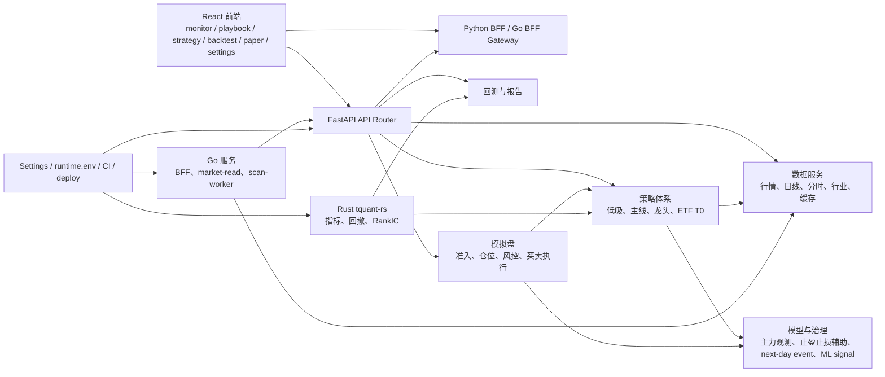

# Understand Anything 全项目系统审查报告（2026-05-28）

## 审查背景

本次审查对象为 `/Users/j/Documents/gupiao`，定位为 A 股量化交易平台，包含 FastAPI 后端、React 前端、Go 微服务、Rust 数学/指标扩展、回测、模拟盘、策略治理、数据补全与部署脚本。

用户要求使用 Understand Anything skills 对整个项目做系统级架构理解和代码审查，重点确认策略体系、低吸/主线/龙头/ETF 做 T/回测/模拟盘链路、主力观测模型、止盈止损辅助模型、next-day event model、Go/Rust 加速路径、API/BFF/数据服务边界、前端主路径、安全权限、测试部署与上线风险。

本次审查只读业务代码，未修改业务代码。由于 `.understand-anything/` 目录被误删，先恢复 Understand Anything 工作目录和图谱产物，再基于知识图谱和源码证据完成审查。

## Understand Anything 执行情况

- 用户指定执行目标：`$understand /Users/j/Documents/gupiao --full --language zh`。
- 实际处理：先恢复 `.understand-anything/` 目录、`.understandignore`、`config.json`，再执行 full 项目图谱生成，并设置输出语言为中文。
- 生成产物：
  - `/Users/j/Documents/gupiao/.understand-anything/knowledge-graph.json`
  - `/Users/j/Documents/gupiao/.understand-anything/domain-graph.json`
  - `/Users/j/Documents/gupiao/.understand-anything/diff-overlay.json`
  - `/Users/j/Documents/gupiao/.understand-anything/meta.json`
- Dashboard：`http://127.0.0.1:5173/?token=c6b5c57ae6fe9bcd49d07558c3f1fc7c`
- Dashboard 运行信息：
  - PID：见 `/Users/j/Documents/gupiao/.understand-anything/dashboard.pid`
  - 日志：`/Users/j/Documents/gupiao/.understand-anything/dashboard.log`
- 图谱元信息：
  - analyzedFiles：1712
  - gitCommitHash：`29ae8a429ad7aeff3c792af8d73d8d1986860f52`
  - analyzedAt：`2026-05-28T13:42:31.571Z`
  - nodes：7797
  - edges：16309
  - layers：11
  - tour：8
- 节点类型分布：
  - function：5103
  - file：1223
  - class：982
  - config：372
  - document：105
  - service：10
  - pipeline：1
  - schema：1
- 领域图谱：
  - domain nodes：8
  - flow nodes：10
  - total domain graph nodes：40
  - edges：54
- Diff overlay：
  - changedFiles：73
  - changedNodeIds：238
  - affectedNodeIds：12

说明：本次 Understand Anything 的 full 图谱、domain 图谱和 diff overlay 都已生成。由于环境中不允许通过子代理方式委派额外 agent，本报告采用知识图谱、domain 图谱、diff overlay 与源码证据联合审查。

## 项目架构图谱摘要

核心主路径可以归纳为：

1. 实时监控：`/monitor` -> BFF/monitor/market/review -> 行情与市场结构 -> 前端工作台。
2. 选股宝典/低吸候选：`/playbook` -> low-buy screening -> 策略池、主线过滤、候选评分、主力观测 shadow、优先级排序。
3. 策略工作台：`/strategy` -> 策略元数据/快速回测入口 -> backtest API。
4. 回测：`/backtest` -> backtests router/job/service -> 结果、报告、walk-forward 研究脚本。
5. 模拟盘：`/paper` -> paper auth -> priority board -> admission -> validation phase -> portfolio/sizing -> risk control -> order executor；卖出由 dynamic exit 规则主导，exit model 只做 shadow。
6. 设置与部署：`/settings` -> settings service -> DB settings/runtime.env/encryption/admin auth；CI 覆盖后端、前端、Go、Rust，main 分支可触发部署脚本。

## 核心业务链路说明

### 数据采集与补全链路

数据链路由 Python 后端主导，核心职责分布在行情 provider、market services、repositories、background jobs 和数据快照表。`background_jobs.py` 注册数据补全、策略物化、ML 增量训练、因子挖掘、账本对账等循环任务。`SettingsService` 从 DB 与 `runtime.env` 合并运行时配置，数据源和数据库 URL 可通过 settings 管理。

Go `market-read-service` 是读路径加速组件，Python `go_read_client.py` 会按配置优先读 Go 服务，失败后回到 Python 读取路径。这个设计是合理的读加速模式，不把 Go 作为唯一数据真相来源。

主要证据：

- `/Users/j/Documents/gupiao/backend/app/runtime/background_jobs.py`
- `/Users/j/Documents/gupiao/backend/app/services/market/go_read_client.py`
- `/Users/j/Documents/gupiao/go-services/market-read-service/main.go`
- `/Users/j/Documents/gupiao/backend/app/services/settings_service.py`

### 实时监控链路

前端默认首页重定向到 `/monitor`。React route 定义显示当前主产品路径为 `monitor -> playbook -> strategy/backtest/paper/settings`，`/low-buy` 和 `/performance` 已被重定向到主入口，减少了历史入口的用户暴露。

实时监控数据从 Python BFF 或 Go BFF 聚合工作台数据，后端再读取 monitor、market、review、paper、strategy 等服务。Go BFF 支持 fallback 到 Python API，适合做边缘聚合和性能优化。

主要证据：

- `/Users/j/Documents/gupiao/frontend/src/app/router/webRouteDefinitions.tsx:44`
- `/Users/j/Documents/gupiao/backend/app/api/routes/bff.py`
- `/Users/j/Documents/gupiao/go-services/bff-gateway/workspace_aggregate.go`

### 选股宝典/低吸候选链路

低吸链路较清晰：策略 policy 定义生产/辅助/研究/因子层，screening 读取榜单池、主线强度、市场状态、回撤桶、策略扫描池，随后进行候选评估、去重、龙头强度增强、主力观测增强、实时行情应用和最终排序。

关键判断：

- 生产优先级只允许 core + auxiliary。
- research/factor 策略的强买信号被暂停。
- 主线策略在主线数据不足时会清空 hot industries，使策略不进入生产执行。
- 重复策略命中通过 family overlap multiplier 降权，避免多个相近策略叠加污染排序。

主要证据：

- `/Users/j/Documents/gupiao/backend/app/services/low_buy/strategy_policy.py:13`
- `/Users/j/Documents/gupiao/backend/app/services/low_buy/screening.py:125`
- `/Users/j/Documents/gupiao/backend/app/services/low_buy/priority_scoring.py:46`

### 策略工作台链路

策略工作台 `/strategy` 由 `StrategyHubPage` 承载，主要提供策略状态、快速/专家回测入口和策略说明。它没有直接改变生产策略参数，生产参数仍由后端 settings、quant config、strategy governance 等边界控制。

主要证据：

- `/Users/j/Documents/gupiao/frontend/src/features/strategy/StrategyHubPage.tsx`
- `/Users/j/Documents/gupiao/backend/app/api/routes/backtests.py`
- `/Users/j/Documents/gupiao/backend/app/api/routes/strategy_meta.py`

### 回测链路

回测链路分为在线 API 回测和离线报告脚本两类。API 层由 `backtests.py` 暴露，脚本层存在 24 个月回测、walk-forward、市场状态 guard、退出参数 walk-forward、主力模型 readiness 等报告生成器。

最近变更方向是保守的：新增指标和报告 gate 明确“不直接写生产参数”，主力模型 readiness 从可晋级转为不可晋级，策略优化报告测试要求所有候选保持非 production eligible。

主要证据：

- `/Users/j/Documents/gupiao/backend/app/api/routes/backtests.py`
- `/Users/j/Documents/gupiao/backend/scripts/main_force_model_backtest.py`
- `/Users/j/Documents/gupiao/backend/tests/test_strategy_24m_optimization_report.py:19`

### 模拟盘买入/卖出/止盈止损链路

模拟盘买入链路：

1. paper route 要求登录用户具备模拟盘白名单和 `paper_trade` 权限。
2. auto trader 读取 priority board。
3. `AdmissionFilter` 过滤风险、市场状态、价格状态、今日订单、已有持仓。
4. `apply_strategy_validation_phase` 根据真实成交样本和健康分打上 phase。
5. `PositionSizer` 使用默认仓位、半 Kelly、final position cap、validation phase scale、portfolio weight scale 取最小上限。
6. `PaperRiskController` 做账户、单笔、单票、每日买入、手续费等前置风控。
7. `PaperTradingExecutor` 执行真实模拟订单或 dry-run。

卖出/止盈止损链路：

1. `scheduler_exit.py` 获取最新行情，不允许在行情不可用时用持仓旧价兜底。
2. `evaluate_paper_exit` 的动态退出规则决定实际卖出。
3. `ExitModelAdvisor` 只生成 shadow payload，并写入 `record_exit_model_shadow`。
4. 实际订单仍由规则决策产生，模型建议不会覆盖硬止损。

主要证据：

- `/Users/j/Documents/gupiao/backend/app/core/paper_auth.py:11`
- `/Users/j/Documents/gupiao/backend/app/services/paper/admission.py`
- `/Users/j/Documents/gupiao/backend/app/services/paper/strategy_phase_gate.py:14`
- `/Users/j/Documents/gupiao/backend/app/services/paper/sizing.py:130`
- `/Users/j/Documents/gupiao/backend/app/services/paper/risk_control.py`
- `/Users/j/Documents/gupiao/backend/app/services/paper/scheduler_exit.py:38`

### 主力观测模型链路

主力观测模型目前定位清楚：默认是 shadow-only/read-only。候选增强会构造 features，由 `MainForceAdvisor` 输出 stage/action/score/confidence，并通过 `record_main_force_shadow` 写入 `MarketModelObservation`。只有在 `main_force_model_ranking_enabled=true` 且 shadow `promotion_ready=true`、策略在 allow-list、数据质量和风险条件满足时，才会给排序增加 bonus。默认配置里 ranking 是 disabled。

模拟盘中的主力模型建议也默认只读；即使开启 suggestion，也只是 `manual_import_only`，不是自动下单。

主要证据：

- `/Users/j/Documents/gupiao/backend/app/services/low_buy/main_force_model_advisor.py:15`
- `/Users/j/Documents/gupiao/backend/app/services/low_buy/main_force_model_enrichment.py:18`
- `/Users/j/Documents/gupiao/backend/app/services/low_buy/main_force_model_shadow.py:17`
- `/Users/j/Documents/gupiao/backend/app/services/low_buy/main_force_model_ranking.py:9`
- `/Users/j/Documents/gupiao/backend/app/services/paper/main_force_paper_advisor.py:16`
- `/Users/j/Documents/gupiao/backend/app/api/routes/settings.py:121`

### 止盈止损辅助模型链路

止盈止损辅助模型当前没有替代规则卖出。实际退出由 `evaluate_paper_exit` 规则输出；辅助模型仅记录模型建议、confidence、reason、fallback、feature snapshot。近期 walk-forward 报告中，退出参数候选即使通过部分窗口，也仍标记为 shadow candidate，不能直接进入生产。

主要证据：

- `/Users/j/Documents/gupiao/backend/app/services/paper/scheduler_exit.py:71`
- `/Users/j/Documents/gupiao/backend/app/services/paper/scheduler_exit.py:129`
- `/Users/j/Documents/gupiao/docs/reports/exit-parameter-walk-forward-2026-05-28/summary.json`

### Go/Rust 加速链路

Go 路径分三类：

- Go BFF Gateway：聚合工作台数据，并可 fallback 到 Python。
- Go market-read-service：读 Redis/行情缓存，Python 读路径可优先调用，失败 fallback。
- Go scan-worker：已接入生产扫描编排，但策略引擎仍是 Python reference；Go 只是 orchestrator，不是独立 Go 策略引擎。

Rust 路径进入了真实主路径：

- `rust_max_drawdown` 被绩效指标调用。
- RSI、ATR、Bollinger、VWAP、RankIC 等指标调用 Rust wrapper。
- Rust module 不存在或异常时 fallback 到 Python，并暴露 hit/fallback/error/disabled Prometheus 指标。

主要证据：

- `/Users/j/Documents/gupiao/go-services/scan-worker/cmd/scan-worker/main.go:31`
- `/Users/j/Documents/gupiao/backend/app/services/market/go_read_client.py`
- `/Users/j/Documents/gupiao/backend/app/services/finance/rust_math.py:28`
- `/Users/j/Documents/gupiao/backend/app/services/finance/performance_math.py:50`
- `/Users/j/Documents/gupiao/backend/app/services/indicators.py:104`
- `/Users/j/Documents/gupiao/backend/app/main.py:396`

### 设置与部署链路

Settings service 支持 DB settings + runtime.env 覆盖，敏感字段 `llm_api_key`、`database_url` 做脱敏/加密处理，`LLM_API_KEY` 不会持久写回 runtime.env。生产安全配置会校验 secure cookie、strict samesite、强 auth secret、非 memory rate limiter、微服务 internal token、独立 settings encryption key。

CI 覆盖后端、前端、Go、Rust；部署 job 在 main push 后执行脚本部署，但 workflow 中 `RUN_FULL_TESTS=0`、`HTTPS_REQUIRED=0`，上线 gate 仍需加强。

主要证据：

- `/Users/j/Documents/gupiao/backend/app/services/settings_service.py:21`
- `/Users/j/Documents/gupiao/backend/app/core/security_config.py:9`
- `/Users/j/Documents/gupiao/.github/workflows/ci.yml:109`

## 策略体系审查

结论：策略分层总体清楚，主路径没有发现明显策略互相污染。低吸、主线、龙头、ETF T0、回测、模拟盘之间的职责基本一致，但研究/ML/factor/agent 相关 API 面过宽，容易在产品和运营层形成“看起来可生产”的误解。

正向结论：

- `CORE_STRATEGIES`、`AUXILIARY_STRATEGIES`、`RESEARCH_STRATEGIES`、`FACTOR_STRATEGIES` 分层明确。
- `PRODUCTION_PRIORITY_STRATEGIES = CORE | AUXILIARY`，研究/因子策略不进入 strong buy。
- 主线策略要求 hot industries 来源为 `mainline_strength`，否则不进入生产执行。
- 策略重复命中通过 family overlap 降权，减少重复策略堆分。
- 策略验证 phase 已进入模拟盘仓位上限，`validation_position_scale` 会被 `PositionSizer` 取最小 cap。

主要风险：

- 产品入口仍暴露较多研究、ML、agent、factor 能力，虽然多数有 admin auth 或治理 gate，但边界主要靠每个 route 自治，不够像“生产路由 allow-list”。
- ML signal 有训练、晋级、预测 API，但从全局搜索看，`/ml/signals/predict` 主要是独立 API surface，没有接入 `monitor -> playbook -> paper` 主路径，容易形成未接入的能力面。

## 模型体系审查

结论：主力观测模型和止盈止损辅助模型默认没有越权进入自动交易主路径；next-day event model 只对明确策略集合生成计划。但模型治理还存在样本去重、shadow 记录可观测性和 next-day event 验收不足的问题。

主力观测模型：

- 默认 display/shadow enabled，ranking disabled。
- ranking bonus 只有在 shadow promotion ready 且开关启用时生效。
- 最近变更明确将主力模型生产 readiness 降为 false：`oos_promotion_ready=false`，`promotion_blockers` 包含 `true_walk_forward_train_valid_test_not_implemented`、shadow 样本不足、settled 样本不足、fallback rate 过高。

止盈止损辅助模型：

- 实际卖出由规则模型决定。
- Exit helper 写 shadow record，不覆盖硬止损。
- 最近 walk-forward 仍是 shadow candidate，不允许直接改生产参数。

next-day event model：

- 支持策略集合写死在 `EVENT_MODEL_STRATEGIES`。
- 对其他策略返回空计划。
- 风险在于该模型输出已经进入 candidate payload，但缺少独立 shadow/验收报告。

ML signal：

- 训练和晋级门槛较完整，含样本数、accuracy、AUC、CV 均值/方差、AUC gap、artifact checksum、人工 approve。
- 当前更像研究/管理能力面，未看到其预测输出进入低吸排序或模拟盘自动买入主路径。

## Go/Rust 主路径审查

结论：Rust 是真实主路径加速；Go market-read 和 Go BFF 是可用的读/聚合加速；Go scan-worker 已接入扫描编排，但不是 Go 策略引擎。

Go：

- BFF Gateway：真实可接入，有 fallback。
- market-read-service：真实读路径可接入，有 fallback。
- scan-worker：真实进入生产扫描编排，但核心策略计算仍调用 Python reference。
- 风险：`production_write_enabled=true` 容易被误解为 Go 策略引擎已生产化，实际 status 已写明 `strategy_engine=python_reference`。

Rust：

- `tquant_rs` 被 Python wrapper 调用，进入回撤、RSI、ATR、Bollinger、VWAP、RankIC 等主路径。
- fallback 存在且可观测，但如果生产环境缺 wheel，会静默回 Python，性能承诺可能失真。
- CI 有 Rust cargo test、maturin build、wheel smoke、bench baseline。

## 前端页面与产品链路审查

结论：前端主产品路径已经收敛到实时监控、选股宝典、策略、回测、模拟盘、设置，旧入口通过 redirect 处理；但页面和工作台组件仍偏重，`MonitorPage` 与若干后台页面过大，存在重复入口/重复信息的维护风险。

正向结论：

- `/` -> `/monitor`
- `/low-buy` -> `/playbook`
- `/performance` -> `/paper`
- Settings 对 admin 和普通用户做了 tab 分离。
- Playbook 页面围绕可执行、观察、接近买点、观察/放弃、最近表现和今日主看展开，贴近策略主路径。

风险：

- `MonitorPage.tsx` 约 989 行，承担过多业务状态和展示逻辑。
- route wrappers、WorkspaceRoute、Trading workspace、feature pages 的层级仍偏复杂。
- 设置页同时承载账户、交易参数、LLM、因子、数据源、诊断、治理、审计，对管理员可用但维护成本高。

## 后端 API 与数据链路审查

结论：后端功能完整但 API surface 偏宽。核心业务服务与研究/agent/ML/factor/runtime/admin/internal 路由都挂在同一 `api_router`，如果生产环境没有 route allow-list，暴露面会随功能增长不断扩张。

正向结论：

- 多数高风险写接口有 `require_admin_auth` 或 `get_current_user`。
- internal service token middleware 会拦截带 BFF hop 或 internal token 的请求，缺 token 或 token 不匹配直接 403。
- feature flag 更新有单独 audit log 和 operation audit。
- settings 敏感字段加密/脱敏，runtime.env 不写回 LLM key。

风险：

- `/api/admin/users` 可以改用户角色、启停、模拟盘白名单，但未看到 operation audit。
- `/api/runtime-tasks` 可以 enqueue runtime task，依赖 admin auth，但未看到 operation audit。
- audit middleware 的 prefix 未覆盖 `/api/admin`、`/api/runtime-tasks` 等高风险路径。

## 安全与权限审查

结论：认证和基础安全配置有较完整的防线，但权限变更审计和自动模拟交易默认值需要上线前收紧。

已具备的防线：

- production-like 环境会强制 secure cookie、strict samesite、强 auth secret、非 memory rate limiter、微服务 internal token、独立 settings encryption key。
- 管理接口支持 admin bearer 或 `ADMIN_API_TOKEN`，未配置 token 时拒绝。
- 模拟盘要求登录用户在白名单中，并具备 `paper_trade` 权限。
- CSP、X-Frame-Options、nosniff、Permissions-Policy 已设置。

需要加强：

- 管理员用户权限变更必须入审计。
- runtime task enqueue 必须入审计。
- 模拟盘自动交易默认不要在生产中自动启动非 dry-run。

## 测试与部署审查

结论：测试面较宽，包含后端 pytest、前端 lint/build/test、Go test、Rust test/build/smoke/bench。但部署 workflow 的上线 gate 还不够硬，尤其是 `RUN_FULL_TESTS=0` 和 `HTTPS_REQUIRED=0`。

已具备：

- 后端 compile + pytest。
- 前端 lint/build/vitest。
- Go bff/market/scan test。
- Rust cargo test、maturin build、wheel smoke、bench baseline。
- 近期新增测试明确阻止策略优化报告、主力模型、退出模型直接晋级生产。

不足：

- Deploy job 依赖 CI 通过，但部署脚本自身关闭 full tests。
- HTTPS_REQUIRED 在 workflow 中为 0，不适合作为生产默认。
- 缺少“生产路由 allow-list + route auth manifest + audit coverage”类上线检查。

## Understand Diff 最近变更影响

diff overlay 排除 `.understand-anything/` 后显示：

- changedFiles：73
- changedNodeIds：238
- affectedNodeIds：12
- 影响节点主要集中在：
  - `backend/app/core/database.py`
  - `backend/app/models/entities.py`
  - `backend/app/repositories/low_buy/__init__.py`
  - `backend/app/services/etf/universe.py`
  - `backend/app/services/low_buy/execution_simulation.py`
  - `backend/app/services/low_buy/main_force_model_*`
  - `backend/app/services/low_buy/strategy_families.py`
  - `backend/app/services/low_buy_screener.py`
  - `backend/scripts/low_buy_market_backtest.py`

最近变更判断：

- 未发现生产 runtime 路由或模拟盘主执行路径被直接改写。
- 主要变更是回测报告指标、主力模型 readiness 降级、24 个月策略优化报告、walk-forward 报告和相应测试。
- 变更方向偏保守：强调不允许直接写生产参数、不允许把静态归因和研究报告当作生产验收。
- 风险是报告/脚本/JSON 产物大量增加，容易让“研究结论、shadow 结论、生产配置”边界在文档和产品层混淆。

## P0/P1/P2/P3 问题清单

### P0

未发现 P0。没有发现模型直接绕过风控自动下真实交易订单，也没有发现主力模型或止盈止损辅助模型无门槛覆盖生产买卖决策。

### F-01 模拟盘自动交易默认启用且默认非 dry-run

- 严重程度：P1
- 问题描述：`paper_auto_trading_enabled=True` 且 `paper_auto_trading_dry_run=False` 是默认配置；`background_jobs.py` 在启动后台任务时会自动启动模拟盘自动交易。`PaperAutoTrader` docstring 写着 defaults to dry-run，但实际从 settings 构造时默认是非 dry-run。
- 影响模块：模拟盘、自动交易、风控、后台任务。
- 证据文件/函数：
  - `/Users/j/Documents/gupiao/backend/app/core/config.py:166`
  - `/Users/j/Documents/gupiao/backend/app/runtime/background_jobs.py:465`
  - `/Users/j/Documents/gupiao/backend/app/services/paper/scheduler.py:52`
  - `/Users/j/Documents/gupiao/backend/app/services/paper/scheduler.py:498`
- 是否影响生产：是。生产部署如果开启后台任务，会启动模拟盘交易循环。
- 是否影响策略结果：不影响策略评分本身。
- 是否影响模拟盘/自动交易/风控：是。会产生模拟盘订单，不是 dry-run。
- 修复建议：生产默认改为 `paper_auto_trading_enabled=False` 或 `paper_auto_trading_dry_run=True`；要求管理员显式启动并记录启动审计；启动状态在 settings/runtime diagnostics 中明确显示。
- 应补测试：生产配置默认不自动启动 auto trader；非交易时段不会启动；管理员 start 不传 dry_run 时生产默认仍为 dry-run；docstring 与配置一致性测试。

### F-02 管理员用户/权限和 runtime task 变更缺少统一 operation audit

- 严重程度：P1
- 问题描述：`/api/admin/users` 可以修改用户启用状态、角色、模拟盘白名单；`/api/runtime-tasks` 可以创建运行任务。两者有 admin auth，但 audit middleware 的 prefix 未覆盖 `/api/admin`、`/api/runtime-tasks`，路由内也未看到 `record_operation_audit`。
- 影响模块：认证、权限、模拟盘白名单、后台任务、审计。
- 证据文件/函数：
  - `/Users/j/Documents/gupiao/backend/app/services/operation_audit_middleware.py:17`
  - `/Users/j/Documents/gupiao/backend/app/api/routes/admin_users.py:74`
  - `/Users/j/Documents/gupiao/backend/app/api/routes/runtime_tasks.py:20`
  - `/Users/j/Documents/gupiao/backend/app/api/router.py:42`
- 是否影响生产：是。生产权限变更和任务创建无法完整追踪。
- 是否影响策略结果：不直接影响。
- 是否影响模拟盘/自动交易/风控：是。可影响用户 paper trading 权限和后台任务触发。
- 修复建议：将 `/api/admin`、`/api/runtime-tasks` 纳入 audit middleware，或在每个高风险 route 内显式写审计；审计 detail 记录变更前后 diff、operator、IP、request id。
- 应补测试：更新用户角色/白名单后生成 operation audit；enqueue runtime task 后生成 operation audit；失败请求也记录 failed audit。

### F-03 后端 API surface 过宽，研究/生产边界依赖单路由自律

- 严重程度：P2
- 问题描述：`api_router` 同时挂载 bff、auth、backtests、admin、internal、analysis、ai、research、agent、paper、feishu、factor、feature flags、runtime tasks、ml signals、v1 等路由。生产暴露面较宽，缺少统一的 production route manifest 或 allow-list。
- 影响模块：后端 API、BFF、研究能力、ML/factor/agent、运维。
- 证据文件/函数：
  - `/Users/j/Documents/gupiao/backend/app/api/router.py:39`
- 是否影响生产：是。增加攻击面和误用面。
- 是否影响策略结果：不直接影响。
- 是否影响模拟盘/自动交易/风控：间接影响，尤其是 paper、runtime、settings、admin 相关路由。
- 修复建议：引入生产 route manifest，按 `core/research/admin/internal` 分类；生产只暴露 core allow-list；research/agent/ml/factor 默认 behind admin + feature flag + route gate。
- 应补测试：生成路由清单快照；生产配置下 research/agent/ml/factor 路由未显式开启则 404/403；每个 mutating route 都有 auth 和 audit 断言。

### F-04 Go scan-worker 已接入编排，但状态字段容易被误解为 Go 策略引擎生产化

- 严重程度：P2
- 问题描述：scan-worker status 返回 `production_scan_enabled=true`、`production_write_enabled=true`，但常量同时说明 `strategy_engine=python_reference`、`scan_worker_role=go_orchestrated_reference`。这表示 Go 只做编排和发布确认，不是独立 Go 策略引擎。
- 影响模块：Go scan-worker、低吸扫描、运维监控、性能宣称。
- 证据文件/函数：
  - `/Users/j/Documents/gupiao/go-services/scan-worker/cmd/scan-worker/main.go:31`
  - `/Users/j/Documents/gupiao/go-services/scan-worker/cmd/scan-worker/main.go:91`
  - `/Users/j/Documents/gupiao/go-services/scan-worker/cmd/scan-worker/main.go:152`
- 是否影响生产：是，主要是运维认知和故障切换。
- 是否影响策略结果：不影响，结果仍来自 Python reference。
- 是否影响模拟盘/自动交易/风控：间接影响，扫描物化结果会进入候选池。
- 修复建议：将 status 字段拆成 `go_orchestrator_enabled`、`python_reference_strategy_engine=true`、`go_strategy_engine_enabled=false`；前端/监控不得展示为“Go 策略已生产加速”。
- 应补测试：scan-worker status contract 测试；Python reference 失败时 fallback/502 行为测试；排序一致性字段测试。

### F-05 Go BFF shadow 只记录日志，缺少持久化 shadow observation

- 严重程度：P2
- 问题描述：Go BFF shadow check 会比较 schema、字段和 manifest，但结果只写 logger warning，没有写 DB observation 或 Prometheus parity counter。对“shadow 是否实际记录”的可审计性不足。
- 影响模块：Go BFF、BFF parity、观测性、上线验证。
- 证据文件/函数：
  - `/Users/j/Documents/gupiao/backend/app/services/bff/go_gateway_shadow.py:18`
  - `/Users/j/Documents/gupiao/backend/app/services/bff/go_gateway_shadow.py:58`
  - `/Users/j/Documents/gupiao/backend/app/services/bff/go_gateway_shadow.py:82`
- 是否影响生产：间接影响。Go BFF 上线前缺少可追溯 parity 样本。
- 是否影响策略结果：不直接影响。
- 是否影响模拟盘/自动交易/风控：不直接影响。
- 修复建议：新增 `BffShadowObservation` 或通用 shadow observation 表，记录 workspace、schema version、diff summary、status、latency、request id；同时暴露 metrics。
- 应补测试：shadow success/mismatch/failure 都产生 observation；dashboard 能查询最近 shadow 结果。

### F-06 主力模型 shadow 样本按 signal_state 去重，可能放大同一股票同一天样本数

- 严重程度：P2
- 问题描述：主力模型 shadow upsert 使用 `model_key + symbol + trade_date + signal_state` 查找记录。同一股票同一交易日如果 action 状态变化，可能生成多条 observation，进而影响 `record_count` 和晋级门槛解释。
- 影响模块：主力观测模型、shadow 样本、模型晋级 gate。
- 证据文件/函数：
  - `/Users/j/Documents/gupiao/backend/app/services/low_buy/main_force_model_shadow.py:53`
  - `/Users/j/Documents/gupiao/backend/app/services/low_buy/main_force_model_shadow.py:99`
  - `/Users/j/Documents/gupiao/backend/app/services/low_buy/main_force_model_shadow.py:266`
- 是否影响生产：只有在未来开启 ranking/paper suggestion 晋级时影响生产。
- 是否影响策略结果：开启 ranking 后可能影响排序门槛。
- 是否影响模拟盘/自动交易/风控：当前默认不影响；开启模型 suggestion 或 ranking 后会间接影响。
- 修复建议：定义主样本粒度为 `model_key + symbol + trade_date`，signal_state 放 payload；如需多状态样本，summary 必须按 symbol/date 去重后计算 promotion gate。
- 应补测试：同 symbol/date 不同 signal_state 只算一个 promotion sample；summary record_count 和 settled_count 去重。

### F-07 next-day event model 已进入候选 payload，但缺少独立验收与 shadow 统计

- 严重程度：P2
- 问题描述：`build_next_day_event_plan` 对指定策略生成次日行动、止盈、持有天数、确认规则，并在 candidate 构造时写入 payload。它不会直接下单，但会影响前端和人工决策；目前未看到独立 backtest/shadow 统计。
- 影响模块：低吸候选、前端选股宝典、人工交易解释、策略验收。
- 证据文件/函数：
  - `/Users/j/Documents/gupiao/backend/app/services/low_buy/next_day_event_model.py:8`
  - `/Users/j/Documents/gupiao/backend/app/services/low_buy/next_day_event_model.py:22`
  - `/Users/j/Documents/gupiao/backend/app/services/low_buy/candidate.py:309`
- 是否影响生产：间接影响。作为解释和次日行动建议可能影响人工执行。
- 是否影响策略结果：不直接影响排序，但影响策略解释和人工选择。
- 是否影响模拟盘/自动交易/风控：当前不直接影响自动交易。
- 修复建议：为 next-day event model 增加 shadow outcome 表或报告，统计次日/t+2 是否达成、冲高兑现、失效退出、回撤；未达门槛时 UI 标为 research hint。
- 应补测试：非 allow-list 策略返回空计划；allow-list 策略的 outcome 记录完整；无 shadow 门槛时不能标为 production recommendation。

### F-08 静态行业归因使用当前 `Instrument.sector_name`，不能作为生产历史回测依据

- 严重程度：P2
- 问题描述：近期新增静态行业归因使用当前 instrument 表的 sector_name。代码已写明只能用于研究归因，生产级历史回测需要 `instrument_industry_history`。如果后续被产品或报告误用为生产依据，会引入历史口径漂移和元数据泄漏风险。
- 影响模块：24 个月回测报告、行业归因、策略优化决策。
- 证据文件/函数：
  - `/Users/j/Documents/gupiao/backend/scripts/strategy_24m_static_attribution.py:18`
  - `/Users/j/Documents/gupiao/backend/scripts/strategy_24m_static_attribution.py:47`
- 是否影响生产：当前不影响；被误用时影响。
- 是否影响策略结果：被用于筛选或参数优化时会影响。
- 是否影响模拟盘/自动交易/风控：不直接影响。
- 修复建议：补历史行业/概念快照表，所有历史回测按 trade_date join 历史行业；静态归因报告加醒目的 non-production tag。
- 应补测试：历史行业 join 使用 as-of trade_date；报告中静态归因不能输出 `production_eligible=true`。

### F-09 Rust fallback 有指标但缺少生产 readiness 硬门槛

- 严重程度：P2
- 问题描述：Rust wrapper 真实进入主路径，但如果 `tquant_rs` 缺失会 fallback 到 Python，并只增加 fallback metric。生产如果声称 Rust 加速已启用，需要启动前或健康检查确认 wheel 可加载、fallback rate 在阈值内。
- 影响模块：Rust 加速、指标计算、回测性能、生产监控。
- 证据文件/函数：
  - `/Users/j/Documents/gupiao/backend/app/services/finance/rust_math.py:289`
  - `/Users/j/Documents/gupiao/backend/app/main.py:396`
  - `/Users/j/Documents/gupiao/.github/workflows/ci.yml:87`
- 是否影响生产：是，影响性能承诺和运行状态判断。
- 是否影响策略结果：正常 fallback 不应影响结果；Rust/Python parity 出问题时可能影响。
- 是否影响模拟盘/自动交易/风控：间接影响指标计算性能与延迟。
- 修复建议：新增 `/readyz` 或 admin diagnostics 中的 Rust module load check；当 `rust_finance_math_enabled=true` 且生产环境无法 import 时，readiness fail 或明确 degraded。
- 应补测试：Rust enabled + module missing 时 readiness degraded；fallback metric 增长触发告警；关键指标 Rust/Python parity fixture。

### F-10 部署 workflow 未强制 full tests 和 HTTPS required

- 严重程度：P2
- 问题描述：CI 覆盖面较好，但 deploy job 中 `RUN_FULL_TESTS=0`、`HTTPS_REQUIRED=0`。如果部署脚本没有额外 gate，生产发布缺少强制全量回归和 HTTPS 确认。
- 影响模块：CI/CD、部署、上线回滚。
- 证据文件/函数：
  - `/Users/j/Documents/gupiao/.github/workflows/ci.yml:109`
  - `/Users/j/Documents/gupiao/.github/workflows/ci.yml:127`
- 是否影响生产：是。
- 是否影响策略结果：不直接影响。
- 是否影响模拟盘/自动交易/风控：间接影响，部署缺陷可能影响风控和交易任务。
- 修复建议：生产部署默认 `HTTPS_REQUIRED=1`；部署前执行 `make prod-preflight` 或等价脚本；保留上一版镜像/包和 DB migration rollback plan。
- 应补测试：deploy dry-run 检查 HTTPS、env、DB、Redis、internal token、Rust wheel、Go services；失败时不执行部署。

### F-11 ML signal 预测 API 暂未接入主策略路径，属于研究/管理 surface

- 严重程度：P3
- 问题描述：ML signal 有样本构建、训练、模型列表、晋级、预测 API 和后台增量训练，但全局调用关系中未看到 `/ml/signals/predict` 被低吸排序、模拟盘或 monitor 主路径消费。若产品展示为“已增强策略”，会形成壳代码/未接入主路径误解。
- 影响模块：ML signal、研究能力、产品说明、策略治理。
- 证据文件/函数：
  - `/Users/j/Documents/gupiao/backend/app/api/routes/ml_signals.py:103`
  - `/Users/j/Documents/gupiao/backend/app/services/ml_signal/promotion_service.py:20`
  - `/Users/j/Documents/gupiao/backend/app/runtime/background_jobs.py:442`
- 是否影响生产：当前不影响。
- 是否影响策略结果：当前不影响主路径策略结果。
- 是否影响模拟盘/自动交易/风控：当前不影响。
- 修复建议：在 route manifest 和 UI 中标为 research/admin only；如要接入主路径，必须定义 feature flag、shadow、parity、promotion gate、回滚开关。
- 应补测试：生产 route manifest 标记 ML predict 非核心路径；未启用 feature flag 时不能影响 priority score 或 paper order。

### F-12 前端主路径已收敛，但页面和入口层级仍偏重

- 严重程度：P3
- 问题描述：虽然 `/low-buy`、`/performance` 已 redirect，主路径较清楚，但 Monitor、Settings、Paper worker 和 route wrapper 层级仍较重，存在重复入口、重复信息和维护成本问题。
- 影响模块：前端页面、产品主路径、可维护性。
- 证据文件/函数：
  - `/Users/j/Documents/gupiao/frontend/src/app/router/webRouteDefinitions.tsx:44`
  - `/Users/j/Documents/gupiao/frontend/src/features/monitor/MonitorPage.tsx` 约 989 行
  - `/Users/j/Documents/gupiao/frontend/src/features/paper/PixelTraderWorker.tsx` 约 479 行
  - `/Users/j/Documents/gupiao/frontend/src/features/settings/SettingsPage.tsx:175`
- 是否影响生产：不直接影响。
- 是否影响策略结果：不影响。
- 是否影响模拟盘/自动交易/风控：不直接影响。
- 修复建议：以 `monitor -> playbook -> strategy/backtest -> paper -> settings` 为唯一产品导航模型；拆分 MonitorPage 的行情、主线、候选、告警、任务状态区域；Settings 按 admin 子页面拆分。
- 应补测试：路由快照测试；主导航只显示主路径；旧入口 redirect 测试；移动端布局截图回归。

### F-13 多个后端/脚本单文件过大，职责混杂

- 严重程度：P3
- 问题描述：部分文件超过 450-700 行，承担 API、编排、计算、展示 payload 等多类职责，降低审查和回归定位效率。
- 影响模块：后端 API、market review、background jobs、回测脚本、Go/Rust 验收脚本。
- 证据文件/函数：
  - `/Users/j/Documents/gupiao/backend/app/api/routes/backtests.py` 约 694 行
  - `/Users/j/Documents/gupiao/backend/app/services/market/review.py` 约 767 行
  - `/Users/j/Documents/gupiao/backend/app/runtime/background_jobs.py` 约 475 行
  - `/Users/j/Documents/gupiao/backend/app/main.py` 约 487 行
  - `/Users/j/Documents/gupiao/scripts/verify_go_rust_performance_acceptance.py` 约 535 行
- 是否影响生产：不直接影响。
- 是否影响策略结果：不直接影响。
- 是否影响模拟盘/自动交易/风控：间接影响维护质量。
- 修复建议：按 route handler/service/schema/presenter 拆分；background jobs 拆注册表和 job implementations；验收脚本拆采集、断言、报告渲染。
- 应补测试：拆分前后 snapshot/parity 测试，保证 API response schema 不变。

### F-14 Understand 图谱纳入 Rust build target，工具噪音会影响后续图谱质量

- 严重程度：P3
- 问题描述：本次 `.understandignore` 忽略了 `rust-services/**/target/`，但仓库实际 Rust target 在 `rust/tquant-rs/target/`。图谱扫描可能纳入 build artifacts，增加噪音。
- 影响模块：Understand Anything 图谱、后续架构审查效率。
- 证据文件/函数：
  - `/Users/j/Documents/gupiao/.understand-anything/.understandignore:21`
  - `/Users/j/Documents/gupiao/rust/tquant-rs/target/`
- 是否影响生产：否。
- 是否影响策略结果：否。
- 是否影响模拟盘/自动交易/风控：否。
- 修复建议：将 `rust/tquant-rs/target/` 和 `rust/tquant-rs/dist/` 加入 Understand ignore；重新生成图谱。
- 应补测试：图谱扫描文件列表不包含 Rust target/dist artifacts。

## 可直接采用的整改建议

1. 先修 P1：模拟盘自动交易生产默认改为 dry-run 或 disabled；管理员启动写 audit；启动状态放入 diagnostics。
2. 先修 P1：`/api/admin/users` 和 `/api/runtime-tasks` 写 operation audit，覆盖成功与失败。
3. 建立 production route manifest，把 core、research、admin、internal、experimental 路由分层；生产默认只启 core。
4. 给 Go scan-worker 状态字段改名，明确“Go orchestrator + Python reference strategy engine”。
5. 给 Go BFF shadow 增加持久化 observation 和 parity metrics。
6. 主力模型 shadow summary 按 symbol/date 去重，避免 signal_state 变化影响晋级样本。
7. next-day event model 增加 shadow outcome 和验收报告，未达标前 UI 标为 research hint。
8. Rust enabled 时增加 readiness gate 和 fallback rate 告警。
9. 生产 deploy 强制 `HTTPS_REQUIRED=1`，接入 `prod-preflight`，保留回滚手册。
10. 前端只保留一个主导航叙事：实时监控、选股宝典、策略/回测、模拟盘、设置；其他研究入口挂到 admin/research。

## 需要进一步确认的问题

1. 生产环境是否真的启用了 `paper_auto_trading_enabled=True` 和后台任务 leader lock。如果是，F-01 需要上线前立刻修。
2. 是否存在外部网关层 route allow-list。如果网关已经限制 research/admin/internal route，F-03 严重性可降一级。
3. Go BFF shadow 是否由日志系统做了结构化采集和告警。如果没有，F-05 应作为上线前观测性整改。
4. 主力模型 shadow 的业务定义是否允许同 symbol/date 多 signal_state 计多样本。如果不允许，F-06 需要修；如果允许，需要在报告中显式说明样本粒度。
5. ML signal 未来是否计划进入低吸排序或模拟盘。如果计划接入，需要提前设计 feature flag、shadow、promotion gate 和 rollback。
6. 部署脚本内部是否已强制 HTTPS、DB backup、migration preflight 和 smoke test。如果没有，F-10 需要进入发布阻断项。

## 总体上线风险结论

总体结论：当前平台主业务链路已经具备较完整的产品闭环和策略治理框架，核心链路是可理解、可追踪的。低吸策略分层、主线过滤、重复策略降权、模拟盘准入/仓位/风控、主力模型 shadow gate、止盈止损 shadow 边界、Go/Rust fallback 与 CI 覆盖都不是空壳。

但不建议直接以“生产无条件可上线”结论放行。上线前至少应修复两个 P1：模拟盘自动交易默认非 dry-run，以及管理员权限/runtime task 变更审计缺口。P2 中的 route surface、Go scan-worker 语义、Go BFF shadow 持久化、主力 shadow 样本粒度、next-day event 验收、Rust readiness 和部署 gate，也应纳入首轮上线清单。

策略结果层面：未发现近期变更把研究报告或模型输出直接写入生产参数；相反，最近变更整体偏保守，主动阻止主力模型、退出模型和策略优化结果直接晋级生产。

模拟盘/自动交易/风控层面：主流程风控较完整，但默认自动启动非 dry-run 的配置不适合作为生产默认。该项修复前，建议只以人工启动或 dry-run 方式运行模拟盘自动交易。
