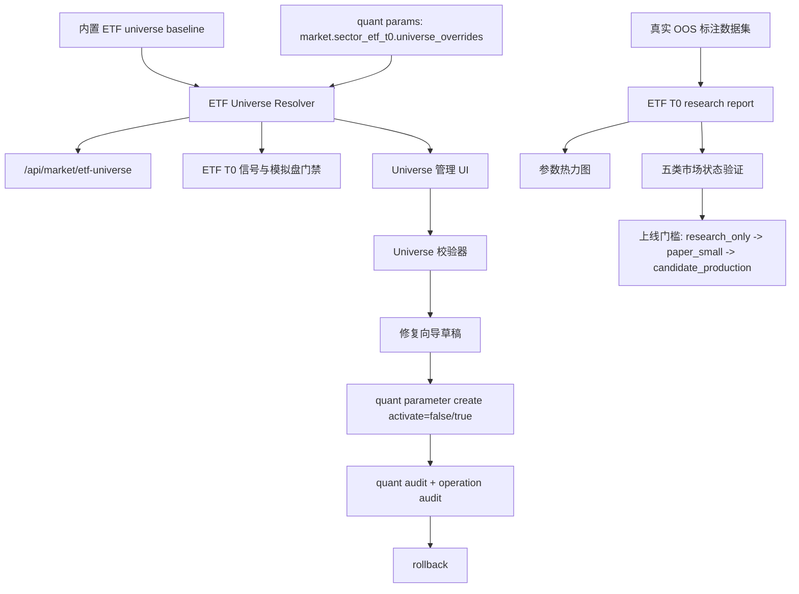

# ETF Universe 管理与真实 OOS 数据集增强方案

日期：2026-05-27  
适用范围：ETF universe、ETF T0 做T、量化参数审计、策略工作台、设置页、回测研究、模拟盘验收  
当前基线：`backend/app/services/etf/universe.py` 已有内置 universe；`market.sector_etf_t0.universe_overrides` 已能通过量化参数运行时覆盖；`/api/backtests/etf-t0-research` 已能输出 ETF T0 参数热力图和五类市场状态自动分段验证。

## 1. 总体目标

本方案补齐两个非阻塞但关键的生产化增强：

1. ETF universe 专用管理 UI / 修复向导  
   让管理员能安全地查看、校验、变更、回滚 ETF universe 覆盖项，避免直接编辑大段量化参数 JSON。

2. 真实标注 OOS 数据集  
   将当前“按分钟线自动切五段”的五类市场验证，升级为带来源、版本、审计、覆盖率和稳定性门槛的真实样本外数据集。

核心原则：

- 不改变已有低吸、筛选、风控、回测、模拟盘账本和自动交易约束。
- ETF universe 只定义品种能力与交易约束，不生成策略信号。
- ETF T0 策略真源仍为 Python；Go 只读行情和聚合 data quality；Rust 只做指标计算加速。
- 管理 UI 默认只做草稿、校验、审计和回滚，不直接绕过模拟盘风控或自动交易门禁。

## 2. 当前状态

### 2.1 已有能力

- `backend/app/services/etf/universe.py`
  - 内置 `EtfProfile`：`symbol`、`category`、`t0_eligible`、`settlement_rule`、`tracking_index`、`min_amount`、`max_spread_bps`、`slippage_bps`、`premium_discount_available`、`enabled_for_t0`、`notes`。
  - 运行时覆盖来自 `market.sector_etf_t0.universe_overrides`。
  - `same_day_sell_allowed` 已用于模拟盘可卖、市场规则和 ETF T0 执行门禁。

- `backend/app/api/routes/market.py`
  - `GET /api/market/etf-universe` 返回 universe 版本、审计路径和 profile 列表。
  - `GET /api/market/etf-minute-snapshots` 通过 Go market-read-service 读取分钟快照和 data quality。

- `frontend/src/features/strategy/EtfT0StrategyStatusPanel.tsx`
  - 已展示 universe、审计路径、Go 分钟快照诊断和上线门槛。

- `frontend/src/features/settings/QuantParameterSectorEtfCard.tsx`
  - 已能配置 ETF T0 自动交易参数，但没有 universe 专用编辑、校验和修复向导。

- `backend/app/api/routes/quant_config.py`
  - 量化参数已有 create、audit、rollback。
  - 管理变更会写 `operation_audit_log`。

- `backend/app/services/etf/t0_backtest.py`
  - 已有 ETF T0 分钟回测、参数热力图、五类市场状态自动分段验证。

### 2.2 当前缺口

- Universe 覆盖项只能通过量化参数 JSON 间接修改，不适合日常运维。
- 缺少专用校验：重复 symbol、无效 category、T0 与 settlement_rule 冲突、min_amount 过低、spread/slippage 异常、跨境/黄金/商品缺折溢价标记。
- 缺少修复向导：不能把“疑似错误 ETF”一步转成可审计草稿。
- 缺少 universe diff：管理员无法直观看到“内置基线 vs 当前覆盖 vs 新草稿”的变化。
- 五类市场状态验证当前是自动分段，不等于真实 OOS。它能做 smoke，但不能作为生产参数升档依据。
- 缺少 OOS 数据集版本、覆盖率、样本来源、市场状态标注质量和验收门槛。

## 3. 目标架构



## 4. ETF Universe 专用管理 UI / 修复向导

### 4.1 产品形态

新增入口：

- 设置页：`设置 -> ETF Universe`
- 策略工作台 ETF T0 面板：增加“管理 Universe”快捷入口

页面分区：

1. Universe 总览
   - 总数、T+0 可用数、禁用数、覆盖项数量、异常项数量、当前版本、审计路径。

2. ETF Profile 表格
   - 字段：代码、名称、分类、T+0、结算规则、是否启用 T0、跟踪指数、最低成交额、最大价差、滑点、折溢价数据、来源、校验状态、备注。
   - 支持筛选：分类、T+0、覆盖项、异常项、数据质量。

3. Diff 面板
   - baseline 值、当前 runtime 值、草稿值。
   - 高风险变化高亮：`t0_eligible false -> true`、`settlement_rule t1 -> t0`、`min_amount` 下调、`max_spread_bps` 上调。

4. 修复向导
   - 输入 symbol/name 或从异常列表选择。
   - 自动推断分类和初始规则。
   - 展示风险提示和校验结果。
   - 生成 `universe_overrides` 草稿。
   - 支持“保存草稿”和“保存并激活”。

5. 审计与回滚
   - 显示最近 universe 变更版本。
   - 一键回滚到指定 quant parameter version。
   - 回滚前展示 diff 和影响标的。

### 4.2 后端设计

#### 4.2.1 新增服务

新增文件：`backend/app/services/etf/universe_admin.py`

职责：

- 生成 baseline/current/draft diff。
- 校验 profile。
- 生成修复建议。
- 将草稿转换为量化参数 `market.sector_etf_t0.universe_overrides`。

核心类型：

```python
@dataclass(frozen=True)
class EtfUniverseValidationIssue:
    symbol: str
    severity: str  # error / warning / info
    field: str
    message: str
    suggested_value: Any | None = None


@dataclass(frozen=True)
class EtfUniverseDiffItem:
    symbol: str
    field: str
    baseline_value: Any
    current_value: Any
    draft_value: Any
    risk_level: str  # high / medium / low
```

校验规则：

- `symbol` 必须非空，长度 1-16。
- `category` 必须属于 `EtfCategory`。
- `t0_eligible=true` 时 `settlement_rule` 必须是 `t0`，否则 error。
- `settlement_rule=t0` 但 `enabled_for_t0=false` 允许，但 warning：表示可 T0 但运营禁用。
- `min_amount <= 0` 为 error。
- `max_spread_bps <= 0` 或 `max_spread_bps > 50` 为 warning。
- `slippage_bps < 0` 或 `slippage_bps > 30` 为 warning。
- `category in cross_border/gold/commodity` 且 `premium_discount_available=false` 为 warning。
- 未知行业 ETF 不允许自动推为 T0，必须来自显式 override 并有 notes。

#### 4.2.2 新增 API

新增文件或扩展：`backend/app/api/routes/market.py`

建议接口：

- `GET /api/market/etf-universe/admin`
  - 权限：管理员。
  - 返回 baseline/current/overrides/validation/diff。

- `POST /api/market/etf-universe/validate`
  - 权限：管理员。
  - 入参：draft overrides。
  - 返回 validation issues + normalized draft。
  - 不写数据库。

- `POST /api/market/etf-universe/repair-draft`
  - 权限：管理员。
  - 入参：symbol/name/category 可选。
  - 返回建议 profile、风险说明、需要人工确认项。
  - 不写数据库。

- `POST /api/market/etf-universe/apply`
  - 权限：管理员。
  - 入参：draft overrides、version、description、activate。
  - 行为：调用 `QuantParameterVersionService.create`，写 quant audit 和 operation audit。

- `POST /api/market/etf-universe/rollback`
  - 权限：管理员。
  - 行为：复用 `QuantParameterVersionService.rollback`，resource_type 标为 `etf_universe`。

不建议直接新建 ETF universe 表作为第一阶段。当前已有量化参数版本、审计和回滚链路，第一阶段复用它，降低迁移风险。

### 4.3 前端设计

新增文件：

- `frontend/src/features/settings/EtfUniverseAdminCard.tsx`
- `frontend/src/stores/etfUniverseAdminStore.ts`
- `frontend/src/api/etfUniverseAdmin.ts`
- `frontend/src/types/etfUniverseAdmin.ts`

页面状态放 Zustand，避免在业务组件里引入新的复杂本地状态。

主要 UI：

- `MetricGrid`：总览指标。
- `DataTable`：profile 表格。
- `DataTable`：校验问题。
- `DataTable`：diff。
- `Modal` 或抽屉：修复向导。
- `Popconfirm`：应用和回滚确认。

关键交互：

1. 打开页面自动加载 admin payload。
2. 点击“新建覆盖项”打开修复向导。
3. 输入 symbol/name，点击“生成建议”。
4. 修改字段后点击“校验草稿”。
5. 校验无 error 才允许保存。
6. 保存时必须填写 version 和 description。
7. 高风险 diff 必须二次确认。
8. 保存成功后刷新 universe 和 audit。

### 4.4 数据契约

建议响应：

```json
{
  "version": "etf-universe-v1",
  "audit_scope": "market.sector_etf_t0.universe_overrides",
  "baseline_count": 24,
  "current_count": 26,
  "override_count": 2,
  "t0_enabled_count": 20,
  "items": [],
  "overrides": {},
  "validation": {
    "error_count": 0,
    "warning_count": 2,
    "issues": []
  },
  "diff": [],
  "recent_versions": []
}
```

## 5. 真实标注 OOS 数据集

### 5.1 目标

把 ETF T0 研究验证从“自动分段 smoke”升级为“可复现、可审计、可比较”的样本外数据集：

- 每个样本有明确市场状态标签。
- 每个标签有来源和置信度。
- 每个数据集有版本、时间范围、分钟线覆盖率、缺失率、标的池和 checksum。
- 每次 ETF T0 research report 能绑定 dataset version。
- 只有真实 OOS 数据集通过，才允许进入 `paper_small` 或 `candidate_production` 建议。

### 5.2 市场状态标签

标准五类：

- `bull`：牛市/强趋势
- `range`：震荡
- `bear`：熊市/弱趋势
- `risk_off`：退潮
- `strong_rebound`：强反弹

兼容当前中文展示：

- `bull -> 牛市`
- `range -> 震荡`
- `bear -> 熊市`
- `risk_off -> 退潮`
- `strong_rebound -> 强反弹`

标注字段：

- `regime`
- `label`
- `start_time`
- `end_time`
- `confidence`
- `source`
- `source_version`
- `notes`

### 5.3 数据模型

第一阶段建议用 JSON manifest + 数据库记录并行：

#### Manifest 文件

新增目录：

- `data/oos/etf_t0/`

示例文件：

- `data/oos/etf_t0/manifest-2026q2-v1.json`

结构：

```json
{
  "dataset_key": "etf_t0_oos_2026q2_v1",
  "version": "2026q2-v1",
  "created_at": "2026-05-27T00:00:00+08:00",
  "symbols": ["510300", "510500", "512480"],
  "period": "1m",
  "start_time": "2026-04-01 09:30",
  "end_time": "2026-05-27 15:00",
  "regime_segments": [
    {
      "regime": "range",
      "label": "震荡",
      "start_time": "2026-04-08 09:30",
      "end_time": "2026-04-12 15:00",
      "confidence": 0.82,
      "source": "market_regime_snapshot",
      "source_version": "market-regime-v1",
      "notes": "市场宽度中性，成交温和，板块轮动较快"
    }
  ],
  "quality": {
    "bar_count": 120000,
    "missing_bar_ratio": 0.012,
    "stale_ratio": 0.004,
    "symbol_coverage_ratio": 0.96
  },
  "checksum": "sha256:..."
}
```

#### 数据库表

第二阶段再加表，避免第一阶段迁移膨胀：

- `etf_t0_oos_dataset`
- `etf_t0_oos_regime_segment`
- `etf_t0_oos_validation_run`

推荐字段：

`etf_t0_oos_dataset`

- `id`
- `dataset_key`
- `version`
- `status`: draft / active / archived
- `symbols_json`
- `period`
- `start_time`
- `end_time`
- `quality_json`
- `checksum`
- `created_by`
- `created_at`

`etf_t0_oos_regime_segment`

- `id`
- `dataset_id`
- `regime`
- `label`
- `start_time`
- `end_time`
- `confidence`
- `source`
- `source_version`
- `notes`

`etf_t0_oos_validation_run`

- `id`
- `dataset_id`
- `symbol`
- `params_json`
- `result_json`
- `passed`
- `created_at`

### 5.4 后端服务

新增文件：

- `backend/app/services/etf/oos_dataset.py`
- `backend/app/services/etf/oos_validation.py`

职责：

- 加载 manifest。
- 校验 manifest。
- 将 regime segments 转换为 `EtfT0MarketRegimeSegment`。
- 检查分钟线覆盖率、缺失率、样本数量。
- 调用 `run_etf_t0_research_report(..., market_regime_segments=segments)`。
- 输出 OOS verdict。

OOS 验收规则：

- 每类市场至少 1 个 segment；缺失的市场状态必须标为 `needs_data`。
- 总 bar_count 不低于阈值，例如 5000。
- `missing_bar_ratio <= 3%`。
- `symbol_coverage_ratio >= 90%`。
- 每个通过参数至少在 3 类市场中不是 fail。
- `risk_off` 中不允许出现显著亏损和过高交易频率。
- `range` 中要求 ETF T0 策略相对基线有净边际。
- 参数热力图不能只靠单一参数点胜出，邻近参数应保持稳定。

### 5.5 API

建议接口：

- `GET /api/backtests/etf-t0-oos/datasets`
  - 列出可用 OOS 数据集。

- `GET /api/backtests/etf-t0-oos/datasets/{dataset_key}`
  - 查看 dataset manifest、质量、状态覆盖。

- `POST /api/backtests/etf-t0-oos/validate`
  - 入参：dataset_key、symbol、quantity、params、param_grid。
  - 返回：base report、heatmap、真实 regime validations、dataset quality、verdict。

- `POST /api/backtests/etf-t0-oos/promote-check`
  - 只读检查：判断是否满足从 research 到 paper_small / candidate_production 的门槛。
  - 不自动修改生产状态。

### 5.6 前端 UI

回测页 ETF T0 面板新增：

- OOS 数据集选择器。
- Dataset quality 卡片。
- 五类市场覆盖表。
- OOS 验证结果表。
- 参数稳定性热力图。
- Promote check 只读结论。

策略工作台 ETF T0 面板新增：

- 当前最新 OOS dataset version。
- 最近一次 OOS 验证结论。
- 未满足门槛的原因。

模拟盘页面新增：

- ETF T0 当前状态：research_only / paper_small / candidate_production。
- 如果未通过 OOS，自动交易仍保持关闭或仅观察。

## 6. 里程碑

### M1：Universe 管理只读与校验

目标：管理员可以看到完整 universe、覆盖项、diff 和校验问题。

后端：

- 新增 `universe_admin.py`。
- 新增 `GET /api/market/etf-universe/admin`。
- 新增 `POST /api/market/etf-universe/validate`。

前端：

- 新增 `EtfUniverseAdminCard`。
- 设置页增加 ETF Universe 管理入口。

验收：

- 能看到 baseline/current/overrides。
- 能识别 T0 与结算规则冲突。
- 无 admin 权限不能访问。

### M2：Universe 修复向导与可审计保存

目标：管理员可以通过向导生成覆盖项，保存为量化参数版本，并支持回滚。

后端：

- 新增 `POST /api/market/etf-universe/repair-draft`。
- 新增 `POST /api/market/etf-universe/apply`。
- 新增 `POST /api/market/etf-universe/rollback` 或复用 quant rollback 并补 resource 标识。

前端：

- 增加修复向导。
- 增加保存草稿、保存并激活、回滚确认。

验收：

- 高风险变更有二次确认。
- 保存会写 `quant_parameter_audit_log` 和 `operation_audit_log`。
- 回滚后 `/api/market/etf-universe` 立即反映旧版本。

### M3：OOS Manifest 与只读验证

目标：ETF T0 research 可以使用真实标注 OOS 数据集，而不是自动分段。

后端：

- 新增 `oos_dataset.py`。
- 新增 manifest loader 和 validator。
- 新增 `GET /api/backtests/etf-t0-oos/datasets`。
- 新增 `POST /api/backtests/etf-t0-oos/validate`。

前端：

- 回测页 ETF T0 面板增加 OOS dataset 选择和验证按钮。

验收：

- Dataset 质量不足时返回明确原因。
- 五类市场覆盖不足时不允许通过。
- 输出 dataset_key、checksum、quality。

### M4：OOS 结果沉淀与上线门槛

目标：OOS 结果能作为 ETF T0 从 research 到 paper_small 的只读准入证据。

后端：

- 新增 OOS validation run 存储。
- 新增 promote-check。
- 将最近一次 OOS 结果展示到策略工作台。

前端：

- 策略工作台展示 OOS 结论。
- 模拟盘展示 ETF T0 阶段和未满足门槛原因。

验收：

- 未通过 OOS 不会自动进入生产候选。
- 通过 OOS 也只生成建议，不绕过人工确认和模拟盘风控。

## 7. 开发任务清单

### 后端任务

1. 新增 `backend/app/services/etf/universe_admin.py`
   - 实现 baseline/current/override diff。
   - 实现 `validate_profile` 和 `validate_overrides`。
   - 实现 `build_repair_draft`。

2. 扩展 schema
   - 修改 `backend/app/models/schema_defs/market.py`。
   - 新增 `EtfUniverseAdminResponse`、`EtfUniverseValidationIssueOut`、`EtfUniverseDiffItemOut`、`EtfUniverseApplyRequest`。

3. 扩展 market route
   - 修改 `backend/app/api/routes/market.py`。
   - 增加 admin-only universe 管理接口。

4. 新增 OOS dataset 服务
   - 新增 `backend/app/services/etf/oos_dataset.py`。
   - 支持从 `data/oos/etf_t0/*.json` 加载 manifest。
   - 校验 checksum、质量、五类覆盖。

5. 新增 OOS validation 服务
   - 新增 `backend/app/services/etf/oos_validation.py`。
   - 调用 `run_etf_t0_research_report` 并注入真实 `market_regime_segments`。

6. 扩展 backtest route
   - 修改 `backend/app/api/routes/backtests.py`。
   - 增加 `/backtests/etf-t0-oos/datasets` 和 `/backtests/etf-t0-oos/validate`。

### 前端任务

1. 新增 API
   - `frontend/src/api/etfUniverseAdmin.ts`
   - `frontend/src/api/etfT0Oos.ts`

2. 新增类型
   - `frontend/src/types/etfUniverseAdmin.ts`
   - `frontend/src/types/etfT0Oos.ts`

3. 新增 Zustand store
   - `frontend/src/stores/etfUniverseAdminStore.ts`
   - `frontend/src/stores/etfT0OosStore.ts`

4. 设置页 UI
   - 新增 `frontend/src/features/settings/EtfUniverseAdminCard.tsx`
   - 修改 `frontend/src/features/settings/SettingsPage.tsx`

5. 回测页 UI
   - 修改 `frontend/src/features/backtest/EtfT0BacktestPanel.tsx`
   - 增加 OOS dataset selector、quality、regime coverage、result table。

6. 策略工作台 UI
   - 修改 `frontend/src/features/strategy/EtfT0StrategyStatusPanel.tsx`
   - 增加最近 OOS 结论。

## 8. 测试计划

### 后端测试

新增：

- `backend/tests/test_etf_universe_admin.py`
- `backend/tests/test_etf_t0_oos_dataset.py`
- `backend/tests/test_etf_t0_oos_validation.py`

覆盖：

- admin 权限校验。
- invalid category 报错。
- `t0_eligible=true` + `settlement_rule=t1` 报 error。
- `min_amount <= 0` 报 error。
- cross_border/gold/commodity 缺折溢价标记报 warning。
- repair draft 不自动激活。
- apply 写 quant audit 和 operation audit。
- rollback 恢复旧 universe。
- OOS dataset 五类覆盖不足不能通过。
- missing_bar_ratio 超阈值不能通过。
- OOS validate 使用真实 segments，不再自动等分。

命令：

```bash
PYTHONPATH=backend:. backend/.venv/bin/python -m pytest \
  backend/tests/test_etf_universe_admin.py \
  backend/tests/test_etf_t0_oos_dataset.py \
  backend/tests/test_etf_t0_oos_validation.py -q
```

回归：

```bash
PYTHONPATH=backend:. backend/.venv/bin/python -m pytest backend/tests -q
```

### 前端测试

新增：

- `frontend/src/features/settings/EtfUniverseAdminCard.test.tsx`
- `frontend/src/features/backtest/EtfT0OosPanel.test.tsx`
- `frontend/src/features/strategy/EtfT0StrategyStatusPanel.test.tsx`

覆盖：

- 只读表格渲染。
- 校验 error 阻止保存。
- 高风险 diff 显示。
- OOS dataset quality 显示。
- OOS 缺失市场状态显示 needs_data。

命令：

```bash
cd frontend
npm test -- --run \
  src/features/settings/EtfUniverseAdminCard.test.tsx \
  src/features/backtest/EtfT0OosPanel.test.tsx \
  src/features/strategy/EtfT0StrategyStatusPanel.test.tsx
npm run lint
npm run build
```

### 部署验收

```bash
./scripts/quick_cloud_deploy.sh --performance-verify
./scripts/quick_cloud_deploy.sh --verify-only --performance-verify
```

## 9. 上线门槛

### Universe 管理

- 所有 mutation API 必须 admin-only。
- 所有保存和回滚必须写 quant audit 与 operation audit。
- 校验存在 error 时禁止激活。
- 高风险 diff 必须二次确认。
- 回滚后 `GET /api/market/etf-universe` 与模拟盘 eligibility 立即一致。

### OOS 数据集

- Dataset 必须有 version、checksum、quality。
- 五类市场状态至少覆盖 4 类；缺失状态不能宣称全市场通过。
- `missing_bar_ratio <= 3%`。
- `symbol_coverage_ratio >= 90%`。
- OOS 通过只允许进入 `paper_small` 建议，不允许直接绕过模拟盘观察。
- 自动交易仍必须遵守现有权限、风控、确认机制和模拟盘账本约束。

## 10. 风险与回滚

### 风险

- 管理 UI 误把未知 ETF 放入 T0。
- OOS 标签质量不足导致参数误判。
- Dataset 覆盖不足却被误当生产证据。
- Universe 覆盖项和内置 baseline 冲突。

### 控制

- 默认所有新增 mutation admin-only。
- 校验 error 阻止激活。
- 高风险 diff 二次确认。
- OOS 结果标记 `research_only`，不直接改生产状态。
- 回滚复用 quant parameter rollback。

### 回滚

1. Universe 变更回滚：
   - 使用 quant parameter rollback 回到上一个版本。
   - 验证 `/api/market/etf-universe`。
   - 验证模拟盘 ETF T0 eligibility。

2. OOS 数据集回滚：
   - 将 dataset status 改为 archived。
   - 策略工作台隐藏该版本。
   - 保留历史 validation run，不删除审计。

## 11. 推荐推进顺序

1. 先做 M1，只读管理和校验，不增加写入风险。
2. 再做 M2，保存草稿、激活和回滚。
3. 再做 M3，真实 OOS manifest 和只读验证。
4. 最后做 M4，把 OOS 结果沉淀到策略工作台和模拟盘阶段门槛。

这样每一步都能独立上线、独立回滚，不会影响已有策略主路径。
