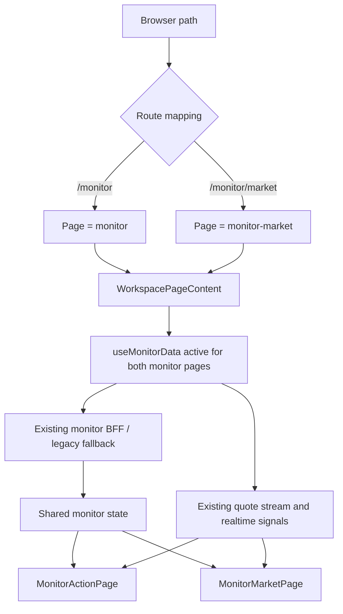

# Monitor Page Split Implementation Plan

> **For agentic workers:** REQUIRED SUB-SKILL: Use superpowers:subagent-driven-development (recommended) or superpowers:executing-plans to implement this plan task-by-task. Steps use checkbox (`- [ ]`) syntax for tracking.

**Goal:** Split the current realtime monitor surface into `/monitor` action desk and `/monitor/market` market context desk without changing monitor BFF contracts, production ranking semantics, or realtime quote behavior.

**Architecture:** Keep the current monitor BFF and `useMonitorData` data pipeline in Phase 1, then split only the frontend route, page composition, and information hierarchy. `/monitor` remains the default action-oriented entry; `/monitor/market` moves market breadth, pulse, sector, ETF, review, and runtime context out of the execution surface. A later phase may add BFF view projections only after the frontend split is stable.

**Tech Stack:** React, TypeScript, Vite, AntD, TanStack Query/server state, Zustand monitor UI state, realtime signals, `VirtualCardList`, existing FastAPI OpenAPI generated types.

---

## 1. Scope And Hard Boundaries

### In Scope

1. Add a second monitor route: `/monitor/market`.
2. Split current monitor UI into:
   - `/monitor`: realtime action desk.
   - `/monitor/market`: market context desk.
3. Reuse existing monitor BFF, monitor state, realtime signals, and generated API types.
4. Preserve `/monitor` as the default legacy-compatible route.
5. Add tests for route mapping, page rendering, navigation highlighting, data activation, and page responsibility boundaries.
6. Generate baseline and acceptance reports.

### Out Of Scope

1. No deployment.
2. No production strategy semantic changes.
3. No `strategy_policy.py` changes.
4. No priority-board ranking, production score, or production sorting changes.
5. No Phase 1 BFF contract split.
6. No change to `monitor_snapshot.priority_board` as the priority-board read path.
7. No extra SSE/quote stream instance after route split.
8. No unrelated refactor or formatting.
9. No backend changes unless tests prove a frontend-only split is impossible.

## 2. Current Context

Current monitor responsibilities are concentrated in:

```text
frontend/src/features/monitor/MonitorPage.tsx
frontend/src/features/monitor/MonitorPage.panels.tsx
frontend/src/features/monitor/MonitorMoreTabs.tsx
frontend/src/features/trading-workspace/useMonitorData.ts
frontend/src/features/trading-workspace/WorkspacePageContent.tsx
frontend/src/features/workspace-shared/workspaceTypes.ts
frontend/src/features/workspace-shared/workspaceConstants.ts
frontend/src/features/trading-workspace/pageResponsibilities.ts
frontend/src/features/trading-workspace/Topbar.tsx
```

Important constraints:

1. The accepted hot-read outcome used monitor BFF and priority-board hot reads as regression targets.
2. The live BFF payload exposes priority board at `monitor_snapshot.priority_board`.
3. Existing rollback switches include monitor BFF aggregation, BFF cache TTL, live overlay, empty fallback, overlay cache, and filter cache settings.
4. `useMonitorData.ts` still owns both BFF and legacy fallback paths. The split must not duplicate its polling/SSE behavior.

## 3. Target Information Architecture

### 3.1 Page Responsibilities

| Route | Page | Primary Question | Primary Users | Keeps |
|---|---|---|---|---|
| `/monitor` | Realtime Action Desk | What should I act on today? | Trading operator | Today's conclusion, priority board, holdings/watchlist, stock key levels, action buttons |
| `/monitor/market` | Market Context Desk | Does the market support action? | Trading operator / reviewer | Market gate, breadth, pulse, sectors, ETF T0, market review, runtime/data quality |

### 3.2 What Moves

Stays in `/monitor`:

1. `MonitorConclusionBar`.
2. `KeyLevelAlerts`.
3. Full priority-board list.
4. `StrategyLaneTabs`.
5. `StrategyLaneStatusCard`.
6. `RiskFilterBadges`.
7. `MarketStateGatePanel` compact summary.
8. `FamilyStrip`.
9. Holdings/watchlist list.
10. `HoldingEntryDrawer`.
11. Stock-level key level panel.
12. Analyze/detail/edit/remove actions.

Moves to `/monitor/market`:

1. Full market gate explanation.
2. `MarketBreadthStrip`.
3. `HourlyAllMarketPulse`.
4. `MonitorReviewPanel`.
5. `SectorLeaderGatePanel`.
6. Sector relative strength.
7. `SectorEtfOpportunityCard`.
8. Paired hedge context.
9. Runtime status.
10. Instrument sync status.
11. Data quality diagnostics.

## 4. Routing And Data Flow



Phase 1 must keep this data rule:

```text
page === "monitor" || page === "monitor-market"
```

Both pages read the same monitor state. They must not create separate monitor data hooks or separate quote-stream subscriptions.

## 5. Layout Diagrams

### 5.1 `/monitor` Realtime Action Desk

Desktop layout:

```text
┌──────────────────────────────────────────────────────────────────────────────┐
│ Topbar: 实时行动 | 市场环境 | 策略复盘 | 模拟盘 | 回测 | 数据 | 设置          │
├──────────────────────────────────────────────────────────────────────────────┤
│ 今日结论 / 行动总览                                                         │
│ ┌──────────────────────────────────────────────────────────────────────────┐ │
│ │ MonitorConclusionBar: 今日方向 / 立即处理 / 观察数量 / 刷新 / 同步       │ │
│ └──────────────────────────────────────────────────────────────────────────┘ │
│ KeyLevelAlerts                                                              │
├─────────────────────────────────────┬────────────────────────────────────────┤
│ 生产优先榜                           │ 我的持仓 / 自选                         │
│ ┌─────────────────────────────────┐ │ ┌────────────────────────────────────┐ │
│ │ StrategyLaneTabs                │ │ │ 持仓数量 / runtime / + 录入持仓     │ │
│ │ StrategyLaneStatusCard          │ │ │ VirtualCardList(watchCards)        │ │
│ │ MarketStateGate compact         │ │ │ - 详情 / 分析 / 编辑 / 移除          │ │
│ │ RiskFilterBadges                │ │ └────────────────────────────────────┘ │
│ │ FamilyStrip                     │ │                                        │
│ │ VirtualCardList(priorityCards)  │ │ 个股关键位观察                         │
│ │ - 详情 / 分析                   │ │ ┌────────────────────────────────────┐ │
│ └─────────────────────────────────┘ │ │ KeyLevelPanel + VolumePositionTags  │ │
│                                     │ └────────────────────────────────────┘ │
├─────────────────────────────────────┴────────────────────────────────────────┤
│ HoldingEntryDrawer hidden until action                                      │
└──────────────────────────────────────────────────────────────────────────────┘
```

Mobile layout:

```text
┌─────────────────────────────┐
│ Topbar / page switch         │
├─────────────────────────────┤
│ 今日结论                     │
├─────────────────────────────┤
│ 生产优先榜                   │
│ VirtualCardList              │
├─────────────────────────────┤
│ 我的持仓 / 自选               │
│ VirtualCardList              │
├─────────────────────────────┤
│ 个股关键位                   │
└─────────────────────────────┘
```

### 5.2 `/monitor/market` Market Context Desk

Desktop layout:

```text
┌──────────────────────────────────────────────────────────────────────────────┐
│ Topbar: 实时行动 | 市场环境 | 策略复盘 | 模拟盘 | 回测 | 数据 | 设置          │
├──────────────────────────────────────────────────────────────────────────────┤
│ 市场总闸 / 数据质量摘要                                                     │
│ ┌──────────────────────────────────────────────────────────────────────────┐ │
│ │ MarketStateGatePanel full: gate / firepower / directional bias / quality │ │
│ └──────────────────────────────────────────────────────────────────────────┘ │
├─────────────────────────────────────┬────────────────────────────────────────┤
│ 市场宽度与日内脉冲                   │ 板块轮动与 ETF T0                       │
│ ┌─────────────────────────────────┐ │ ┌────────────────────────────────────┐ │
│ │ MarketBreadthStrip              │ │ │ SectorLeaderGatePanel              │ │
│ │ HourlyAllMarketPulse            │ │ │ Sector relative strength            │ │
│ │ Market key levels               │ │ │ SectorEtfOpportunityCard list       │ │
│ └─────────────────────────────────┘ │ └────────────────────────────────────┘ │
├─────────────────────────────────────┼────────────────────────────────────────┤
│ 市场复盘                             │ 运行时 / 同步 / 对冲研究                 │
│ ┌─────────────────────────────────┐ │ ┌────────────────────────────────────┐ │
│ │ MonitorReviewPanel              │ │ │ runtime status                      │ │
│ │ reviewStatus + reviewReports    │ │ │ instrument sync status              │ │
│ └─────────────────────────────────┘ │ │ paired hedge context                │ │
│                                     │ └────────────────────────────────────┘ │
└─────────────────────────────────────┴────────────────────────────────────────┘
```

Mobile layout:

```text
┌─────────────────────────────┐
│ Topbar / page switch         │
├─────────────────────────────┤
│ 市场总闸                     │
├─────────────────────────────┤
│ 市场宽度                     │
├─────────────────────────────┤
│ 日内脉冲                     │
├─────────────────────────────┤
│ 板块轮动 / ETF T0            │
├─────────────────────────────┤
│ 市场复盘                     │
├─────────────────────────────┤
│ 数据质量 / runtime / sync    │
└─────────────────────────────┘
```

## 6. File Structure

### Create

```text
frontend/src/features/monitor/MonitorActionPage.tsx
frontend/src/features/monitor/MonitorMarketPage.tsx
frontend/src/features/monitor/MonitorSharedPanels.tsx
frontend/src/features/monitor/monitorPageModel.ts
frontend/src/features/monitor/MonitorActionPage.test.tsx
frontend/src/features/monitor/MonitorMarketPage.test.tsx
docs/reports/monitor-page-split-baseline-2026-06-05.md
docs/reports/monitor-page-split-acceptance-2026-06-05.md
```

### Modify

```text
frontend/src/features/workspace-shared/workspaceTypes.ts
frontend/src/features/workspace-shared/workspaceConstants.ts
frontend/src/features/trading-workspace/workspaceRoutes.ts
frontend/src/features/trading-workspace/pageResponsibilities.ts
frontend/src/features/trading-workspace/WorkspacePageContent.tsx
frontend/src/features/trading-workspace/Topbar.tsx
frontend/src/features/trading-workspace/useMonitorData.ts
frontend/src/features/monitor/MonitorPage.tsx
frontend/src/features/monitor/MonitorMoreTabs.tsx
frontend/src/styles/workspace/workspace.css
```

### Test Or Update

```text
frontend/src/features/trading-workspace/pageResponsibilities.test.ts
frontend/src/features/trading-workspace/pageInformationHierarchy.test.ts
frontend/src/features/trading-workspace/Topbar.signal.test.ts
frontend/src/features/trading-workspace/useWorkspaceNavigation.test.ts
frontend/src/features/trading-workspace/WorkspacePageContent.test.tsx
frontend/src/features/monitor/MonitorPage.structure.test.ts
```

If a listed test file does not exist, create the smallest focused test file beside the related module.

## 7. Implementation Tasks

### Task 0: Baseline Report And Dirty-Tree Guard

**Files:**
- Create: `docs/reports/monitor-page-split-baseline-2026-06-05.md`

- [ ] **Step 1: Record status**

Run:

```bash
cd /Users/j/Documents/gupiao
git status --short
```

Expected: Existing unrelated dirty files are documented and not reverted.

- [ ] **Step 2: Inspect monitor files**

Run:

```bash
cd /Users/j/Documents/gupiao
rg -n "MonitorPage|MonitorMoreTabs|useMonitorData|PAGE_PATHS|PATH_PAGE_MAP|type Page" frontend/src/features frontend/src/stores frontend/src/state -g '*.{ts,tsx}'
```

Expected: Output identifies current monitor route, page, panels, and data hook.

- [ ] **Step 3: Create baseline report**

Write `docs/reports/monitor-page-split-baseline-2026-06-05.md` with:

```markdown
# Monitor Page Split Baseline

Date: 2026-06-05

## Git Status

Paste `git status --short` output here.

## Current Monitor Surface

- Route: `/monitor`
- Page component: `frontend/src/features/monitor/MonitorPage.tsx`
- Data hook: `frontend/src/features/trading-workspace/useMonitorData.ts`
- BFF path: `/bff/v1/workspace/monitor`
- Priority board path: `monitor_snapshot.priority_board`

## Split Boundary

- `/monitor`: realtime action desk
- `/monitor/market`: market context desk

## Hard Boundaries

- No deployment.
- No production strategy semantic changes.
- No `strategy_policy.py` changes.
- No BFF contract split in Phase 1.
- No duplicated SSE/quote stream.
```

### Task 1: Add Route And Page Type

**Files:**
- Modify: `frontend/src/features/workspace-shared/workspaceTypes.ts`
- Modify: `frontend/src/features/workspace-shared/workspaceConstants.ts`
- Modify: `frontend/src/features/trading-workspace/workspaceRoutes.ts`
- Test: route/navigation tests under `frontend/src/features/trading-workspace/`

- [ ] **Step 1: Add failing route test**

Create or update a routing test to assert:

```ts
expect(PAGE_PATHS["monitor-market"]).toBe("/monitor/market");
expect(PATH_PAGE_MAP["/monitor/market"]).toBe("monitor-market");
expect(PATH_PAGE_MAP["/monitor"]).toBe("monitor");
```

- [ ] **Step 2: Run focused test**

Run:

```bash
cd /Users/j/Documents/gupiao/frontend
npm test -- --run frontend/src/features/trading-workspace
```

Expected: Fails because `monitor-market` is not defined.

- [ ] **Step 3: Update page type and paths**

Add `"monitor-market"` to `Page`, `PAGE_PATHS`, and `PATH_PAGE_MAP`.

- [ ] **Step 4: Re-run focused test**

Run the same command.

Expected: Route tests pass.

### Task 2: Add Page Responsibility Metadata

**Files:**
- Modify: `frontend/src/features/trading-workspace/pageResponsibilities.ts`
- Test: `frontend/src/features/trading-workspace/pageResponsibilities.test.ts`
- Test: `frontend/src/features/trading-workspace/pageInformationHierarchy.test.ts`

- [ ] **Step 1: Add failing metadata tests**

Assert:

```ts
expect(WORKSPACE_PAGE_RESPONSIBILITIES.monitor.primaryQuestion).toContain("今天");
expect(WORKSPACE_PAGE_RESPONSIBILITIES["monitor-market"].primaryQuestion).toContain("市场");
expect(WORKSPACE_PAGE_RESPONSIBILITIES["monitor-market"].heavyListSurface).toContain("VirtualCardList");
```

- [ ] **Step 2: Add metadata**

Add responsibility entry:

```ts
"monitor-market": {
  page: "monitor-market",
  label: "市场环境",
  primaryQuestion: "市场是否支持行动？",
  coreSurface: ["市场总闸", "市场宽度", "日内脉冲", "板块轮动", "复盘与数据质量"],
  heavyListSurface: ["VirtualCardList"],
  modeBadges: ["shadow", "research", "watch"],
}
```

Keep `monitor` focused on realtime action.

- [ ] **Step 3: Run tests**

```bash
cd /Users/j/Documents/gupiao/frontend
npm test -- --run frontend/src/features/trading-workspace/pageResponsibilities.test.ts frontend/src/features/trading-workspace/pageInformationHierarchy.test.ts
```

Expected: PASS.

### Task 3: Create Shared View Model Helpers

**Files:**
- Create: `frontend/src/features/monitor/monitorPageModel.ts`
- Test: `frontend/src/features/monitor/monitorPageModel.test.ts`

- [ ] **Step 1: Add tests for page split model**

Test should verify:

```ts
expect(buildMonitorActionModel({ priorityBoard, priorityCards, watchCards }).priorityCount).toBe(priorityCards.length);
expect(buildMonitorMarketModel({ marketBreadth, marketPulse, sectorEtfT0 }).hasMarketContext).toBe(true);
```

- [ ] **Step 2: Implement helper**

Implement pure helpers that only compute display booleans/counts. Do not fetch, mutate, or change domain semantics.

- [ ] **Step 3: Run test**

```bash
cd /Users/j/Documents/gupiao/frontend
npm test -- --run frontend/src/features/monitor/monitorPageModel.test.ts
```

Expected: PASS.

### Task 4: Create MonitorActionPage

**Files:**
- Create: `frontend/src/features/monitor/MonitorActionPage.tsx`
- Test: `frontend/src/features/monitor/MonitorActionPage.test.tsx`

- [ ] **Step 1: Add rendering test**

Render action page with minimal props and assert:

```ts
expect(screen.getByText(/今日|方向|结论/)).toBeTruthy();
expect(screen.getByText(/生产优先榜/)).toBeTruthy();
expect(screen.getByText(/我的持仓/)).toBeTruthy();
expect(screen.queryByText(/市场复盘/)).toBeNull();
```

- [ ] **Step 2: Move action UI**

Move action-related JSX from `MonitorPage.tsx` into `MonitorActionPage.tsx`:

1. `MonitorConclusionBar`.
2. `KeyLevelAlerts`.
3. Holdings/watchlist panel.
4. Priority-board panel.
5. Stock key levels.
6. `HoldingEntryDrawer`.

- [ ] **Step 3: Keep handlers unchanged**

Props must preserve current handler names:

```ts
onRefresh
onSync
onAi
onGoPlaybook
onLaneChange
onSelect
onAnalyze
onEdit
onRemove
onAddWatchlist
onCancelEdit
```

- [ ] **Step 4: Run test**

```bash
cd /Users/j/Documents/gupiao/frontend
npm test -- --run frontend/src/features/monitor/MonitorActionPage.test.tsx
```

Expected: PASS.

### Task 5: Create MonitorMarketPage

**Files:**
- Create: `frontend/src/features/monitor/MonitorMarketPage.tsx`
- Test: `frontend/src/features/monitor/MonitorMarketPage.test.tsx`

- [ ] **Step 1: Add rendering test**

Render market page with minimal props and assert:

```ts
expect(screen.getByText(/市场|总闸|环境/)).toBeTruthy();
expect(screen.getByText(/宽度|脉冲|板块|复盘/)).toBeTruthy();
expect(screen.queryByText(/\+ 录入持仓/)).toBeNull();
```

- [ ] **Step 2: Move market UI**

Move market-context JSX from `MonitorMoreTabs.tsx` and `MonitorPage.panels.tsx` into `MonitorMarketPage.tsx` composition:

1. `MarketBreadthStrip`.
2. `HourlyAllMarketPulse`.
3. `MonitorReviewPanel`.
4. `SectorLeaderGatePanel`.
5. `SectorEtfOpportunityCard`.
6. Paired hedge summary.
7. Runtime and instrument sync status.

- [ ] **Step 3: Add action-page CTA**

Market page may show a compact link back to `/monitor`, but must not duplicate full priority-card list.

- [ ] **Step 4: Run test**

```bash
cd /Users/j/Documents/gupiao/frontend
npm test -- --run frontend/src/features/monitor/MonitorMarketPage.test.tsx
```

Expected: PASS.

### Task 6: Wire WorkspacePageContent

**Files:**
- Modify: `frontend/src/features/trading-workspace/WorkspacePageContent.tsx`
- Modify: relevant lazy import site for monitor page modules.
- Test: `frontend/src/features/trading-workspace/WorkspacePageContent.test.tsx`

- [ ] **Step 1: Add test**

Assert:

```ts
page === "monitor" renders MonitorActionPage;
page === "monitor-market" renders MonitorMarketPage;
```

- [ ] **Step 2: Wire rendering**

Render:

```tsx
{page === "monitor" && <MonitorActionPage {...monitorPageProps} />}
{page === "monitor-market" && <MonitorMarketPage {...monitorPageProps} />}
```

If preserving `MonitorPage` as a wrapper, route through wrapper only when the flag or compatibility path requires it.

- [ ] **Step 3: Run focused tests**

```bash
cd /Users/j/Documents/gupiao/frontend
npm test -- --run frontend/src/features/trading-workspace/WorkspacePageContent.test.tsx
```

Expected: PASS.

### Task 7: Update Topbar And Navigation

**Files:**
- Modify: `frontend/src/features/trading-workspace/Topbar.tsx`
- Modify: `frontend/src/features/trading-workspace/useWorkspaceNavigation.ts`
- Test: `frontend/src/features/trading-workspace/Topbar.signal.test.ts`
- Test: `frontend/src/features/trading-workspace/useWorkspaceNavigation.test.ts`

- [ ] **Step 1: Add nav tests**

Assert:

```ts
expect(renderedTopbar).toContain("实时行动");
expect(renderedTopbar).toContain("市场环境");
```

- [ ] **Step 2: Add navigation item**

Add nav item:

```ts
{ page: "monitor", label: "实时行动" }
{ page: "monitor-market", label: "市场环境" }
```

- [ ] **Step 3: Preserve old route**

`/monitor` remains the page for realtime action. Do not redirect `/monitor` to `/monitor/market`.

- [ ] **Step 4: Run tests**

```bash
cd /Users/j/Documents/gupiao/frontend
npm test -- --run frontend/src/features/trading-workspace/Topbar.signal.test.ts frontend/src/features/trading-workspace/useWorkspaceNavigation.test.ts
```

Expected: PASS.

### Task 8: Guard useMonitorData Activation

**Files:**
- Modify: `frontend/src/features/trading-workspace/useMonitorData.ts`
- Test: existing or new `frontend/src/features/trading-workspace/useMonitorData.test.tsx`

- [ ] **Step 1: Add activation test**

Assert monitor data is active for:

```ts
"monitor"
"monitor-market"
```

and inactive for unrelated pages where current behavior expects it inactive.

- [ ] **Step 2: Implement helper if needed**

Add small helper:

```ts
export function isMonitorDataPage(page: Page): boolean {
  return page === "monitor" || page === "monitor-market";
}
```

Use it in the active condition passed to `useMonitorData`.

- [ ] **Step 3: Verify quote stream is not duplicated**

Ensure no new `useQuoteStream` call is added to page components. It must remain inside the shared data hook.

- [ ] **Step 4: Run tests**

```bash
cd /Users/j/Documents/gupiao/frontend
npm test -- --run frontend/src/features/trading-workspace/useMonitorData.test.tsx
```

Expected: PASS or, if no such test exists, PASS for the new focused test.

### Task 9: Style And Responsive Layout

**Files:**
- Modify: `frontend/src/styles/workspace/workspace.css`
- Modify: `frontend/src/features/trading-workspace/workspaceShellStyles.ts` only if needed.

- [ ] **Step 1: Add focused class names**

Use names:

```text
monitor-action-*
monitor-market-*
monitor-shared-*
```

- [ ] **Step 2: Preserve card/list constraints**

Do not place cards inside cards. Keep `VirtualCardList` for long priority/watch/ETF lists.

- [ ] **Step 3: Check mobile layout**

Ensure both pages stack in the order shown in the layout diagrams.

### Task 10: Acceptance Report And Full Verification

**Files:**
- Create: `docs/reports/monitor-page-split-acceptance-2026-06-05.md`

- [ ] **Step 1: Run full frontend validation**

```bash
cd /Users/j/Documents/gupiao/frontend
npm run api:check
npm run typecheck
npm run lint
npm test -- --run
npm run build
```

- [ ] **Step 2: Run diff checks**

```bash
cd /Users/j/Documents/gupiao
git diff --check
git status --short
```

- [ ] **Step 3: Write acceptance report**

Include:

```markdown
# Monitor Page Split Acceptance

## Routes
- `/monitor`: realtime action desk
- `/monitor/market`: market context desk

## BFF/API
- `/bff/v1/workspace/monitor` unchanged.
- Priority board still read from `monitor_snapshot.priority_board`.

## Realtime
- Quote stream remains owned by `useMonitorData`.
- No second page-level quote stream added.

## Tests
Paste command results.

## Platform Impact
Conclusion: no production strategy semantic change; no production ranking change.

## Rollback
Remove `monitor-market` route or disable `monitor_split_pages_enabled`; route `/monitor` continues to serve realtime action desk.
```

## 8. Optional Phase 2: BFF View Projection

Do not implement in Phase 1.

After Phase 1 is stable, consider:

```text
/bff/v1/workspace/monitor?view=action
/bff/v1/workspace/monitor?view=market
```

Acceptance gates before Phase 2:

1. Phase 1 tests are green.
2. Browser request count is not worse.
3. Hot-read p95 remains within accepted regression target.
4. Response shape remains backward compatible or gets an explicit compatibility alias.

## 9. Final Verification Checklist

- [ ] `/monitor` shows realtime action desk.
- [ ] `/monitor/market` shows market context desk.
- [ ] `/monitor` old path still works.
- [ ] Topbar highlights both monitor pages correctly.
- [ ] `useMonitorData` active for both monitor pages.
- [ ] No new page-level `useQuoteStream`.
- [ ] No BFF contract change.
- [ ] Priority board path remains `monitor_snapshot.priority_board`.
- [ ] Holdings/watchlist operations still work.
- [ ] Market page does not show holding-entry UI.
- [ ] Action page does not show full market review surface.
- [ ] `npm run api:check` passes.
- [ ] `npm run typecheck` passes.
- [ ] `npm run lint` passes.
- [ ] `npm test -- --run` passes.
- [ ] `npm run build` passes.
- [ ] `git diff --check` passes.

## 10. Implementation Prompt

```text
你在 /Users/j/Documents/gupiao 仓库工作。本轮目标是把实时监控界面拆成两个界面：/monitor 实时行动台，/monitor/market 市场环境台。第一阶段只拆前端路由、页面和组件，不拆 BFF，不改生产策略语义，不影响平台功能。

开始前必须阅读：
/Users/j/Documents/gupiao/AGENTS.md
/Users/j/Documents/gupiao/docs/engineering-conventions.md
/Users/j/Documents/gupiao/docs/platform-modular-architecture-uplift-execution-plan-2026-06-04.md
/Users/j/Documents/gupiao/docs/architecture/current-boundary-map.md
/Users/j/Documents/gupiao/docs/monitor-page-split-development-plan-2026-06-05.md

开始前必须执行：
cd /Users/j/Documents/gupiao
git status --short

若存在脏文件，必须先看相关 git diff，只允许做本轮拆页相关最小改动；不得覆盖、回退或格式化用户已有改动。

硬边界：
1. 不部署。
2. 不修改 strategy_policy.py。
3. 不修改生产策略语义。
4. 不改变 priority board、生产排序、生产分口径。
5. 不拆 /bff/v1/workspace/monitor 契约。
6. 不改变 monitor_snapshot.priority_board 嵌套读取路径。
7. 不让两个页面重复启动 SSE/quote stream。
8. 不为了拆页重构无关业务代码。

目标：
- /monitor = 实时行动台：今日结论、生产优先榜、策略 lane、持仓/自选、个股关键位、操作按钮。
- /monitor/market = 市场环境台：市场总闸、市场宽度、小时脉冲、板块轮动、ETF T0、复盘报告、数据质量、runtime/sync 状态。
- 第一阶段复用 useMonitorData 和现有 BFF。

执行：
A0 生成 docs/reports/monitor-page-split-baseline-2026-06-05.md，记录现状、git status、模块清单、BFF 不改边界。
A1 在 workspaceTypes/workspaceConstants/workspaceRoutes/pageResponsibilities 中增加 monitor-market 和 /monitor/market。
A2 新增 MonitorActionPage.tsx、MonitorMarketPage.tsx、MonitorSharedPanels.tsx、monitorPageModel.ts。
A3 拆分 MonitorPage 内容：行动链进 MonitorActionPage，市场上下文进 MonitorMarketPage；MonitorPage 保留兼容 wrapper 或导出。
A4 修改 WorkspacePageContent 和 Topbar，支持两个页面入口和高亮。
A5 调整 useMonitorData active 条件，确保 monitor 与 monitor-market 都可用，但不重复请求/SSE。
A6 补测试：路由、页面渲染、Topbar 高亮、行动台/市场台内容边界、useMonitorData active 条件。
A7 运行前端验证命令和 git diff --check。
A8 生成 docs/reports/monitor-page-split-acceptance-2026-06-05.md。

必须运行：
cd /Users/j/Documents/gupiao/frontend
npm run api:check
npm run typecheck
npm run lint
npm test -- --run
npm run build

最后运行：
cd /Users/j/Documents/gupiao
git diff --check
git status --short

最终回复必须包含：
- 拆成了哪两个界面。
- 改动文件清单。
- BFF/API 是否改动。
- 请求/SSE 是否重复的验证结论。
- 测试结果。
- 是否影响平台功能：明确回答“不影响”或说明风险。
- 未处理项和后续建议。
```
