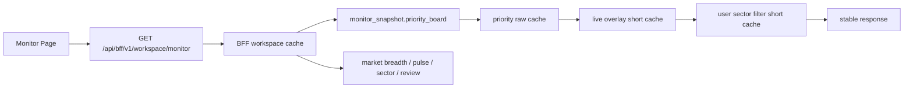

# 监控榜单刷新延迟线上实测整改开发文档（2026-06-04）

> **For agentic workers:** REQUIRED SUB-SKILL: `superpowers:executing-plans` 或 `superpowers:subagent-driven-development`。执行时按任务逐项打勾，不要跨批混改。

## 1. 背景与线上实测结论

权威依据：

- `docs/superpowers/plans/2026-06-03-monitor-priority-board-latency-final.md` §6 与 §9.1。
- 2026-06-04 线上只读实测，目标地址：`http://43.143.243.97:18090`。

线上实测摘要：

| 项 | 实测结果 | 判读 |
|---|---:|---|
| `/healthz` | `{"status":"ok","app":"维斯量化交易平台"}` | 服务存活 |
| `/readyz` | database/frontend_dist/analytics_dependencies 均 `true` | 基础就绪 |
| BFF workspace keys | `monitor_snapshot/market_breadth/market_pulse/...`，未见顶层 `priority_board` | 需修正验收口径并确认嵌套榜单 |
| baseline priority_board sha | 3 次一致 | 缓存或口径稳定 |
| N 字强买守卫 | `[]` | 通过 |
| baseline items | 11，全部 `avoid`，`strategy_key=volume_shrink` | 非空，但无可买信号 |
| L2 stale | 当前未触发 stale，仅证明非空 | stale 回退未被实测证明 |
| priority_board P95 | `0.603s` | 未达 `<=112ms` |
| BFF P95 | `0.910s` | 未达 `<=85ms` |
| 二次调用 | 未低于首次 50% | L3 缓存收益不明显 |
| `/metrics` | 缺 `ADMIN_API_TOKEN`，跳过 | 缺观测证据 |

重要修正：

- 当前 BFF schema 中 `priority_board` 很可能位于 `monitor_snapshot.priority_board`，不是顶层字段。
- 后续验收不能只跑 `jq keys`，必须检查 `.monitor_snapshot.priority_board.items | length`。
- 如果产品需要顶层 `priority_board`，只能做向后兼容 alias，不能破坏既有 `monitor_snapshot` 契约。

## 2. 目标

本开发的目标是让监控页刷新从“能用但慢、冷启体验差”变为“单请求、非空、热路径稳定快、策略口径不漂移”。

量化目标：

| 指标 | 当前线上 | 目标 |
|---|---:|---:|
| 监控页首屏业务请求数 | 仍需浏览器确认 | 1 个 `/api/bff/v1/workspace/monitor` |
| BFF P95 | `910ms` | `<=85ms`，或先降到 `<=160ms` 作为灰度门 |
| priority_board P95 | `603ms` | `<=112ms` |
| 同 URL 后两次调用 | 未明显下降 | `< 首次 50%` |
| 冷启/换 variant 空榜 | 待复现 | 不空，stale 明确 |
| 策略关键字段 | baseline sha 稳定 | 合包前后 sha 一致 |

## 3. 硬边界

1. 不改策略计算口径，不改 `production_score`、`priority_score`、`buy_signal_state` 判定。
2. 不改 `portfolio_backtest_metrics`、`participates_in_priority_board` 等业务事实源。
3. 不绕过用户板块偏好过滤。
4. 不新增 Web 后台 loop。
5. 不引入新运行时依赖。
6. 不加快 30 秒轮询频率。
7. 不上 WebSocket、SSR、WASM，不做全栈 async 重写。
8. L5 增量物化默认不做；如果后续做，必须先补 full vs incremental parity 测试。
9. 线上验收只读，除登录接口外禁止 `POST/PUT/PATCH/DELETE`。
10. 当前 `http://43.143.243.97:18090` 是裸 IP + HTTP，不得使用真实账号做长期测试。

## 4. 代码锚点

后端：

- `backend/app/api/routes/bff.py`
- `backend/app/models/schema_defs/bff.py`
- `backend/app/services/bff/workspace_cache.py`
- `backend/app/services/bff/timeout.py`
- `backend/app/services/low_buy/priority_board.py`
- `backend/app/services/read_models/live_quote_overlay.py`
- `backend/app/services/user_sector_preferences.py`
- `backend/app/services/performance/prometheus.py`
- `backend/app/services/performance/read_model_metrics.py`
- `backend/app/core/config.py`

前端：

- `frontend/src/features/trading-workspace/useMonitorData.ts`
- `frontend/src/features/monitor/queries.ts`
- `frontend/src/api/client.ts`
- `frontend/src/api/base.ts`
- `frontend/src/types/*`
- `frontend/src/generated/api-types.ts`

测试：

- `backend/tests/test_low_buy_priority_board_strategy_variants.py`
- `backend/tests/test_low_buy_production_scoring.py`
- `backend/tests/test_bff_*.py`（如不存在则新增聚焦文件）
- `backend/tests/test_user_sector_preferences.py`
- `backend/tests/test_read_model_live_overlay.py`
- `frontend/src/features/trading-workspace/*.test.tsx`

文档/契约：

- `docs/contracts/openapi.json`
- `docs/superpowers/plans/2026-06-03-monitor-priority-board-latency-final.md`

## 5. 目标架构



原则：

- 页面只发一个首屏 BFF 请求。
- 榜单仍由原 `priority_board` 口径生成。
- BFF 只做聚合、缓存、stale/fallback 和错误隔离。
- overlay/filter 缓存的是最终展示响应，不参与策略评分。

## 6. Feature Flags

已有或需要确认的配置：

| Flag | 默认 | 作用 |
|---|---:|---|
| `MONITOR_BFF_AGGREGATE_ENABLED` | `true` | 关闭后回到 legacy 多接口 |
| `BFF_MONITOR_CACHE_TTL_SECONDS` | `5` | BFF workspace cache |
| `PRIORITY_BOARD_EMPTY_FALLBACK_TO_LAST_SNAPSHOT` | `true` | cache empty 时回退上次快照 |
| `READ_MODEL_LIVE_OVERLAY_ENABLED` | `true` | 关闭 live overlay |
| `PRIORITY_BOARD_OVERLAY_CACHE_ENABLED` | `true` | overlay 结果短缓存 |
| `PRIORITY_BOARD_OVERLAY_CACHE_TTL_SECONDS` | `2` | overlay 缓存 TTL |
| `PRIORITY_BOARD_FILTER_CACHE_ENABLED` | `true` | 用户板块偏好过滤缓存 |

需补充或确认：

- `PRIORITY_BOARD_FILTER_CACHE_TTL_SECONDS`：建议配置化，默认 `30`。
- `BFF_MONITOR_SOURCE_TIMEOUT_MS`：建议配置化，默认 `120`。
- `BFF_MONITOR_DEBUG_TIMINGS_ENABLED`：默认 `false`，仅 admin/token 可见。

## 7. 分批开发任务

### P0：观测与验收口径修正

目标：先排除误判，明确瓶颈来自哪个子模块。

- [ ] 修正线上只读验收脚本，检查嵌套字段：

```bash
curl -fsS -H "Authorization: Bearer ***" \
  "$BASE/api/bff/v1/workspace/monitor?priority_limit=12&sector_limit=8&per_sector_limit=8&hedge_limit=4" \
  | jq '{
      keys: keys,
      priority_items_n: (.monitor_snapshot.priority_board.items | length),
      priority_data_quality: .monitor_snapshot.priority_board.data_quality,
      priority_warning: .monitor_snapshot.priority_board.snapshot_warning,
      partial_errors
    }'
```

- [ ] 给 BFF 每个 source 增加耗时指标：
  - `bff_monitor_source_seconds{source=...}`
  - `bff_monitor_source_timeout_total{source=...}`
  - `bff_monitor_partial_timeout_total`
- [ ] 给 priority final response 增加缓存指标：
  - `priority_board_response_cache_hits_total`
  - `priority_board_overlay_cache_hits_total`
  - `priority_board_filter_cache_hits_total`
- [ ] 可选 admin 调试字段 `debug_timings`，仅 admin/token 返回，普通用户不显示。

验收：

- `/metrics` 能看到 BFF、priority、overlay、filter 的 hit/miss/timeout。
- 不需要改策略结果字段。

### P1：BFF 合包确认与契约补强

目标：监控页首屏只依赖一个 BFF 请求，同时 BFF payload 明确携带榜单。

后端要求：

- [ ] 保持 `monitor_snapshot.priority_board` 为主契约。
- [ ] 如前端或验收需要顶层快捷字段，可新增只读 alias：
  - `priority_board`
  - `watchlist_signals`
  - `sector_etf_t0`
- [ ] alias 必须与 `monitor_snapshot` 内同名对象完全一致，不允许二次计算。
- [ ] `partial_errors` 不能吞掉 `data_quality` 和 `snapshot_warning`。

前端要求：

- [ ] `useMonitorData.ts` 首屏只调用 `api.getMonitorWorkspaceBff(12)`。
- [ ] 不再首屏并发打 14 个独立接口。
- [ ] 只允许对 BFF 缺失字段做补偿读取，例如 runtime/admin 或历史兼容字段。
- [ ] `loadPriorityLane(front_row_*)` 可继续请求独立 lane，但 baseline 首屏必须来自 BFF。

测试：

- [ ] 新增 `test_monitor_bff_contains_priority_board_snapshot`。
- [ ] 新增 `test_monitor_bff_priority_alias_matches_monitor_snapshot_when_enabled`（若新增 alias）。
- [ ] 前端测试确认首屏 fetch 只调用 BFF。

验收：

- DevTools Network：打开监控页，首屏业务请求只有 1 个 `/api/bff/v1/workspace/monitor`。
- BFF 响应中 `.monitor_snapshot.priority_board.items` 非空或带明确 stale/empty warning。

### P2：BFF 子模块隔离、timeout 与 partial fallback

目标：BFF P95 不被慢模块拖垮。

问题：线上 BFF P95 `910ms`，远超目标。当前 `_build_monitor_workspace` 串行执行多源，且部分 live source 可能拖慢。

实施：

- [ ] 为每个 BFF source 做独立 timing。
- [ ] 将非关键 source 使用短 timeout 包裹。
- [ ] `priority_board` 是首屏核心，优先返回。
- [ ] 非关键 source 超时写入 `partial_errors`，返回上次缓存或 `None`，不能拖住整体响应。
- [ ] `allow_live_sources=false` 时不要阻塞 market live source；需要 live 数据时由缓存或 overlay 提供。

核心 source 分级：

| 优先级 | Source | 行为 |
|---|---|---|
| P0 | `monitor_snapshot.priority_board` | 必须返回或 stale fallback |
| P1 | `market_pulse`、`market_breadth` | 超时可 partial |
| P2 | `sector_relative_strength`、`review_reports`、`paired_hedge` | 超时不阻塞榜单 |
| P3 | `runtime` | 仅 admin，需要时才读取 |

验收：

- BFF P95 先降到 `<=160ms`，最终目标 `<=85ms`。
- `partial_errors` 可解释慢源，不能空白失败。

### P3：priority_board 最终响应缓存

目标：priority_board P95 从 `603ms` 降到 `<=112ms`。

缓存层级：

1. 原始 priority response：
   - key：`date + limit + strategy_variant`
2. live overlay response：
   - key：`priority_board:{response_hash}:overlay:{quote_marker}`
   - TTL：`1-3s`
3. 用户板块偏好过滤 response：
   - key：`priority_board:{response_hash}:user:{user_id}:excluded_hash:{hash}`
   - TTL：`30s`

实施：

- [ ] 确认 `apply_priority_board_live_overlay` 缓存 key 包含 quote marker，而不是只包含 response hash。
- [ ] 确认 overlay cache hit 时不重新读 `local_quote_cache`。
- [ ] 确认 `filter_priority_board_response` 命中用户过滤缓存时不再重算 counts/family_sections。
- [ ] 用户偏好修改后主动失效该用户过滤缓存。
- [ ] 增加 hit/miss 指标。

测试：

- [ ] `test_priority_board_overlay_cache_returns_same_payload_as_uncached`
- [ ] `test_priority_board_overlay_cache_key_changes_with_quote_marker`
- [ ] `test_priority_board_filter_cache_returns_same_payload_as_uncached`
- [ ] `test_priority_board_filter_cache_invalidates_on_user_preference_change`

验收：

- 同 URL 连续三次，后两次 TTFB `< 首次 50%`。
- `priority_board` 关键字段 sha 一致。

### P4：L2 stale fallback 强化与可测化

目标：cache empty 或刚部署时不空白。

当前线上 baseline 非空，只证明没有空榜，不能证明 stale fallback。

实施：

- [ ] 保留或补强 `priority_board_empty_fallback_to_last_snapshot`。
- [ ] 上次成功快照持久化在 `SystemSetting` 或已有 analytics/read model 层。
- [ ] cache empty 时优先返回上次成功快照：

```json
{
  "data_quality": "stale",
  "snapshot_warning": "正在后台刷新，当前展示上次可用榜单"
}
```

- [ ] 只有从未生成过任何成功快照时才允许空响应。

测试：

- [ ] `test_priority_board_empty_falls_back_to_last_snapshot_with_stale_flag`
- [ ] `test_priority_board_empty_without_last_snapshot_returns_explicit_warning`
- [ ] `test_priority_board_stale_flag_survives_bff_monitor_snapshot`

验收：

- 模拟 cache empty 后返回 `items_n > 0` 且 warning 明确。
- BFF 中 stale 标识不能丢。

### P5：前端 placeholderData 与空白保护

目标：接口抖动时不闪空。

实施：

- [ ] 监控页热查询加 `placeholderData: (prev) => prev` 或等价保留旧值。
- [ ] BFF 刷新失败时保留上一份 `priorityBoard`，同时显示错误/过期提示。
- [ ] 不隐藏 `data_quality`、`snapshot_warning`、`partial_errors`。
- [ ] 切 lane 时旧 lane 不误当新 lane；不同 `strategy_variant` 要独立缓存。

测试：

- [ ] BFF 下一次请求 pending 时页面仍显示上一份榜单。
- [ ] BFF 401 时触发登录态失效，不无限刷 401。
- [ ] stale warning 显示。

### P6：L5 增量物化暂缓

默认不做。

触发条件：

- P1-P5 完成后，BFF 和 priority_board P95 仍无法达标。

前置测试：

- [ ] `test_incremental_vs_full_materialization_parity`
- [ ] 同一输入下 item 顺序、score、state 完全一致。

## 8. 策略正确性守卫

必须保持：

- `low_buy_screener.priority_board -> _build_priority_items -> production_scoring -> portfolio_backtest_metrics` 不变。
- overlay 只更新行情展示字段，不参与评分和排序。
- 用户板块偏好过滤只影响用户展示，不改全局策略结果。
- N 字策略不得进入 baseline `buy_now/soft_buy_now`。

后端必跑：

```bash
PYTHONPATH=backend backend/.venv/bin/python -m pytest \
  backend/tests/test_low_buy_priority_board_strategy_variants.py \
  backend/tests/test_low_buy_production_scoring.py \
  -q
```

接口 sha 守卫：

```bash
curl -fsS -H "Authorization: Bearer $TOKEN" \
  "$BASE/api/screeners/low-buy/priority-board?strategy_variant=baseline&limit=12" \
  | jq -S '.items|map({symbol,strategy_key,buy_signal_state,priority_score,production_score,elite_watch_score})' \
  | sha256sum
```

禁用策略守卫：

```bash
jq '[.items[]|select(.buy_signal_state=="buy_now" or .buy_signal_state=="soft_buy_now")|.strategy_key]|unique'
```

结果不得包含：

- `n_pattern_long_wash`
- `n_pattern_short_wash`
- `core_midcap_vwap_ma5_retrace`

## 9. 验收命令

本地测试：

```bash
cd /Users/j/Documents/gupiao
PYTHONPATH=backend backend/.venv/bin/python -m pytest \
  backend/tests/test_low_buy_priority_board_strategy_variants.py \
  backend/tests/test_low_buy_production_scoring.py \
  backend/tests/test_bff_monitor_workspace.py \
  backend/tests/test_read_model_live_overlay.py \
  backend/tests/test_user_sector_preferences.py \
  -q
```

前端：

```bash
cd /Users/j/Documents/gupiao/frontend
npm run api:check
npm run lint
npm test -- --run
npm run build
```

线上只读复测：

```bash
BASE="${BASE:-http://43.143.243.97:18090}"
curl -fsS "$BASE/healthz"
curl -fsS "$BASE/readyz"
```

BFF payload：

```bash
curl -fsS -H "Authorization: Bearer $TOKEN" \
  "$BASE/api/bff/v1/workspace/monitor?priority_limit=12&sector_limit=8&per_sector_limit=8&hedge_limit=4" \
  | jq '{
      keys: keys,
      priority_items_n: (.monitor_snapshot.priority_board.items | length),
      priority_data_quality: .monitor_snapshot.priority_board.data_quality,
      priority_warning: .monitor_snapshot.priority_board.snapshot_warning,
      partial_errors
    }'
```

P95：

```bash
for i in $(seq 1 30); do
  curl -fsS -o /dev/null -w "%{time_starttransfer}\n" \
    -H "Authorization: Bearer $TOKEN" \
    "$BASE/api/screeners/low-buy/priority-board?strategy_variant=baseline&limit=12"
done | sort -n | awk 'NR==15{p50=$1} NR==29{p95=$1} END{print "p50:", p50, " p95:", p95}'
```

Metrics：

```bash
curl -fsS -H "X-Admin-Token: $ADMIN_API_TOKEN" "$BASE/metrics" \
  | rg "bff_|priority_board|live_overlay|market_read|local_quote_cache"
```

## 10. Definition of Done

- [ ] 监控页首屏只有 1 个 BFF 请求。
- [ ] BFF payload 明确包含 `.monitor_snapshot.priority_board`，且前端使用该字段。
- [ ] BFF P95 `<=85ms`；若网络环境波动，灰度门先要求 `<=160ms` 并继续优化。
- [ ] priority_board P95 `<=112ms`。
- [ ] 同 URL 后两次调用 `< 首次 50%`。
- [ ] cache empty 可返回上次成功快照，且 stale warning 显示。
- [ ] `partial_errors` 可见，不吞掉榜单。
- [ ] 策略关键字段 sha 稳定。
- [ ] 禁用策略不产生 `buy_now/soft_buy_now`。
- [ ] 后端测试、前端 lint/test/build/api check 全绿。

## 11. 发布与回退

发布顺序：

1. 发布 P0 指标。
2. 发布 P1 BFF 契约补强。
3. 发布 P2 timeout/partial fallback。
4. 发布 P3 overlay/filter 缓存。
5. 发布 P4 stale fallback。
6. 发布 P5 前端 placeholderData。

回退开关：

```text
MONITOR_BFF_AGGREGATE_ENABLED=false
PRIORITY_BOARD_EMPTY_FALLBACK_TO_LAST_SNAPSHOT=false
READ_MODEL_LIVE_OVERLAY_ENABLED=false
PRIORITY_BOARD_OVERLAY_CACHE_ENABLED=false
PRIORITY_BOARD_FILTER_CACHE_ENABLED=false
```

回退优先级：

1. 如果 BFF 返回结构异常，关闭 `MONITOR_BFF_AGGREGATE_ENABLED`。
2. 如果 stale 快照误导用户，关闭 `PRIORITY_BOARD_EMPTY_FALLBACK_TO_LAST_SNAPSHOT`。
3. 如果报价覆盖异常，关闭 `PRIORITY_BOARD_OVERLAY_CACHE_ENABLED` 或 `READ_MODEL_LIVE_OVERLAY_ENABLED`。
4. 如果用户偏好过滤错误，关闭 `PRIORITY_BOARD_FILTER_CACHE_ENABLED`。

## 12. 风险与注意事项

- 当前线上 HTTP 明文传输，不应继续用真实账号做性能验收。
- BFF P95 高可能来自某个非关键 source；必须用 P0 指标定位，不能盲目重构。
- `monitor_snapshot.priority_board` 嵌套结构是现有契约；新增 top-level alias 必须向后兼容。
- `front_row_weighted/front_row_only` 当前线上返回空，不能用它们证明前排榜优化有效。
- L5 增量物化可能影响排序稳定性，默认推迟。

## 13. 实施提示词

```text
你是 Codex，在 /Users/j/Documents/gupiao 落地 docs/superpowers/plans/2026-06-04-monitor-priority-board-latency-online-remediation.md。

先确认 git status，不回滚用户改动。严格只做 P0-P5，默认不做 P6/L5 增量物化。

硬边界：
1. 不改策略口径，不改 production_score/priority_score/buy_signal_state。
2. 不绕过用户板块偏好过滤。
3. 不新增 Web 后台 loop，不引入新运行时依赖。
4. overlay/filter 缓存只能缓存展示结果，不能参与评分。
5. BFF 契约优先保留 monitor_snapshot.priority_board，新增顶层 alias 必须向后兼容。

重点修复：
- 补 BFF source timing/metrics，定位 BFF P95。
- 确认监控页首屏只走 /api/bff/v1/workspace/monitor。
- 确认 BFF payload 内 .monitor_snapshot.priority_board 可用，必要时加兼容 alias。
- BFF 非关键 source timeout 后写 partial_errors，不拖住 priority_board。
- priority_board overlay/filter 最终响应缓存要命中，用户偏好变更必须失效缓存。
- cache empty 时返回上次成功快照并显式 stale warning。
- 前端保留旧数据，不闪空，不隐藏 stale warning。

必须新增/补充测试：
- test_monitor_bff_contains_priority_board_snapshot
- test_priority_board_empty_falls_back_to_last_snapshot_with_stale_flag
- test_priority_board_overlay_cache_returns_same_payload_as_uncached
- test_priority_board_filter_cache_invalidates_on_user_preference_change
- 前端监控页 BFF pending 时保留上一份榜单

验收：
PYTHONPATH=backend backend/.venv/bin/python -m pytest backend/tests/test_low_buy_priority_board_strategy_variants.py backend/tests/test_low_buy_production_scoring.py backend/tests/test_bff_monitor_workspace.py backend/tests/test_read_model_live_overlay.py backend/tests/test_user_sector_preferences.py -q
cd frontend && npm run api:check && npm run lint && npm test -- --run && npm run build

最终输出修改文件、测试结果、线上只读复测命令和回退 flag。
```
