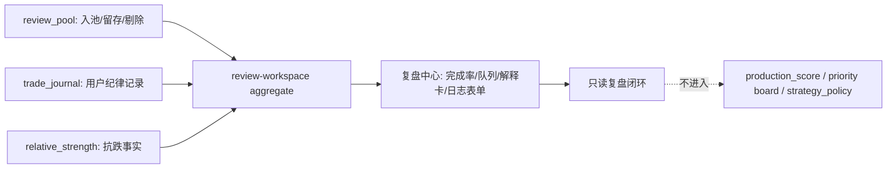

# Strategy Review Workspace Optimization Implementation Plan

> **For agentic workers:** REQUIRED SUB-SKILL: Use superpowers:subagent-driven-development (recommended) or superpowers:executing-plans to implement this plan task-by-task. Steps use checkbox (`- [ ]`) syntax for tracking.

**Goal:** 将策略跟踪里的“复盘 / 纪律日志 / 抗跌事实”从三个孤立 Tab 优化成一个可执行的“复盘中心”，形成“复盘队列 -> 写纪律日志 -> 查看抗跌事实 -> 日/周小结”的闭环。

**Architecture:** 后端新增只读聚合接口复用现有 `review_pool`、`trade_journal`、`relative_strength` 服务，不改生产排序、不改 `strategy_policy.py`。前端新增 `StrategyReviewWorkspacePanel`，把三类能力收进一个复盘工作台；已有独立组件保留为子组件或回退路径。OpenAPI 仍是契约事实源，前端类型从 `frontend/src/generated/api-types.ts` 收敛。

**Tech Stack:** FastAPI, Pydantic, SQLAlchemy, RuntimeTaskQueue, React, AntD, TanStack Query, Zustand, DataTable, VirtualCardList, Vitest, Pytest.

---

## 0. Scope And Hard Boundaries

### Authority Documents

- `/Users/j/Documents/gupiao/AGENTS.md`
- `/Users/j/Documents/gupiao/docs/engineering-conventions.md`
- `/Users/j/Documents/gupiao/docs/trading-experience-observation-suite-requirements-2026-06-02.md`
- `/Users/j/Documents/gupiao/docs/trading-experience-observation-suite-final-execution-plan-2026-06-02.md`
- `/Users/j/Documents/gupiao/docs/reports/three-pages-layout-restructure-plan-2026-06-01.md`
- `/Users/j/Documents/gupiao/docs/reports/frontend-information-density-optimization-plan-2026-06-01.md`
- `/Users/j/Documents/gupiao/docs/reports/platform-next-stage-b5-frontend-information-denoising-2026-06-04.md`

### Non-Negotiable Boundaries

- Do not modify `backend/app/services/low_buy/strategy_policy.py`.
- Do not modify low-buy, priority board, front-row weighted, or strategy tracking production ranking semantics.
- Do not create or write `production_score`.
- Do not emit buy/sell/add/low-buy/must-rise recommendation copy.
- Do not make “抗跌事实” a prediction; it remains observed relative strength only.
- Do not rebuild low-buy, AKeyLevel, sector leader, or strategy tracking engines.
- Do not run heavy compute in Web request paths.
- All new behavior must be behind existing flags:
  - `trading_experience_suite_enabled`
  - `trade_review_suite_enabled`
  - `relative_strength_board_enabled`
- If flags are disabled, `/strategy-tracking` must keep existing behavior and not show the review workspace.

### Added Small Features In This Plan

The following four small features are part of this plan and must be implemented with the review workspace, not deferred:

1. **复盘完成率**：show today review completion rate, missing journal count, and 7-day discipline pass rate from existing journal flags.
2. **一键从复盘队列写日志**：selecting a queue row pre-fills symbol, signal source, and review reason in the journal form.
3. **抗跌事实解释卡**：show market context, relative-to-market, relative-to-sector, resilience flag, and a non-predictive disclaimer.
4. **收盘后复盘提醒状态**：show whether the post-close review pool is not due, queued, refreshing, ready, insufficient, or blocked. This is a UI/API status only; Feishu notification integration remains outside this implementation unless separately authorized.
5. **性能预算与源级观测**：review workspace API must expose source timings and stay on cached/read-model paths; frontend must avoid duplicate queries, large rerenders, layout shift, and oversized bundles.

---

## 1. File Structure

### Backend

- Modify: `/Users/j/Documents/gupiao/backend/app/services/trading_experience/schemas.py`
  - Add `ReviewWorkspaceSourceStatus`, `ReviewWorkspaceSummary`, `ReviewWorkspaceItem`, `ReviewWorkspaceResponse`.
  - Add `TradeJournalEntryUpdate` for journal edit support.
- Create: `/Users/j/Documents/gupiao/backend/app/services/trading_experience/review_workspace.py`
  - Compose review pool, trade journal, and relative strength into a read-only workspace payload.
  - No heavy recomputation; use existing service functions.
  - Record source-level elapsed milliseconds for `review_pool`, `trade_journal`, and `relative_strength`.
- Modify: `/Users/j/Documents/gupiao/backend/app/services/trading_experience/service.py`
  - Add `review_workspace(...)`.
- Modify: `/Users/j/Documents/gupiao/backend/app/api/routes/trading_experience.py`
  - Add `GET /api/trading-experience/review-workspace`.
  - Add `PATCH /api/trading-experience/trade-journal/{entry_id}` and `DELETE /api/trading-experience/trade-journal/{entry_id}`.
- Test: `/Users/j/Documents/gupiao/backend/tests/test_trading_experience_review_workspace.py`
  - Contract and behavior tests for the aggregate endpoint.

### Frontend API And Types

- Modify generated by command: `/Users/j/Documents/gupiao/docs/contracts/openapi.json`
- Modify generated by command: `/Users/j/Documents/gupiao/docs/contracts/openapi.hash`
- Modify generated by command: `/Users/j/Documents/gupiao/frontend/src/generated/api-types.ts`
- Modify: `/Users/j/Documents/gupiao/frontend/src/types.ts`
  - Export generated `ReviewWorkspaceResponse`, `ReviewWorkspaceItem`, and `TradeJournalEntryUpdate` through the existing type barrel.
- Modify: `/Users/j/Documents/gupiao/frontend/src/api/client.ts`
  - Add `getTradingExperienceReviewWorkspace(...)`.
- Modify: `/Users/j/Documents/gupiao/frontend/src/features/strategy-tracking/queries.ts`
  - Add `useReviewWorkspace(...)`.

### Frontend UI

- Create: `/Users/j/Documents/gupiao/frontend/src/features/strategy-tracking/StrategyReviewWorkspacePanel.tsx`
  - Main review center panel.
- Create: `/Users/j/Documents/gupiao/frontend/src/features/strategy-tracking/ReviewWorkspaceSummaryCards.tsx`
  - Compact KPI cards: 待复盘 / 已留存 / 已剔除 / 缺日志 / 完成率 / 7日纪律.
- Create: `/Users/j/Documents/gupiao/frontend/src/features/strategy-tracking/ReviewWorkspaceReminderStatus.tsx`
  - Post-close review refresh/reminder status strip.
- Create: `/Users/j/Documents/gupiao/frontend/src/features/strategy-tracking/ReviewWorkspacePerfStatus.tsx`
  - Compact source timing and stale/partial status display for professional mode.
- Create: `/Users/j/Documents/gupiao/frontend/src/features/strategy-tracking/ReviewWorkspaceQueue.tsx`
  - Review queue table/card list.
- Create: `/Users/j/Documents/gupiao/frontend/src/features/strategy-tracking/ReviewWorkspaceRelativeStrengthCard.tsx`
  - Non-predictive relative strength explanation card.
- Create: `/Users/j/Documents/gupiao/frontend/src/features/strategy-tracking/ReviewWorkspaceDetail.tsx`
  - Selected item detail, evidence, related journal entries, relative strength facts.
- Modify: `/Users/j/Documents/gupiao/frontend/src/features/strategy-tracking/TradeJournalQuickEntry.tsx`
  - Accept `initialSymbol`, `initialReasonText`, `initialSignalSource` props with default empty/manual values.
- Modify: `/Users/j/Documents/gupiao/frontend/src/features/strategy-tracking/StrategyTrackingPage.tsx`
  - Replace separate `复盘` / `纪律日志` / `抗跌事实` analysis tabs with one `复盘中心` tab when relevant flags are enabled.
- Modify: `/Users/j/Documents/gupiao/frontend/src/stores/strategyTrackingStore.ts`
  - Add `reviewWorkspaceSelectedKey: string | null`.
  - Add `setReviewWorkspaceSelectedKey(...)`.
  - Replace or alias analysis tab values carefully; preserve existing values for backward compatibility.
- Modify: `/Users/j/Documents/gupiao/frontend/src/styles/workspace/workspace-strategy-tracking.css`
  - Add dense review workspace grid, KPI cards, reminder strip, detail card, and mobile single-column styles.
- Create: `/Users/j/Documents/gupiao/docs/reports/strategy-review-workspace-performance-2026-06-05.md`
  - Record local API timing, frontend render checks, bundle/analyze result, and performance acceptance status.

### Tests

- Create: `/Users/j/Documents/gupiao/frontend/src/features/strategy-tracking/StrategyReviewWorkspacePanel.test.tsx`
- Modify: `/Users/j/Documents/gupiao/frontend/src/features/strategy-tracking/StrategyTrackingPage.test.tsx`
- Modify: `/Users/j/Documents/gupiao/frontend/src/features/strategy-tracking/TradeJournalPanel.test.tsx`
- Modify: `/Users/j/Documents/gupiao/frontend/src/features/strategy-tracking/TradeReviewPanel.test.tsx`
- Modify: `/Users/j/Documents/gupiao/frontend/src/features/strategy-tracking/RelativeStrengthBoard.test.tsx`

---

## 2. Data Contract

### Backend Schema

Add these schemas to `backend/app/services/trading_experience/schemas.py`:

```python
ReviewReminderStatus = Literal["not_due", "queued", "refreshing", "ready", "insufficient", "blocked"]


class ReviewWorkspaceSourceStatus(BaseModel):
    source: Literal["review_pool", "trade_journal", "relative_strength"]
    status: Literal["ok", "disabled", "stale", "insufficient", "timeout", "error"]
    elapsed_ms: float = 0.0
    item_count: int = 0
    reason: str = ""


class ReviewWorkspaceReminder(BaseModel):
    status: ReviewReminderStatus = "not_due"
    message: str = "收盘后生成复盘池"
    pool_date: str | None = None
    refresh_queued: bool = False
    last_success_at: datetime | None = None
    data_quality: DataQuality = "insufficient"


class ReviewWorkspaceSummary(BaseModel):
    pending_review_count: int = 0
    retained_count: int = 0
    dropped_count: int = 0
    missing_journal_count: int = 0
    journal_count: int = 0
    relative_strength_count: int = 0
    completion_rate_pct: float = 0.0
    seven_day_discipline_pass_rate_pct: float | None = None
    seven_day_journal_count: int = 0
    market_context: str = "unknown"


class ReviewWorkspaceItem(BaseModel):
    review_key: str
    pool_item: ReviewPoolItem
    journal_entries: list[TradeJournalEntryOut] = Field(default_factory=list)
    relative_strength: RelativeStrengthItem | None = None
    review_status: Literal["pending", "journaled", "retained", "dropped", "data_issue"]
    next_action_label: str


class ReviewWorkspaceResponse(TradingExperienceMeta):
    enabled: bool
    review_enabled: bool
    relative_strength_enabled: bool
    pool_date: str | None = None
    board_filter: BoardFilter = "include_all"
    reminder: ReviewWorkspaceReminder = Field(default_factory=ReviewWorkspaceReminder)
    summary: ReviewWorkspaceSummary = Field(default_factory=ReviewWorkspaceSummary)
    sources: list[ReviewWorkspaceSourceStatus] = Field(default_factory=list)
    cache_status: Literal["fresh", "stale", "miss"] = "miss"
    elapsed_ms: float = 0.0
    items: list[ReviewWorkspaceItem] = Field(default_factory=list)
    total: int = 0
```

### Frontend Contract Expectations

The UI must use generated types after `npm run api:check`, but component props should be shaped as:

```ts
type ReviewWorkspaceResponse = components["schemas"]["ReviewWorkspaceResponse"];
type ReviewWorkspaceItem = components["schemas"]["ReviewWorkspaceItem"];
```

Do not manually duplicate backend fields in frontend unless the project type barrel already requires it.

### Performance Budget

Backend budget:

| Surface | Target | Hard Limit | Notes |
|---|---:|---:|---|
| `GET /api/trading-experience/review-workspace` warm p95 | `<250ms` | `<500ms` | local/API warm path, no heavy compute |
| `review_pool` source elapsed | `<120ms` | `<250ms` | prefer stored pool when available |
| `trade_journal` source elapsed | `<80ms` | `<150ms` | limit query, index-friendly order |
| `relative_strength` source elapsed | `<120ms` | `<250ms` | read/cached only; if slow, return partial |
| response payload size | `<120KB` | `<250KB` | `limit=30`; no unbounded evidence text |

Frontend budget:

| Surface | Target | Hard Limit | Notes |
|---|---:|---:|---|
| Review workspace first render after data | `<120ms` | `<250ms` | measured by test/profiler helper when available |
| Review queue rows | `<=30` default | `<=100` max | virtualize/card-list if mobile or large |
| Duplicate network requests | `0` duplicates per tab switch | `0` | one aggregate query replaces three independent queries |
| Layout shift | no visible jump after data | no overlapping text | fixed metric card slots |
| Bundle impact gzip | `<15KB` | `<30KB` | no new framework dependency |

Performance rules:

- Do not call `review_pool`, `trade_journal`, and `relative_strength` as three separate frontend queries after the aggregate is enabled.
- Backend aggregate must return `sources[]`, `elapsed_ms`, and `cache_status`.
- If a noncritical source is slow or unavailable, return partial data with `sources[].status` and keep the main response available.
- Do not increase API timeout thresholds to pass performance.
- No new npm/pypi framework-level dependencies for this feature.

### UI Layout Wireframes

Desktop layout, `>=1200px`:

```text
┌──────────────────────────────────────────────────────────────────────────────┐
│ 复盘中心                                                     [只看主板]       │
│ 复盘队列、纪律日志、抗跌事实串成一个闭环；仅用于观察和复盘。                  │
├──────────────────────────────────────────────────────────────────────────────┤
│ 收盘后复盘：今日复盘池已生成 · 待复盘 6 条 · 缺日志 4 条 · 不发送买卖建议       │
├────────────┬────────────┬────────────┬────────────┬────────────┬────────────┤
│ 待复盘 6   │ 已留存 3   │ 已剔除 2   │ 缺日志 4   │ 完成率 33% │ 7日纪律 71% │
├───────────────────────────────────┬──────────────────────────────────────────┤
│ 复盘队列 DataTable                 │ 详情 / 写纪律日志                         │
│ 股票 | 状态 | 涨幅 | 跟踪日 | 动作   │ 股票、证据、剔除原因                       │
│ 浦发  待复盘  +8.2  3     写复盘    │ 抗跌事实解释卡                             │
│ ...                               │ 一键预填纪律日志表单                       │
└───────────────────────────────────┴──────────────────────────────────────────┘
```

Mobile layout, `<768px`:

```text
┌────────────────────────────┐
│ 复盘中心        [只看主板] │
│ 收盘后复盘状态             │
├────────────┬───────────────┤
│ 待复盘     │ 缺日志        │
│ 完成率     │ 7日纪律       │
├────────────────────────────┤
│ 复盘队列 VirtualCardList   │
│ 浦发银行 600000            │
│ 待复盘 · 留存 · +8.2%      │
│ [写复盘]                  │
├────────────────────────────┤
│ 详情抽屉/折叠区            │
│ 抗跌事实解释卡             │
│ 一键预填纪律日志           │
└────────────────────────────┘
```

Mermaid information flow:



### Styling Rules

- Use existing global workspace CSS file: `frontend/src/styles/workspace/workspace-strategy-tracking.css`.
- Add class names only; do not add inline `style={{}}` objects.
- Required classes:
  - `.strategy-review-reminder`
  - `.strategy-review-summary-cards`
  - `.strategy-review-summary-card`
  - `.strategy-review-workspace-grid`
  - `.strategy-review-queue`
  - `.strategy-review-detail`
  - `.strategy-review-relative-card`
- Use existing spacing and color tokens where available. Do not introduce decorative hero blocks, gradient orbs, or card-in-card nesting.
- Cards must be compact: fixed metric label/value slots, no text overflow, and mobile wraps into two columns.

---

## 3. Task A: Backend Review Workspace Aggregate

**Files:**
- Create: `/Users/j/Documents/gupiao/backend/app/services/trading_experience/review_workspace.py`
- Modify: `/Users/j/Documents/gupiao/backend/app/services/trading_experience/schemas.py`
- Modify: `/Users/j/Documents/gupiao/backend/app/services/trading_experience/service.py`
- Modify: `/Users/j/Documents/gupiao/backend/app/api/routes/trading_experience.py`
- Test: `/Users/j/Documents/gupiao/backend/tests/test_trading_experience_review_workspace.py`

- [x] **Step A1: Write failing backend tests**

Add `/Users/j/Documents/gupiao/backend/tests/test_trading_experience_review_workspace.py`:

```python
from datetime import date

from app.services.trading_experience.service import TradingExperienceService


def test_review_workspace_is_disabled_when_flags_are_off(db_session):
    response = TradingExperienceService(db_session).review_workspace(pool_date=date(2026, 5, 24), limit=10)

    assert response.enabled is False
    assert response.review_enabled is False
    assert response.relative_strength_enabled is False
    assert response.data_quality == "blocked"
    assert response.items == []
    assert response.summary.pending_review_count == 0


def test_review_workspace_links_pool_items_to_journals_and_relative_strength(db_session, monkeypatch):
    monkeypatch.setattr(
        "app.services.trading_experience.service.TradingExperienceService.flags",
        lambda self: {
            "trading_experience_suite_enabled": True,
            "trade_review_suite_enabled": True,
            "vp_position_tags_enabled": False,
            "relative_strength_board_enabled": True,
            "holding_discipline_assistant_enabled": False,
            "limit_up_followthrough_enabled": False,
            "t_trade_discipline_enabled": False,
        },
    )

    response = TradingExperienceService(db_session).review_workspace(pool_date=date(2026, 5, 24), limit=20)

    assert response.enabled is True
    assert response.review_enabled is True
    assert response.relative_strength_enabled is True
    assert response.research_only is True
    assert response.source == "review_workspace"
    assert response.summary.pending_review_count >= 0
    assert response.summary.missing_journal_count >= 0
    assert response.summary.completion_rate_pct >= 0
    assert response.summary.seven_day_journal_count >= 0
    assert response.reminder.status in {"not_due", "queued", "refreshing", "ready", "insufficient", "blocked"}
    assert response.reminder.message
    for item in response.items:
        assert item.review_key == f"{item.pool_item.pool_date}:{item.pool_item.symbol}"
        assert item.next_action_label in {"写复盘", "查看纪律", "查看剔除原因", "检查数据"}
        assert item.review_status in {"pending", "journaled", "retained", "dropped", "data_issue"}
```

Run:

```bash
cd /Users/j/Documents/gupiao
PYTHONPATH=backend:. backend/.venv/bin/python -m pytest backend/tests/test_trading_experience_review_workspace.py -q
```

Expected: fail because `review_workspace` does not exist.

- [x] **Step A2: Add schemas**

Edit `backend/app/services/trading_experience/schemas.py` and add the schema block from section 2 after `RelativeStrengthResponse`.

- [x] **Step A3: Implement aggregator**

Create `/Users/j/Documents/gupiao/backend/app/services/trading_experience/review_workspace.py`:

```python
from __future__ import annotations

from datetime import date, datetime
from time import perf_counter

from sqlalchemy.orm import Session

from app.services.trading_experience import relative_strength, review_pool, trade_journal
from app.services.trading_experience.config import ENGINE_VERSION
from app.services.trading_experience.schemas import (
    BoardFilter,
    ReviewWorkspaceReminder,
    ReviewWorkspaceItem,
    ReviewWorkspaceResponse,
    ReviewWorkspaceSourceStatus,
    ReviewWorkspaceSummary,
)


def build_workspace(
    db: Session,
    *,
    pool_date: date | None,
    limit: int,
    board_filter: BoardFilter,
    relative_strength_enabled: bool,
) -> ReviewWorkspaceResponse:
    started = perf_counter()
    sources: list[ReviewWorkspaceSourceStatus] = []

    source_started = perf_counter()
    pool_items = review_pool.list_review_pool(db, pool_date=pool_date, limit=limit, board_filter=board_filter)
    sources.append(
        ReviewWorkspaceSourceStatus(
            source="review_pool",
            status="ok" if pool_items else "insufficient",
            elapsed_ms=_elapsed_ms(source_started),
            item_count=len(pool_items),
            reason="" if pool_items else "empty_review_pool",
        )
    )

    source_started = perf_counter()
    journal_entries = trade_journal.list_entries(db, user_id=None, account_id=None, symbol=None, limit=max(limit * 4, 80))
    sources.append(
        ReviewWorkspaceSourceStatus(
            source="trade_journal",
            status="ok",
            elapsed_ms=_elapsed_ms(source_started),
            item_count=len(journal_entries),
        )
    )
    journal_by_symbol: dict[str, list] = {}
    for entry in journal_entries:
        journal_by_symbol.setdefault(entry.symbol, []).append(entry)

    source_started = perf_counter()
    rs_items = relative_strength.build_board(db, trade_date=pool_date, limit=max(limit * 4, 80)) if relative_strength_enabled else []
    sources.append(
        ReviewWorkspaceSourceStatus(
            source="relative_strength",
            status=("ok" if rs_items else "insufficient") if relative_strength_enabled else "disabled",
            elapsed_ms=_elapsed_ms(source_started),
            item_count=len(rs_items),
            reason="" if rs_items or relative_strength_enabled else "feature_flag_disabled",
        )
    )
    rs_by_symbol = {item.symbol: item for item in rs_items}

    workspace_items: list[ReviewWorkspaceItem] = []
    for pool_item in pool_items:
        entries = journal_by_symbol.get(pool_item.symbol, [])
        related_rs = rs_by_symbol.get(pool_item.symbol)
        status = _review_status(pool_item.data_quality, pool_item.status, bool(entries))
        workspace_items.append(
            ReviewWorkspaceItem(
                review_key=f"{pool_item.pool_date}:{pool_item.symbol}",
                pool_item=pool_item,
                journal_entries=entries,
                relative_strength=related_rs,
                review_status=status,
                next_action_label=_next_action_label(status),
            )
        )

    summary = ReviewWorkspaceSummary(
        pending_review_count=sum(1 for item in workspace_items if item.review_status == "pending"),
        retained_count=sum(1 for item in workspace_items if item.pool_item.status == "retained"),
        dropped_count=sum(1 for item in workspace_items if item.pool_item.status == "dropped"),
        missing_journal_count=sum(1 for item in workspace_items if not item.journal_entries),
        journal_count=sum(len(item.journal_entries) for item in workspace_items),
        relative_strength_count=sum(1 for item in workspace_items if item.relative_strength is not None),
        completion_rate_pct=_completion_rate(workspace_items),
        seven_day_discipline_pass_rate_pct=_discipline_pass_rate(journal_entries),
        seven_day_journal_count=len(journal_entries),
        market_context=_market_context(rs_items),
    )
    reminder = _reminder(pool_items, workspace_items, pool_date)

    return ReviewWorkspaceResponse(
        enabled=True,
        review_enabled=True,
        relative_strength_enabled=relative_strength_enabled,
        pool_date=pool_items[0].pool_date if pool_items else (pool_date.isoformat() if pool_date else None),
        board_filter=board_filter,
        reminder=reminder,
        summary=summary,
        sources=sources,
        cache_status="fresh" if pool_items else "miss",
        elapsed_ms=_elapsed_ms(started),
        items=workspace_items,
        total=len(workspace_items),
        data_quality="ok" if workspace_items else "insufficient",
        as_of=datetime.now(),
        engine_version=ENGINE_VERSION,
        source="review_workspace",
        research_only=True,
    )


def disabled_workspace(*, review_enabled: bool, relative_strength_enabled: bool, board_filter: BoardFilter) -> ReviewWorkspaceResponse:
    return ReviewWorkspaceResponse(
        enabled=False,
        review_enabled=review_enabled,
        relative_strength_enabled=relative_strength_enabled,
        board_filter=board_filter,
        data_quality="blocked",
        as_of=datetime.now(),
        engine_version=ENGINE_VERSION,
        source="feature_flag",
        research_only=True,
    )


def _review_status(data_quality: str, pool_status: str, has_journal: bool) -> str:
    if data_quality != "ok":
        return "data_issue"
    if has_journal:
        return "journaled"
    if pool_status == "retained":
        return "retained"
    if pool_status == "dropped":
        return "dropped"
    return "pending"


def _next_action_label(status: str) -> str:
    if status == "journaled":
        return "查看纪律"
    if status == "dropped":
        return "查看剔除原因"
    if status == "data_issue":
        return "检查数据"
    return "写复盘"


def _market_context(items: list) -> str:
    if not items:
        return "no_relative_strength"
    index_pcts = [float(item.index_pct or 0.0) for item in items]
    avg_index = sum(index_pcts) / len(index_pcts)
    if avg_index <= -1.0:
        return "market_down_day"
    return "normal_day"


def _elapsed_ms(started: float) -> float:
    return round((perf_counter() - started) * 1000.0, 3)


def _completion_rate(items: list[ReviewWorkspaceItem]) -> float:
    total = len(items)
    if total <= 0:
        return 0.0
    completed = sum(1 for item in items if item.journal_entries)
    return round(completed * 100.0 / total, 2)


def _discipline_pass_rate(entries: list) -> float | None:
    checked = []
    for entry in entries:
        flags = entry.discipline_flags or {}
        if flags:
            checked.append(all(bool(value) for value in flags.values()))
    if not checked:
        return None
    return round(sum(1 for value in checked if value) * 100.0 / len(checked), 2)


def _reminder(pool_items: list, workspace_items: list[ReviewWorkspaceItem], pool_date: date | None) -> ReviewWorkspaceReminder:
    if not pool_items:
        return ReviewWorkspaceReminder(
            status="insufficient",
            message="复盘池暂无可用数据",
            pool_date=pool_date.isoformat() if pool_date else None,
            refresh_queued=False,
            data_quality="insufficient",
        )
    missing = sum(1 for item in workspace_items if not item.journal_entries)
    return ReviewWorkspaceReminder(
        status="ready",
        message=f"今日复盘池已生成，待补纪律日志 {missing} 条",
        pool_date=pool_items[0].pool_date,
        refresh_queued=False,
        last_success_at=datetime.now(),
        data_quality="ok",
    )
```

- [x] **Step A4: Wire service**

Edit `backend/app/services/trading_experience/service.py`:

```python
from app.services.trading_experience import holding_discipline, limit_up_followthrough, relative_strength, review_pool, review_workspace, t_trade_attribution, trade_journal, volume_position_tags
```

Add method inside `TradingExperienceService`:

```python
def review_workspace(self, *, pool_date: date | None, limit: int, board_filter: BoardFilter = "include_all") -> ReviewWorkspaceResponse:
    flags = self.flags()
    review_enabled = flags["trading_experience_suite_enabled"] and flags.get("trade_review_suite_enabled", False)
    rs_enabled = flags["trading_experience_suite_enabled"] and flags.get("relative_strength_board_enabled", False)
    if not review_enabled:
        return self._validated(
            review_workspace.disabled_workspace(
                review_enabled=review_enabled,
                relative_strength_enabled=rs_enabled,
                board_filter=board_filter,
            )
        )
    return self._validated(
        review_workspace.build_workspace(
            self.db,
            pool_date=pool_date,
            limit=limit,
            board_filter=board_filter,
            relative_strength_enabled=rs_enabled,
        )
    )
```

- [x] **Step A5: Add route**

Edit `backend/app/api/routes/trading_experience.py`:

```python
from app.services.trading_experience.schemas import ReviewWorkspaceResponse
```

Add:

```python
@router.get("/review-workspace", response_model=ReviewWorkspaceResponse)
def get_review_workspace(
    pool_date: date | None = Query(default=None),
    limit: int = Query(default=30, ge=1, le=100),
    board_filter: BoardFilter = Query(default="include_all"),
    db: Session = Depends(get_db),
) -> ReviewWorkspaceResponse:
    return TradingExperienceService(db).review_workspace(pool_date=pool_date, limit=limit, board_filter=board_filter)
```

- [x] **Step A6: Run backend tests**

Run:

```bash
cd /Users/j/Documents/gupiao
PYTHONPATH=backend:. backend/.venv/bin/python -m pytest backend/tests/test_trading_experience_review_workspace.py backend/tests/test_trading_experience_*.py -q
```

Expected: pass. Existing warning from urllib3/LibreSSL is acceptable if already present.

---

## 4. Task B: OpenAPI And Frontend API Hook

**Files:**
- Modify generated: `/Users/j/Documents/gupiao/docs/contracts/openapi.json`
- Modify generated: `/Users/j/Documents/gupiao/docs/contracts/openapi.hash`
- Modify generated: `/Users/j/Documents/gupiao/frontend/src/generated/api-types.ts`
- Modify: `/Users/j/Documents/gupiao/frontend/src/types.ts`
- Modify: `/Users/j/Documents/gupiao/frontend/src/api/client.ts`
- Modify: `/Users/j/Documents/gupiao/frontend/src/features/strategy-tracking/queries.ts`

- [x] **Step B1: Generate and check API contract**

Run:

```bash
cd /Users/j/Documents/gupiao/frontend
npm run api:check
```

Expected: pass and update generated contract files if backend schemas changed.

- [x] **Step B2: Add API wrapper**

Edit `frontend/src/api/client.ts` next to existing trading experience calls:

```ts
getTradingExperienceReviewWorkspace: (limit = 30, boardFilter: "include_all" | "main_only" = "include_all") =>
  requestCached<ReviewWorkspaceResponse>(`/trading-experience/review-workspace?limit=${limit}&board_filter=${boardFilter}`, 12000),
```

Import `ReviewWorkspaceResponse` from the existing type barrel or generated types.

- [x] **Step B3: Add query hook**

Edit `frontend/src/features/strategy-tracking/queries.ts`:

```ts
export function useReviewWorkspace(boardFilter: "include_all" | "main_only" = "include_all", enabled = true) {
  return useQuery({
    queryKey: [...queryKeys.tradingExperienceReview(boardFilter), "workspace"],
    queryFn: () => api.getTradingExperienceReviewWorkspace(30, boardFilter),
    enabled,
    ...strategyTrackingSwrOptions,
    staleTime: STRATEGY_TRACKING_STALE_TIME_MS,
  });
}
```

- [x] **Step B4: Run typecheck**

Run:

```bash
cd /Users/j/Documents/gupiao/frontend
npm run typecheck
```

Expected: pass.

---

## 5. Task C: Review Workspace UI Components

**Files:**
- Create: `/Users/j/Documents/gupiao/frontend/src/features/strategy-tracking/StrategyReviewWorkspacePanel.tsx`
- Create: `/Users/j/Documents/gupiao/frontend/src/features/strategy-tracking/ReviewWorkspaceSummaryCards.tsx`
- Create: `/Users/j/Documents/gupiao/frontend/src/features/strategy-tracking/ReviewWorkspaceQueue.tsx`
- Create: `/Users/j/Documents/gupiao/frontend/src/features/strategy-tracking/ReviewWorkspaceDetail.tsx`
- Modify: `/Users/j/Documents/gupiao/frontend/src/features/strategy-tracking/TradeJournalQuickEntry.tsx`
- Test: `/Users/j/Documents/gupiao/frontend/src/features/strategy-tracking/StrategyReviewWorkspacePanel.test.tsx`

- [x] **Step C1: Write failing UI test**

Create `frontend/src/features/strategy-tracking/StrategyReviewWorkspacePanel.test.tsx`:

```tsx
import { renderToStaticMarkup } from "react-dom/server";
import { describe, expect, it, vi } from "vitest";
import { StrategyReviewWorkspacePanel } from "./StrategyReviewWorkspacePanel";

describe("StrategyReviewWorkspacePanel", () => {
  it("renders review queue, journal action, and relative strength facts as one workflow", () => {
    const html = renderToStaticMarkup(
      <StrategyReviewWorkspacePanel
        data={{
          enabled: true,
          review_enabled: true,
          relative_strength_enabled: true,
          pool_date: "2026-05-24",
          board_filter: "include_all",
          summary: {
            pending_review_count: 1,
            retained_count: 1,
            dropped_count: 0,
            missing_journal_count: 1,
            journal_count: 0,
            relative_strength_count: 1,
            completion_rate_pct: 0,
            seven_day_discipline_pass_rate_pct: 75,
            seven_day_journal_count: 4,
            market_context: "market_down_day",
          },
          reminder: {
            status: "ready",
            message: "今日复盘池已生成，待补纪律日志 1 条",
            pool_date: "2026-05-24",
            refresh_queued: false,
            last_success_at: "2026-05-24T15:35:00+08:00",
            data_quality: "ok",
          },
          items: [
            {
              review_key: "2026-05-24:600000",
              review_status: "pending",
              next_action_label: "写复盘",
              pool_item: {
                pool_date: "2026-05-24",
                symbol: "600000",
                name: "浦发银行",
                board_type: "main",
                board_name: "主板",
                status: "retained",
                entry_pct: 8.2,
                volume_ratio: 1.4,
                mainline_state: "sector_known",
                sector_role: "银行",
                drop_reason: "",
                tracked_days: 3,
                evidence: ["信号日涨幅 8.20%", "后续跟踪 3 日，仅用于复盘"],
                data_quality: "ok",
                as_of: "2026-05-24T15:30:00+08:00",
                engine_version: "test",
              },
              journal_entries: [],
              relative_strength: {
                symbol: "600000",
                trade_date: "2026-05-24",
                index_code: "000300",
                sector_code: "银行",
                stock_pct: 1.2,
                index_pct: -1.4,
                sector_pct: -0.5,
                rs_vs_index: 2.6,
                rs_vs_sector: 1.7,
                sector_rank: 1,
                resilience_flag: "resilient",
                data_quality: "ok",
                as_of: "2026-05-24T15:30:00+08:00",
              },
            },
          ],
          total: 1,
          data_quality: "ok",
          as_of: "2026-05-24T15:30:00+08:00",
          engine_version: "test",
          source: "review_workspace",
          research_only: true,
        }}
        loading={false}
        boardFilter="include_all"
        onBoardFilterChange={vi.fn()}
        onCreateJournal={vi.fn()}
        creatingJournal={false}
      />,
    );

    expect(html).toContain("复盘中心");
    expect(html).toContain("今日复盘池已生成");
    expect(html).toContain("待复盘");
    expect(html).toContain("缺日志");
    expect(html).toContain("完成率");
    expect(html).toContain("7日纪律");
    expect(html).toContain("浦发银行");
    expect(html).toContain("写复盘");
    expect(html).toContain("抗跌事实");
    expect(html).toContain("相对市场");
    expect(html).toContain("相对板块");
    expect(html).toContain("仅用于观察和复盘");
  });

  it("renders disabled state without review actions", () => {
    const html = renderToStaticMarkup(
      <StrategyReviewWorkspacePanel
        data={{
          enabled: false,
          review_enabled: false,
          relative_strength_enabled: false,
          board_filter: "include_all",
          summary: {
            pending_review_count: 0,
            retained_count: 0,
            dropped_count: 0,
            missing_journal_count: 0,
            journal_count: 0,
            relative_strength_count: 0,
            completion_rate_pct: 0,
            seven_day_discipline_pass_rate_pct: null,
            seven_day_journal_count: 0,
            market_context: "unknown",
          },
          reminder: {
            status: "blocked",
            message: "复盘中心未开启",
            refresh_queued: false,
            data_quality: "blocked",
          },
          items: [],
          total: 0,
          data_quality: "blocked",
          as_of: "2026-05-24T15:30:00+08:00",
          engine_version: "test",
          source: "feature_flag",
          research_only: true,
        }}
        loading={false}
        boardFilter="include_all"
        onBoardFilterChange={vi.fn()}
        onCreateJournal={vi.fn()}
        creatingJournal={false}
      />,
    );

    expect(html).toContain("复盘中心未开启");
    expect(html).not.toContain("写复盘");
  });
});
```

Run:

```bash
cd /Users/j/Documents/gupiao/frontend
npm test -- --run src/features/strategy-tracking/StrategyReviewWorkspacePanel.test.tsx
```

Expected: fail because component files do not exist.

- [x] **Step C2: Implement summary cards**

Create `ReviewWorkspaceSummaryCards.tsx`:

```tsx
import { Tag } from "antd";
import type { ReviewWorkspaceResponse } from "../../types";

export function ReviewWorkspaceSummaryCards({ summary }: { summary: ReviewWorkspaceResponse["summary"] }) {
  const cards = [
    { key: "pending", label: "待复盘", value: summary.pending_review_count, tone: "warn" },
    { key: "retained", label: "已留存", value: summary.retained_count, tone: "up" },
    { key: "dropped", label: "已剔除", value: summary.dropped_count, tone: "down" },
    { key: "missing", label: "缺日志", value: summary.missing_journal_count, tone: "warn" },
    { key: "completion", label: "完成率", value: `${summary.completion_rate_pct.toFixed(0)}%`, tone: "neutral" },
    {
      key: "discipline",
      label: "7日纪律",
      value: summary.seven_day_discipline_pass_rate_pct == null ? "--" : `${summary.seven_day_discipline_pass_rate_pct.toFixed(0)}%`,
      tone: "neutral",
    },
  ];
  return (
    <div className="strategy-review-summary-cards">
      {cards.map((card) => (
        <section className={`strategy-review-summary-card tone-${card.tone}`} key={card.key}>
          <span>{card.label}</span>
          <strong>{card.value}</strong>
        </section>
      ))}
      <Tag>{marketContextText(summary.market_context)}</Tag>
    </div>
  );
}

function marketContextText(value: string) {
  if (value === "market_down_day") return "大跌日背景";
  if (value === "normal_day") return "非大跌日";
  return "市场背景不足";
}
```

- [x] **Step C3: Implement reminder status**

Create `ReviewWorkspaceReminderStatus.tsx`:

```tsx
import { Alert, Tag } from "antd";
import type { ReviewWorkspaceResponse } from "../../types";

export function ReviewWorkspaceReminderStatus({ reminder }: { reminder?: ReviewWorkspaceResponse["reminder"] }) {
  if (!reminder) return null;
  const type = reminder.status === "ready" ? "success" : reminder.status === "blocked" ? "warning" : "info";
  return (
    <Alert
      className="strategy-review-reminder"
      type={type}
      showIcon
      message={
        <span>
          收盘后复盘：{reminder.message}
          {reminder.refresh_queued ? <Tag>刷新已排队</Tag> : null}
          <Tag>{statusText(reminder.status)}</Tag>
        </span>
      }
      description="该状态只提醒复盘池是否可用，不发送买卖建议。"
    />
  );
}

function statusText(status: string) {
  if (status === "ready") return "已生成";
  if (status === "queued") return "已排队";
  if (status === "refreshing") return "刷新中";
  if (status === "insufficient") return "数据不足";
  if (status === "blocked") return "已关闭";
  return "未到收盘";
}
```

- [x] **Step C4: Implement performance status**

Create `ReviewWorkspacePerfStatus.tsx`:

```tsx
import { Tag } from "antd";
import type { ReviewWorkspaceResponse } from "../../types";

export function ReviewWorkspacePerfStatus({ data, professional }: { data?: ReviewWorkspaceResponse; professional: boolean }) {
  if (!professional || !data) return null;
  return (
    <div className="strategy-review-perf-status">
      <Tag>总耗时 {formatMs(data.elapsed_ms)}</Tag>
      <Tag>缓存 {cacheText(data.cache_status)}</Tag>
      {(data.sources ?? []).map((source) => (
        <Tag key={source.source}>
          {sourceName(source.source)} {source.status} {formatMs(source.elapsed_ms)}
        </Tag>
      ))}
    </div>
  );
}

function formatMs(value: number | null | undefined) {
  return `${Math.round(Number(value || 0))}ms`;
}

function cacheText(value: string) {
  if (value === "fresh") return "命中";
  if (value === "stale") return "旧快照";
  return "未命中";
}

function sourceName(value: string) {
  if (value === "review_pool") return "复盘池";
  if (value === "trade_journal") return "纪律日志";
  if (value === "relative_strength") return "抗跌事实";
  return value;
}
```

- [x] **Step C5: Implement queue**

Create `ReviewWorkspaceQueue.tsx`:

```tsx
import { Button, Tag } from "antd";
import { DataTable, PercentCell } from "../../ui/table/DataTable";
import type { ReviewWorkspaceResponse } from "../../types";

type ReviewWorkspaceItem = ReviewWorkspaceResponse["items"][number];

export function ReviewWorkspaceQueue({
  items,
  loading,
  selectedKey,
  onSelect,
}: {
  items: ReviewWorkspaceItem[];
  loading: boolean;
  selectedKey: string | null;
  onSelect: (item: ReviewWorkspaceItem) => void;
}) {
  return (
    <DataTable<ReviewWorkspaceItem>
      rowKey={(item) => item.review_key}
      loading={loading}
      dataSource={items}
      defaultScrollY={320}
      columns={[
        { title: "股票", dataIndex: ["pool_item", "symbol"], width: 160, render: (_, item) => `${item.pool_item.name || "--"} ${item.pool_item.symbol}` },
        { title: "复盘状态", dataIndex: "review_status", width: 110, render: statusTag },
        { title: "信号日涨幅", dataIndex: ["pool_item", "entry_pct"], width: 110, render: (_, item) => <PercentCell value={item.pool_item.entry_pct} /> },
        { title: "跟踪日", dataIndex: ["pool_item", "tracked_days"], width: 90, render: (_, item) => item.pool_item.tracked_days },
        { title: "动作", dataIndex: "next_action_label", width: 120, render: (_, item) => (
          <Button size="small" type={selectedKey === item.review_key ? "primary" : "default"} onClick={() => onSelect(item)}>
            {item.next_action_label}
          </Button>
        ) },
      ]}
    />
  );
}

function statusTag(value: unknown) {
  if (value === "journaled") return <Tag color="green">已记录</Tag>;
  if (value === "retained") return <Tag color="blue">已留存</Tag>;
  if (value === "dropped") return <Tag color="orange">已剔除</Tag>;
  if (value === "data_issue") return <Tag color="red">数据不足</Tag>;
  return <Tag>待复盘</Tag>;
}
```

- [x] **Step C6: Implement relative strength explanation card**

Create `ReviewWorkspaceRelativeStrengthCard.tsx`:

```tsx
import { Alert, Tag } from "antd";
import { PercentCell } from "../../ui/table/DataTable";
import type { ReviewWorkspaceResponse } from "../../types";

type ReviewWorkspaceItem = ReviewWorkspaceResponse["items"][number];

export function ReviewWorkspaceRelativeStrengthCard({ item }: { item: ReviewWorkspaceItem }) {
  const rs = item.relative_strength;
  if (!rs) {
    return <Alert type="warning" showIcon message="抗跌事实不足" description="当前没有匹配到相对强度数据。" />;
  }
  return (
    <section className="strategy-review-relative-card">
      <div className="strategy-tracking-tag-row">
        <strong>抗跌事实</strong>
        <Tag>{flagText(rs.resilience_flag)}</Tag>
        <Tag>{rs.index_code}</Tag>
      </div>
      <div className="strategy-review-relative-grid">
        <span>个股 <PercentCell value={rs.stock_pct} /></span>
        <span>市场 <PercentCell value={rs.index_pct} /></span>
        <span>板块 <PercentCell value={rs.sector_pct} /></span>
        <span>相对市场 <PercentCell value={rs.rs_vs_index} /></span>
        <span>相对板块 <PercentCell value={rs.rs_vs_sector} /></span>
      </div>
      <p>仅用于观察和复盘，不预测后续涨跌。</p>
    </section>
  );
}

function flagText(value: string) {
  if (value === "resilient") return "抗跌";
  if (value === "follow_down") return "跟随下行";
  return "中性";
}
```

- [x] **Step C7: Implement detail**

Create `ReviewWorkspaceDetail.tsx`:

```tsx
import { Alert, Tag, Typography } from "antd";
import type { ReviewWorkspaceResponse, TradeJournalEntryCreate } from "../../types";
import { TqEmpty } from "../../ui/feedback/StateViews";
import { ReviewWorkspaceRelativeStrengthCard } from "./ReviewWorkspaceRelativeStrengthCard";
import { TradeJournalQuickEntry } from "./TradeJournalQuickEntry";

type ReviewWorkspaceItem = ReviewWorkspaceResponse["items"][number];

export function ReviewWorkspaceDetail({
  item,
  creatingJournal,
  onCreateJournal,
}: {
  item?: ReviewWorkspaceItem;
  creatingJournal: boolean;
  onCreateJournal: (payload: TradeJournalEntryCreate) => void;
}) {
  if (!item) {
    return <TqEmpty title="选择一条复盘队列" description="先点左侧股票，再补充纪律记录和查看抗跌事实。" />;
  }
  const reason = [item.pool_item.drop_reason, ...item.pool_item.evidence].filter(Boolean).join("；");
  return (
    <div className="strategy-review-detail">
      <div className="strategy-tracking-tag-row">
        <strong>{item.pool_item.name || item.pool_item.symbol}</strong>
        <Tag>{item.pool_item.board_name}</Tag>
        <Tag>{item.pool_item.status === "dropped" ? "已剔除" : item.pool_item.status === "retained" ? "已留存" : "观察池"}</Tag>
      </div>
      <Typography.Paragraph>{reason || "暂无复盘证据。"}</Typography.Paragraph>
      <ReviewWorkspaceRelativeStrengthCard item={item} />
      <TradeJournalQuickEntry
        accountId={null}
        submitting={creatingJournal}
        initialSymbol={item.pool_item.symbol}
        initialReasonText={reason}
        initialSignalSource="review_workspace"
        onSubmit={onCreateJournal}
      />
    </div>
  );
}
```

- [x] **Step C8: Extend `TradeJournalQuickEntry` props**

Modify `TradeJournalQuickEntry.tsx`:

```tsx
export function TradeJournalQuickEntry({
  accountId,
  onSubmit,
  submitting,
  errorText,
  initialSymbol = "",
  initialReasonText = "",
  initialSignalSource = "manual_review",
}: {
  accountId?: number | null;
  onSubmit: (payload: TradeJournalEntryCreate) => void;
  submitting: boolean;
  errorText?: string;
  initialSymbol?: string;
  initialReasonText?: string;
  initialSignalSource?: string;
}) {
```

Change initial values:

```tsx
initialValues={{
  symbol: initialSymbol,
  action: "note",
  reason_text: initialReasonText,
  discipline_keys: [],
  mistake_tags: [],
}}
```

Change submit payload:

```tsx
signal_source: initialSignalSource,
```

Do not add `useState`.

- [x] **Step C9: Implement main panel**

Create `StrategyReviewWorkspacePanel.tsx`:

```tsx
import { Button, Alert } from "antd";
import { useMemo } from "react";
import type { BoardFilter } from "./boardFilters";
import { nextBoardFilter } from "./boardFilters";
import type { ReviewWorkspaceResponse, TradeJournalEntryCreate } from "../../types";
import { TqEmpty } from "../../ui/feedback/StateViews";
import { useStrategyTrackingStore } from "../../stores/strategyTrackingStore";
import { ReviewWorkspaceDetail } from "./ReviewWorkspaceDetail";
import { ReviewWorkspacePerfStatus } from "./ReviewWorkspacePerfStatus";
import { ReviewWorkspaceQueue } from "./ReviewWorkspaceQueue";
import { ReviewWorkspaceReminderStatus } from "./ReviewWorkspaceReminderStatus";
import { ReviewWorkspaceSummaryCards } from "./ReviewWorkspaceSummaryCards";

export function StrategyReviewWorkspacePanel({
  data,
  loading,
  boardFilter,
  onBoardFilterChange,
  onCreateJournal,
  creatingJournal,
  professional = false,
}: {
  data?: ReviewWorkspaceResponse;
  loading: boolean;
  boardFilter: BoardFilter;
  onBoardFilterChange: (boardFilter: BoardFilter) => void;
  onCreateJournal: (payload: TradeJournalEntryCreate) => void;
  creatingJournal: boolean;
  professional?: boolean;
}) {
  const selectedKey = useStrategyTrackingStore((state) => state.reviewWorkspaceSelectedKey);
  const setSelectedKey = useStrategyTrackingStore((state) => state.setReviewWorkspaceSelectedKey);
  const items = data?.items ?? [];
  const selected = useMemo(() => items.find((item) => item.review_key === selectedKey) ?? items[0], [items, selectedKey]);

  if (data && !data.enabled) {
    return <TqEmpty title="复盘中心未开启" description="当前功能开关关闭，策略跟踪保持既有展示。" />;
  }

  return (
    <div className="strategy-tracking-analysis-stack">
      <div className="strategy-tracking-tab-toolbar">
        <div>
          <strong>复盘中心</strong>
          <span>复盘队列、纪律日志、抗跌事实串成一个闭环；仅用于观察和复盘。</span>
        </div>
        <Button
          size="small"
          type={boardFilter === "main_only" ? "primary" : "default"}
          onClick={() => onBoardFilterChange(nextBoardFilter(boardFilter))}
        >
          只看主板
        </Button>
      </div>
      <ReviewWorkspaceReminderStatus reminder={data?.reminder} />
      <ReviewWorkspacePerfStatus data={data} professional={professional} />
      {data?.summary ? <ReviewWorkspaceSummaryCards summary={data.summary} /> : null}
      {data?.data_quality && data.data_quality !== "ok" ? (
        <Alert type="warning" showIcon message={`复盘中心数据状态：${data.data_quality}`} />
      ) : null}
      <div className="strategy-review-workspace-grid">
        <ReviewWorkspaceQueue
          items={items}
          loading={loading}
          selectedKey={selected?.review_key ?? null}
          onSelect={(item) => setSelectedKey(item.review_key)}
        />
        <ReviewWorkspaceDetail
          item={selected}
          creatingJournal={creatingJournal}
          onCreateJournal={onCreateJournal}
        />
      </div>
    </div>
  );
}
```

- [x] **Step C10: Add store fields**

Modify `frontend/src/stores/strategyTrackingStore.ts`:

```ts
export type StrategyTrackingAnalysisTab = "performance" | "holding" | "drift" | "diagnostics" | "review-workspace" | "trade-review" | "trade-journal" | "relative-strength";
```

Add to interface:

```ts
reviewWorkspaceSelectedKey: string | null;
setReviewWorkspaceSelectedKey: (reviewWorkspaceSelectedKey: string | null) => void;
```

Add initial state and setter:

```ts
reviewWorkspaceSelectedKey: null,
setReviewWorkspaceSelectedKey: (reviewWorkspaceSelectedKey) => set({ reviewWorkspaceSelectedKey }),
```

- [x] **Step C11: Add CSS**

Append to `frontend/src/styles/workspace/workspace-strategy-tracking.css`:

```css
.strategy-review-reminder {
  margin-bottom: var(--sp-3);
}

.strategy-review-perf-status {
  display: flex;
  flex-wrap: wrap;
  gap: var(--sp-2);
  margin-bottom: var(--sp-3);
}

.strategy-review-summary-cards {
  display: grid;
  gap: var(--sp-3);
  grid-template-columns: repeat(6, minmax(0, 1fr));
}

.strategy-review-summary-card {
  border: 1px solid var(--color-border-subtle);
  border-radius: var(--radius-md);
  display: grid;
  gap: var(--sp-1);
  min-width: 0;
  padding: var(--sp-3);
}

.strategy-review-summary-card span {
  color: var(--text-muted);
}

.strategy-review-summary-card strong {
  font-size: 20px;
  font-variant-numeric: tabular-nums;
  line-height: 1.1;
}

.strategy-review-workspace-grid {
  display: grid;
  gap: var(--sp-4);
  grid-template-columns: minmax(0, 1.15fr) minmax(320px, 0.85fr);
}

.strategy-review-detail,
.strategy-review-relative-card {
  border: 1px solid var(--color-border-subtle);
  border-radius: var(--radius-md);
  display: grid;
  gap: var(--sp-3);
  min-width: 0;
  padding: var(--sp-3);
}

.strategy-review-relative-grid {
  display: grid;
  gap: var(--sp-2);
  grid-template-columns: repeat(2, minmax(0, 1fr));
}

@media (max-width: 767px) {
  .strategy-review-summary-cards {
    grid-template-columns: repeat(2, minmax(0, 1fr));
  }

  .strategy-review-workspace-grid {
    grid-template-columns: 1fr;
  }
}
```

If any token name is not present in the project, use the closest existing workspace token rather than adding raw hex colors.

- [x] **Step C11: Run UI tests**

Run:

```bash
cd /Users/j/Documents/gupiao/frontend
npm test -- --run src/features/strategy-tracking/StrategyReviewWorkspacePanel.test.tsx src/features/strategy-tracking/TradeJournalPanel.test.tsx
```

Expected: pass.

---

## 6. Task D: Replace Three Tabs With One Review Center Tab

**Files:**
- Modify: `/Users/j/Documents/gupiao/frontend/src/features/strategy-tracking/StrategyTrackingPage.tsx`
- Modify: `/Users/j/Documents/gupiao/frontend/src/features/strategy-tracking/StrategyTrackingPage.test.tsx`

- [x] **Step D1: Write failing tests**

In `StrategyTrackingPage.test.tsx`, add assertions:

```tsx
it("shows one review center tab instead of separate review, journal, and relative strength tabs when suite is enabled", () => {
  const html = renderStrategyTrackingPage({
    readinessFlags: {
      trading_experience_suite_enabled: true,
      trade_review_suite_enabled: true,
      relative_strength_board_enabled: true,
    },
  });

  expect(html).toContain("复盘中心");
  expect(html).not.toContain(">复盘<");
  expect(html).not.toContain(">纪律日志<");
  expect(html).not.toContain(">抗跌事实<");
});
```

Use the existing test helper in that file rather than creating a new app-level harness.

- [x] **Step D2: Import hook and panel**

Edit `StrategyTrackingPage.tsx`:

```ts
import { StrategyReviewWorkspacePanel } from "./StrategyReviewWorkspacePanel";
import { useCreateTradeJournal, useReviewWorkspace } from "./queries";
```

If `useCreateTradeJournal` is already imported indirectly, keep one import source.

- [x] **Step D3: Use workspace query**

Near existing trading experience queries:

```ts
const reviewWorkspaceEnabled = reviewEnabled || rsEnabled;
const reviewWorkspaceQuery = useReviewWorkspace(store.boardFilter, activeAnalysisTab === "review-workspace" && reviewWorkspaceEnabled);
const createJournal = useCreateTradeJournal(null);
```

When `reviewWorkspaceEnabled` is true, do not enable `useTradeReviewSuite`, `useTradeJournal`, or `useRelativeStrengthBoard` for the same tab. These hooks may remain for legacy tests or fallback components, but the active `复盘中心` path must use only `useReviewWorkspace`.

- [x] **Step D4: Replace pushed analysis tabs**

Inside `analysisTabs`, remove pushes for `trade-review`, `trade-journal`, and `relative-strength`. Add one item when `reviewEnabled || rsEnabled`:

```tsx
if (tradingExperience.reviewEnabled || tradingExperience.rsEnabled) {
  items.push({
    key: "review-workspace",
    label: "复盘中心",
    children: (
      <StrategyReviewWorkspacePanel
        data={tradingExperience.reviewWorkspaceQuery.data}
        loading={tradingExperience.reviewWorkspaceQuery.isFetching}
        boardFilter={store.boardFilter}
        onBoardFilterChange={store.setBoardFilter}
        onCreateJournal={(payload) => tradingExperience.createJournal.mutate(payload)}
        creatingJournal={tradingExperience.createJournal.isPending}
        professional={store.viewMode === "professional"}
      />
    ),
  });
}
```

Extend the `tradingExperience` argument type with:

```ts
reviewWorkspaceQuery: ReturnType<typeof useReviewWorkspace>;
createJournal: ReturnType<typeof useCreateTradeJournal>;
```

- [x] **Step D5: Preserve old deep links**

Modify `visibleAnalysisTab`:

```ts
export function visibleAnalysisTab(tab: StrategyTrackingAnalysisTab, flags: { reviewEnabled: boolean; rsEnabled: boolean }): StrategyTrackingAnalysisTab {
  if ((tab === "trade-review" || tab === "trade-journal" || tab === "relative-strength") && (flags.reviewEnabled || flags.rsEnabled)) return "review-workspace";
  if (tab === "review-workspace" && !(flags.reviewEnabled || flags.rsEnabled)) return "diagnostics";
  if ((tab === "trade-review" || tab === "trade-journal") && !flags.reviewEnabled) return "diagnostics";
  if (tab === "relative-strength" && !flags.rsEnabled) return "diagnostics";
  return tab;
}
```

- [x] **Step D6: Run tests**

Add a test that mocks API calls and verifies that selecting `复盘中心` calls `/trading-experience/review-workspace` and does not call `/trading-experience/review-pool`, `/trading-experience/trade-journal`, or `/trading-experience/relative-strength` as separate queries for the same active tab.

Run:

```bash
cd /Users/j/Documents/gupiao/frontend
npm test -- --run src/features/strategy-tracking/StrategyTrackingPage.test.tsx src/features/strategy-tracking/StrategyReviewWorkspacePanel.test.tsx
```

Expected: pass.

---

## 7. Task E: Journal Edit/Delete Hardening

旧 PRD 明确要求纪律日志支持增删改查，因此本任务是 P0，不作为可选项。

**Files:**
- Modify: `/Users/j/Documents/gupiao/backend/app/services/trading_experience/schemas.py`
- Modify: `/Users/j/Documents/gupiao/backend/app/services/trading_experience/trade_journal.py`
- Modify: `/Users/j/Documents/gupiao/backend/app/services/trading_experience/repository.py`
- Modify: `/Users/j/Documents/gupiao/backend/app/api/routes/trading_experience.py`
- Modify: `/Users/j/Documents/gupiao/frontend/src/api/client.ts`
- Modify: `/Users/j/Documents/gupiao/frontend/src/features/strategy-tracking/queries.ts`
- Modify: `/Users/j/Documents/gupiao/frontend/src/features/strategy-tracking/ReviewWorkspaceDetail.tsx`
- Test: `/Users/j/Documents/gupiao/backend/tests/test_trading_experience_trade_journal.py`

- [x] **Step E1: Backend tests**

Add to `test_trading_experience_trade_journal.py`:

```python
def test_trade_journal_can_update_and_delete_own_entry(client, db_session, auth_headers):
    created = client.post(
        "/api/trading-experience/trade-journal",
        headers=auth_headers,
        json={"symbol": "600000", "action": "note", "reason_text": "初始复盘", "discipline_flags": {}, "mistake_tags": []},
    )
    assert created.status_code == 200
    entry_id = created.json()["entry_id"]

    updated = client.patch(
        f"/api/trading-experience/trade-journal/{entry_id}",
        headers=auth_headers,
        json={"reason_text": "修正后的复盘", "mistake_tags": ["discipline_miss"]},
    )
    assert updated.status_code == 200
    assert updated.json()["reason_text"] == "修正后的复盘"
    assert updated.json()["mistake_tags"] == ["discipline_miss"]

    deleted = client.delete(f"/api/trading-experience/trade-journal/{entry_id}", headers=auth_headers)
    assert deleted.status_code == 204
```

- [x] **Step E2: Add update schema**

```python
class TradeJournalEntryUpdate(BaseModel):
    reason_text: str | None = None
    discipline_flags: dict[str, bool] | None = None
    mistake_tags: list[str] | None = None
```

- [x] **Step E3: Add service functions**

Implement update/delete in `trade_journal.py` using repository row lookup by `entry_id` and `user_id`. Return 404 for missing or unauthorized entries.

- [x] **Step E4: Add frontend mutations**

Add `updateTradingExperienceTradeJournal` and `deleteTradingExperienceTradeJournal` to `api/client.ts`, plus `useUpdateTradeJournal` and `useDeleteTradeJournal` in `queries.ts`. On success invalidate `tradingExperienceJournal(null)` and review workspace query.

- [x] **Step E5: UI edit/delete**

In `ReviewWorkspaceDetail.tsx`, render existing `journal_entries` with `编辑` and `删除` buttons. Keep copy neutral: “修正记录” and “删除记录”; do not add trading advice.

---

## 8. Task F: Relative Strength Accuracy And Copy Hardening

**Files:**
- Modify: `/Users/j/Documents/gupiao/backend/app/services/trading_experience/relative_strength.py`
- Modify: `/Users/j/Documents/gupiao/frontend/src/features/strategy-tracking/ReviewWorkspaceDetail.tsx`
- Test: `/Users/j/Documents/gupiao/backend/tests/test_trading_experience_relative_strength.py`
- Test: `/Users/j/Documents/gupiao/frontend/src/features/strategy-tracking/StrategyReviewWorkspacePanel.test.tsx`

- [x] **Step F1: Backend test for non-predictive copy and insufficient index data**

Add backend test asserting that when market/index data is unavailable, response uses `data_quality="insufficient"` and `index_code` is not misleadingly labeled as a real index.

- [x] **Step F2: Improve backend source labeling**

Current implementation can use `market_average`. Keep it only as fallback:

```python
index_code = "market_average_fallback"
data_quality = "insufficient" if index_code == "market_average_fallback" else "ok"
```

If an existing index service is available in the codebase, prefer explicit index code such as `000300` or market pulse source. Do not add new provider dependencies.

- [x] **Step F3: Frontend copy**

Display:

```text
抗跌事实：相对市场 +X%，相对板块 +Y%。仅用于观察和复盘，不预测后续涨跌。
```

If fallback:

```text
市场指数不足，当前只展示全市场均值对照。
```

---

## 9. Task G: Documentation And Acceptance Report

**Files:**
- Create: `/Users/j/Documents/gupiao/docs/reports/strategy-review-workspace-acceptance-2026-06-05.md`
- Modify: `/Users/j/Documents/gupiao/docs/trading-experience-observation-suite-final-execution-plan-2026-06-02.md`

- [x] **Step G1: Create acceptance report**

The report must include:

```markdown
# 策略跟踪复盘中心优化验收报告

## 范围
- 将复盘 / 纪律日志 / 抗跌事实合并为复盘中心。
- 后端新增只读聚合接口。
- 保留研究/观察层边界。

## 边界
- 未修改 strategy_policy.py。
- 未修改 low-buy / priority board / front-row weighted / production_score。
- 抗跌事实不预测后续涨跌。
- Web 请求不执行重任务。

## 验收命令
- PYTHONPATH=backend:. backend/.venv/bin/python -m pytest backend/tests/test_trading_experience_review_workspace.py backend/tests/test_trading_experience_*.py -q
- cd frontend && npm run api:check
- cd frontend && npm run typecheck
- cd frontend && npm run lint
- cd frontend && npm test -- --run src/features/strategy-tracking/StrategyReviewWorkspacePanel.test.tsx src/features/strategy-tracking/StrategyTrackingPage.test.tsx src/features/strategy-tracking/TradeJournalPanel.test.tsx src/features/strategy-tracking/TradeReviewPanel.test.tsx src/features/strategy-tracking/RelativeStrengthBoard.test.tsx
- cd frontend && npm run build
- cd frontend && npm run analyze
- git diff --check

## 结果记录格式
| Command | Result | Notes |
|---|---|---|
| `PYTHONPATH=backend:. backend/.venv/bin/python -m pytest backend/tests/test_trading_experience_review_workspace.py backend/tests/test_trading_experience_*.py -q` | 运行后填写 pass/fail 与测试数量 | 失败必须先修复 |
| `cd frontend && npm run api:check` | 运行后填写 pass/fail 与 OpenAPI hash | hash 变化需记录 |
| `cd frontend && npm run typecheck` | 运行后填写 pass/fail | 失败必须先修复 |
| `cd frontend && npm run lint` | 运行后填写 pass/fail | 失败必须先修复 |
| `cd frontend && npm test -- --run ...` | 运行后填写 pass/fail 与测试数量 | 失败必须先修复 |
| `cd frontend && npm run build` | 运行后填写 pass/fail | 失败必须先修复 |
| `cd frontend && npm run analyze` | 运行后填写 pass/fail 与 bundle delta | 超预算必须先修复 |
| `git diff --check` | 运行后填写 pass/fail | 必须无输出 |
```

- [x] **Step G2: Update final execution plan with a short implementation note**

Add a short note to the existing final execution plan under frontend entry points:

```markdown
### 复盘中心后续优化

策略跟踪页将“复盘 / 纪律日志 / 抗跌事实”收敛为“复盘中心”。该入口仍属于交易经验观察与复盘套件，继续受 `trading_experience_suite_enabled`、`trade_review_suite_enabled`、`relative_strength_board_enabled` 控制，不进入生产排序，不产 `production_score`，不改 `strategy_policy.py`。
```

Do not rewrite historical requirements.

---

## 10. Task H: Performance Measurement And Guardrails

**Files:**
- Create: `/Users/j/Documents/gupiao/docs/reports/strategy-review-workspace-performance-2026-06-05.md`
- Modify: `/Users/j/Documents/gupiao/frontend/src/features/strategy-tracking/StrategyReviewWorkspacePanel.test.tsx`
- Modify: `/Users/j/Documents/gupiao/backend/tests/test_trading_experience_review_workspace.py`

- [x] **Step H1: Add backend performance shape assertions**

Extend `test_trading_experience_review_workspace.py`:

```python
def test_review_workspace_exposes_source_timing_budget(db_session, monkeypatch):
    monkeypatch.setattr(
        "app.services.trading_experience.service.TradingExperienceService.flags",
        lambda self: {
            "trading_experience_suite_enabled": True,
            "trade_review_suite_enabled": True,
            "vp_position_tags_enabled": False,
            "relative_strength_board_enabled": True,
            "holding_discipline_assistant_enabled": False,
            "limit_up_followthrough_enabled": False,
            "t_trade_discipline_enabled": False,
        },
    )

    response = TradingExperienceService(db_session).review_workspace(pool_date=None, limit=30)

    assert response.elapsed_ms >= 0
    assert response.elapsed_ms < 500
    assert response.cache_status in {"fresh", "stale", "miss"}
    assert {source.source for source in response.sources} == {"review_pool", "trade_journal", "relative_strength"}
    for source in response.sources:
        assert source.elapsed_ms >= 0
        assert source.status in {"ok", "disabled", "stale", "insufficient", "timeout", "error"}
```

- [x] **Step H2: Add frontend performance behavior assertions**

Extend `StrategyReviewWorkspacePanel.test.tsx`:

```tsx
it("shows source timings only in professional mode", () => {
  const html = renderToStaticMarkup(
    <StrategyReviewWorkspacePanel
      data={reviewWorkspaceFixture({ elapsed_ms: 123, cache_status: "fresh" })}
      loading={false}
      boardFilter="include_all"
      onBoardFilterChange={vi.fn()}
      onCreateJournal={vi.fn()}
      creatingJournal={false}
      professional
    />,
  );

  expect(html).toContain("总耗时 123ms");
  expect(html).toContain("缓存 命中");
  expect(html).toContain("复盘池");
  expect(html).toContain("纪律日志");
  expect(html).toContain("抗跌事实");
});
```

- [x] **Step H3: Manual/local API timing sample**

Run a local app or API test client and capture 8 samples:

```bash
cd /Users/j/Documents/gupiao
for i in 1 2 3 4 5 6 7 8; do
  curl -s -w "sample=$i total=%{time_total}s size=%{size_download}\\n" \
    "http://127.0.0.1:8000/api/trading-experience/review-workspace?limit=30&board_filter=include_all" \
    -o /tmp/review-workspace-$i.json
done
```

If local auth is required, use the existing project test client instead of bypassing auth. Record whether samples are authenticated, mocked, or direct local.

- [x] **Step H4: Frontend bundle/analyze**

Run:

```bash
cd /Users/j/Documents/gupiao/frontend
npm run build
npm run analyze
```

Record new chunk/bundle deltas from `frontend/dist/bundle-report.json`. The review workspace must not add framework dependencies and must stay under the `<30KB gzip` hard limit.

- [x] **Step H5: Create performance report**

Create `docs/reports/strategy-review-workspace-performance-2026-06-05.md`:

```markdown
# 策略跟踪复盘中心性能验收

## Backend API Budget
| Metric | Target | Result | Pass |
|---|---:|---:|---|
| review-workspace warm p95 | <250ms target / <500ms hard |  |  |
| review_pool source p95 | <120ms target / <250ms hard |  |  |
| trade_journal source p95 | <80ms target / <150ms hard |  |  |
| relative_strength source p95 | <120ms target / <250ms hard |  |  |
| payload size | <120KB target / <250KB hard |  |  |

## Frontend Budget
| Metric | Target | Result | Pass |
|---|---:|---:|---|
| duplicate active-tab queries | 0 |  |  |
| review workspace bundle gzip delta | <15KB target / <30KB hard |  |  |
| desktop layout overlap | 0 |  |  |
| mobile layout overlap | 0 |  |  |

## Source Timings Evidence
Paste 8 sample lines or test output here.

## Conclusion
State pass/fail. Any fail blocks completion.
```

---

## 11. Full Verification

Run exactly:

```bash
cd /Users/j/Documents/gupiao
PYTHONPATH=backend:. backend/.venv/bin/python -m pytest backend/tests/test_trading_experience_review_workspace.py backend/tests/test_trading_experience_*.py -q

cd /Users/j/Documents/gupiao/frontend
npm run api:check
npm run typecheck
npm run lint
npm test -- --run src/features/strategy-tracking/StrategyReviewWorkspacePanel.test.tsx src/features/strategy-tracking/StrategyTrackingPage.test.tsx src/features/strategy-tracking/TradeJournalPanel.test.tsx src/features/strategy-tracking/TradeReviewPanel.test.tsx src/features/strategy-tracking/RelativeStrengthBoard.test.tsx
npm run build
npm run analyze

cd /Users/j/Documents/gupiao
git diff --check
git status --short
```

Expected:

- Backend tests pass.
- `api:check` passes and OpenAPI hash is updated if schemas changed.
- Typecheck passes.
- Lint passes.
- Frontend targeted tests pass.
- Build passes.
- Analyze passes and bundle impact stays inside budget.
- `git diff --check` has no output.
- `git status --short` lists only intentional files.

---

## 12. Rollback Plan

- Disable `trade_review_suite_enabled`: review workspace should disappear and strategy tracking keeps existing diagnostics/performance/holding/drift tabs.
- Disable `relative_strength_board_enabled`: review workspace still shows review queue and journal, but relative strength facts show insufficient/disabled state.
- Disable `trading_experience_suite_enabled`: all trading experience surfaces are hidden.
- No database destructive migration is required for the aggregate endpoint.
- If journal edit/delete is implemented and must be rolled back, keep create/list endpoints unchanged and hide edit/delete buttons behind frontend feature detection.

---

## 13. Acceptance Criteria

- `/strategy-tracking` shows one `复盘中心` entry instead of separate `复盘` / `纪律日志` / `抗跌事实` entries when the relevant flags are enabled.
- The review center shows:
  - 待复盘 count
  - 已留存 count
  - 已剔除 count
  - 缺日志 count
  - review queue
  - one-click prefilled journal form
  - relative strength facts when available
- No copy says or implies buy/sell/add/low-buy/must-rise recommendation.
- Existing strategy tracking main table, filters, detail drawer, professional/beginner mode, and overview tabs keep their behavior.
- `strategy_policy.py` is untouched.
- Production ranking and `production_score` are untouched.
- All new API responses include `data_quality`, `as_of`, `engine_version`, `source`, and `research_only`.
- Missing data returns `insufficient`, `blocked`, `stale`, or `no_data`; no fake score or blank success state.
- Performance report exists and all hard limits pass:
  - review workspace warm p95 `<500ms`
  - duplicate active-tab queries `0`
  - bundle gzip delta `<30KB`
  - no desktop/mobile overlap in the review workspace

---

## 14. Copy-Ready Execution Prompt

```text
你在 /Users/j/Documents/gupiao 仓库执行 docs/superpowers/plans/2026-06-05-strategy-review-workspace-optimization.md。开始前必须阅读 AGENTS.md、docs/engineering-conventions.md、docs/trading-experience-observation-suite-requirements-2026-06-02.md、docs/trading-experience-observation-suite-final-execution-plan-2026-06-02.md，以及本计划全文。必须使用 superpowers:executing-plans，按计划任务逐项执行并更新 checkbox。开始前先运行 git status --short，保护当前脏 worktree；不得 revert、删除、覆盖无关已有改动；不得部署、提交、push，除非我另行明确授权。

目标：把策略跟踪里的“复盘 / 纪律日志 / 抗跌事实”收敛为“复盘中心”，形成“复盘队列 -> 一键写纪律日志 -> 抗跌事实解释 -> 复盘完成率/7日纪律率 -> 收盘后复盘提醒状态”的闭环。一次性把性能指标纳入实现，避免后期返工。

硬边界：
1. 不修改 backend/app/services/low_buy/strategy_policy.py。
2. 不改变 low-buy / priority board / front-row weighted / strategy tracking 生产排序。
3. 不新增 production_score，不把复盘/抗跌/纪律接入生产排序。
4. 不输出买入、卖出、加仓、低吸、必涨、稳赚、推荐等交易指令。
5. 抗跌事实只能展示相对市场/板块事实，不预测后续涨跌。
6. 不重建 low-buy、AKeyLevel、sector leader、strategy tracking 引擎。
7. Web 请求不得同步跑重任务；聚合接口只能走已有 read/cache/service 路径。
8. OpenAPI 是前后端契约事实源，前端类型必须从 generated api types 收敛。
9. 新功能受 trading_experience_suite_enabled、trade_review_suite_enabled、relative_strength_board_enabled 控制；关闭后回到既有行为。
10. 性能不能靠调高 timeout 或放宽阈值解决。

必须实现：
A. 后端新增 ReviewWorkspaceSourceStatus / ReviewWorkspaceReminder / ReviewWorkspaceSummary / ReviewWorkspaceItem / ReviewWorkspaceResponse。
B. 新增 GET /api/trading-experience/review-workspace，聚合 review_pool、trade_journal、relative_strength，并输出 sources[]、elapsed_ms、cache_status、reminder、completion_rate_pct、seven_day_discipline_pass_rate_pct。
C. 补纪律日志 PATCH/DELETE，满足旧 PRD 的增删改查要求。
D. 前端新增 StrategyReviewWorkspacePanel、ReviewWorkspaceSummaryCards、ReviewWorkspaceReminderStatus、ReviewWorkspacePerfStatus、ReviewWorkspaceQueue、ReviewWorkspaceRelativeStrengthCard、ReviewWorkspaceDetail。
E. /strategy-tracking 启用功能时只显示“复盘中心”，不再显示单独“复盘 / 纪律日志 / 抗跌事实”三个 Tab；旧 deep link 映射到复盘中心。
F. 复盘队列点击后，纪律日志表单自动带入 symbol、reason_text、signal_source=review_workspace。
G. 抗跌事实解释卡必须显示个股、市场、板块、相对市场、相对板块、事实标签和“不预测后续涨跌”文案。
H. 前端样式按计划中的桌面/移动线框实现，使用 workspace-strategy-tracking.css，不写内联 style，不新增框架依赖，不出现文本重叠。
I. 性能验收：review-workspace warm p95 <500ms，目标 <250ms；源级耗时输出；active tab duplicate queries=0；bundle gzip delta <30KB；生成 docs/reports/strategy-review-workspace-performance-2026-06-05.md。

必须运行：
cd /Users/j/Documents/gupiao
PYTHONPATH=backend:. backend/.venv/bin/python -m pytest backend/tests/test_trading_experience_review_workspace.py backend/tests/test_trading_experience_*.py -q

cd /Users/j/Documents/gupiao/frontend
npm run api:check
npm run typecheck
npm run lint
npm test -- --run src/features/strategy-tracking/StrategyReviewWorkspacePanel.test.tsx src/features/strategy-tracking/StrategyTrackingPage.test.tsx src/features/strategy-tracking/TradeJournalPanel.test.tsx src/features/strategy-tracking/TradeReviewPanel.test.tsx src/features/strategy-tracking/RelativeStrengthBoard.test.tsx
npm run build
npm run analyze

cd /Users/j/Documents/gupiao
git diff --check
git status --short

完成后输出：
1. git status --short；
2. 修改文件清单；
3. 每个任务完成/未完成状态；
4. 测试命令和结果；
5. 性能指标和是否达标；
6. 明确说明未部署、未提交、未 push；
7. 明确说明 strategy_policy.py、生产排序、production_score、抗跌事实非预测边界未被破坏。
```
